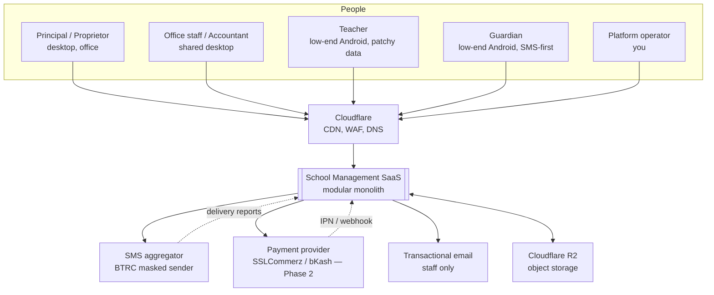
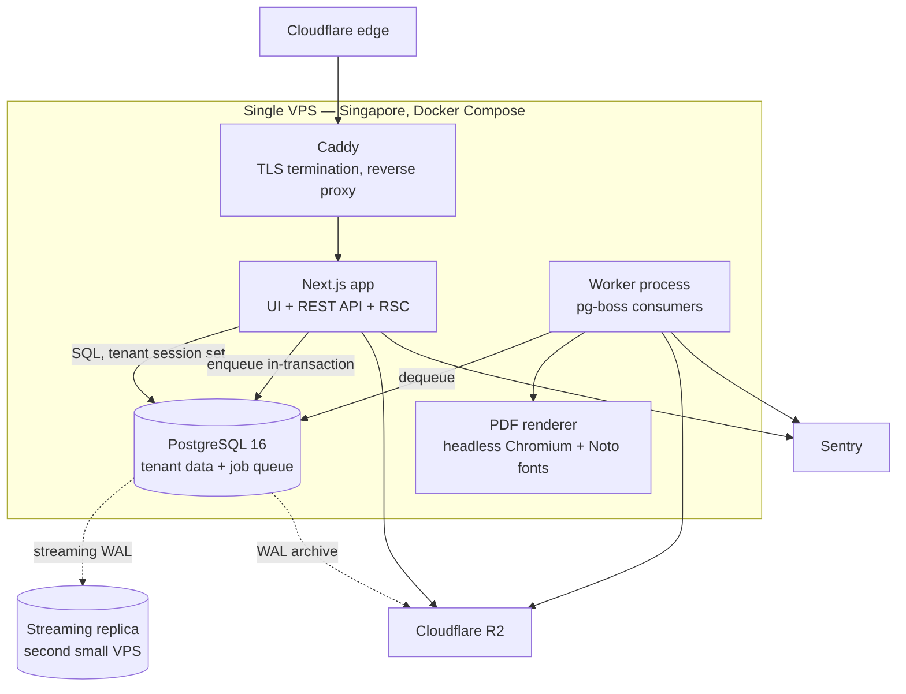
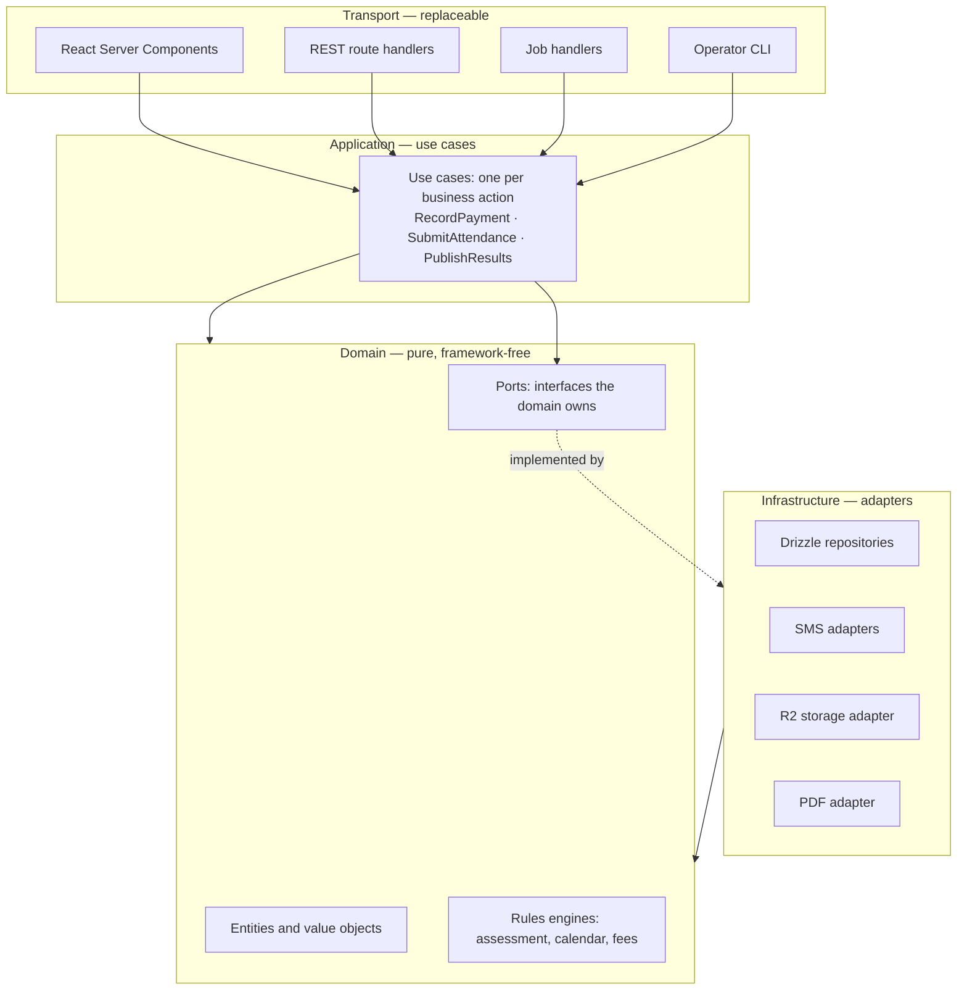
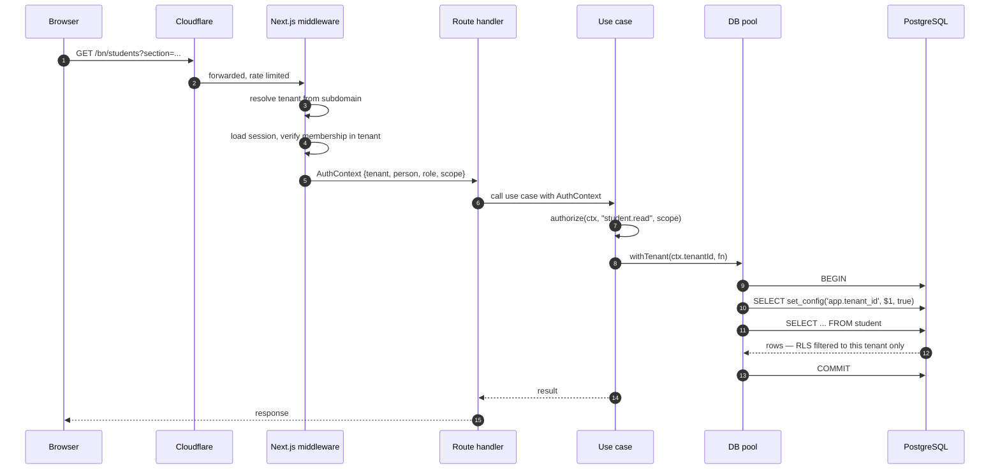

# 6. Architecture overview

## 6.1 System context



Everything a user touches arrives through Cloudflare. That gives DNS, TLS, edge
caching for published results and static assets, WAF and rate limiting without
running any of it on the origin.

## 6.2 Container view



Five containers, one host. The worker is a separate **process**, not a separate
service: same repository, same domain modules, different entrypoint. That
distinction matters — it means a background job and a web request run identical
business logic, and there is no API contract between them to drift.

The PDF renderer is separated because Chromium's memory profile is unlike
anything else in the system and it needs to be capped and restarted
independently.

## 6.3 Layering inside the application



**The one rule that keeps this honest:** `domain/` imports nothing from
`next/*`, nothing from Drizzle, nothing from any SDK. It is enforced
mechanically by an ESLint boundary rule in CI, not by good intentions. When that
rule holds, the assessment engine can be unit-tested without a database, and
extracting a service later is a packaging change rather than a rewrite.

The most likely way this design fails in practice is a route handler that
"just this once" queries the database directly. The lint rule exists because
that will otherwise happen in week three.

## 6.4 Request lifecycle, and where tenancy is enforced



There are **two independent walls** between tenants, and the design assumes
either one may be breached by a bug:

| Wall | Catches | Fails when |
|---|---|---|
| Application scoping — `AuthContext` + use-case authorization | The wrong *role* reading the right tenant | A use case forgets to call `authorize` |
| PostgreSQL RLS — `app.tenant_id` session variable | The wrong *tenant*, always | Someone connects as a `BYPASSRLS` role |

Step 12 is the load-bearing one. Because the session variable is set inside the
transaction and RLS policies compare against it, a query that forgets its
`WHERE tenant_id` clause returns **zero rows** instead of another school's
students. Isolation stops depending on developer memory. Detail in
[§7](07-multi-tenancy.md).

## 6.5 Write path for money — the highest-integrity flow

```mermaid
sequenceDiagram
    autonumber
    participant O as Office staff
    participant U as RecordPayment use case
    participant P as PostgreSQL
    participant W as Worker

    O->>U: POST /payments  {Idempotency-Key}
    U->>P: BEGIN; SET LOCAL synchronous_commit='remote_write'
    U->>P: INSERT idempotency_key — unique, may conflict
    alt key already used
        P-->>U: conflict
        U-->>O: 200 with the original result — no double post
    else new request
        U->>P: SELECT ... FROM receipt_sequence FOR UPDATE
        U->>P: INSERT payment, allocations, ledger entries
        U->>P: pg_boss.send('sms.payment_receipt', ...) in the same tx
        U->>P: COMMIT — waits for replica
        P-->>U: committed
        U-->>O: receipt number, printable
        W->>P: dequeue job
        W->>W: send SMS
    end
```

Three properties worth naming:

1. **The idempotency key is inserted first**, in the same transaction. A retried
   request — the office clicking twice on a slow connection — cannot create a
   second receipt.
2. **The SMS job is enqueued inside the transaction.** If the payment rolls
   back, the job vanishes with it. There is no window where a guardian is told
   about a payment that does not exist. This is the whole reason for choosing a
   Postgres-backed queue ([ADR-0010](../adr/0010-job-queue.md)).
3. **The receipt sequence is locked**, which serialises receipt issuance per
   school. That is the price of gapless numbering, and it is affordable because
   a school issues hundreds of receipts a day, not thousands a second.

## 6.6 Where the seams are

The brief asks that a modular monolith name the places a split would occur. In
rough order of likelihood:

| Seam | Extract when | Difficulty |
|---|---|---|
| **PDF rendering** | Chromium memory destabilises the host | Trivial — already a separate process with a queue between |
| **Notifications** | SMS volume needs independent scaling or a separate provider relationship | Easy — already interface-bound and async |
| **Reporting reads** | Report queries interfere with transactional load | Easy — point the reporting module at the replica; a connection-string change |
| **Import/export** | Admission-season imports starve interactive work | Easy — a worker pool with its own concurrency budget |
| **A whale tenant** | One school outgrows shared infrastructure | Medium — see [§7.6](07-multi-tenancy.md) |
| **Assessment engine** | Never expected | Hard, and there is no reason to |

The first four are already separate *processes* or *modules*; extracting them is
deployment work, not redesign. That is the payoff for the layering rule in §6.3.

## 6.7 What is deliberately absent

| Not present | Why |
|---|---|
| API gateway | Caddy plus Cloudflare covers routing, TLS and rate limiting |
| Service mesh | One host |
| Message broker | pg-boss until a trigger metric says otherwise |
| Separate auth service | Auth is domain logic here, not a shared utility |
| BFF layer | RSC already is the backend-for-frontend |
| Event bus / CQRS | The domain has no read/write asymmetry that justifies the complexity yet. Result snapshots are the one materialised read model, and they are a table |
| Kubernetes | See [ADR-0002](../adr/0002-hosting-and-region.md) |

Each of these is a legitimate pattern that a larger team would benefit from.
At two developers, every one of them is a system that must be understood,
operated and debugged before it returns any value.
