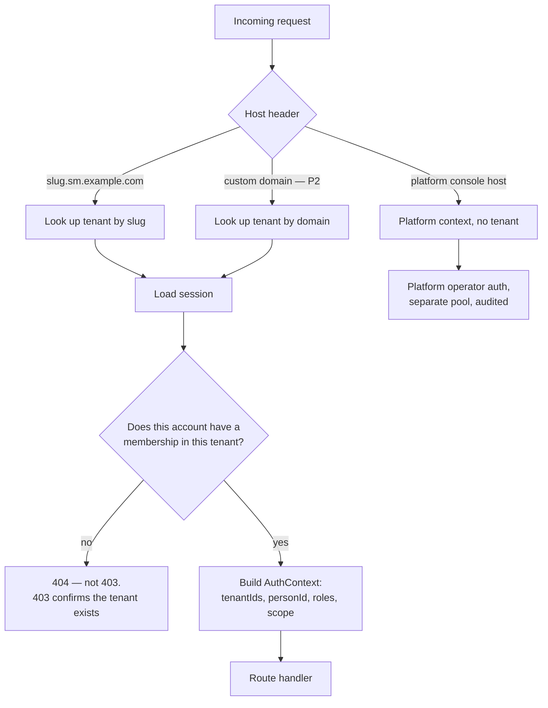

# 7. Multi-tenant strategy

The brief asks for a decision on the tenancy model, and specifically for the
**enforcement mechanism that makes cross-tenant leakage structurally impossible,
rather than unlikely**. That distinction is the substance of this section.

## 7.1 The three candidates, judged against the constraints

| Criterion | **A. Shared schema + `tenant_id` + RLS** | B. Schema per tenant | C. Database per tenant |
|---|---|---|---|
| Migration cost at 1,000 tenants | One migration | 1,000 DDL runs, partially failing, needing a resumable orchestrator | 1,000 connections × migrations |
| Catalogue pressure | ~120 tables total | 120 × 1,000 = 120,000 tables. `pg_dump`, autovacuum and planning degrade | Bounded per DB, unbounded per host |
| Connection pooling | One pool, one DSN | One pool, `search_path` per transaction — workable | A pool **per tenant**. This alone kills it: 1,000 tenants × even 2 connections exceeds any single instance |
| Per-tenant backup/restore | Hardest of the three — logical export filtered by `tenant_id` | Easy — dump one schema | Trivial |
| Noisy-neighbour isolation | Weakest — shared buffers, shared CPU | Weak | Strong |
| Cross-tenant queries for the operator | Trivial | Painful | Very painful |
| Per-tenant fixed cost | ≈ zero | Small but non-zero | Significant |
| Ops burden for 1–2 people | Lowest | High | Prohibitive |

**Decision: A — shared database, shared schema, `tenant_id` on every
tenant-owned table, enforced by PostgreSQL row-level security.**
Recorded as [ADR-0003](../adr/0003-tenancy-model.md).

Option A's two genuine weaknesses are addressed rather than ignored: single-
tenant restore in [§7.5](#75-single-tenant-backup-and-restore), and noisy
neighbours in [§7.4](#74-noisy-neighbour-control). Option C remains available for
one tenant at a time via [§7.6](#76-moving-a-whale-out-without-a-rewrite).

## 7.2 The enforcement mechanism

Three layers. The first is a convention, the second is structural, the third
proves the second is still true.

### Layer 1 — the tenant context (application)

Every request resolves to an `AuthContext` in middleware before any handler
runs. There is exactly one function that opens a database transaction, and it
requires a tenant id:

```ts
// The ONLY way the application touches the database.
export function withTenant<T>(
  ctx: AuthContext,
  fn: (tx: Tx) => Promise<T>,
): Promise<T> {
  return pool.transaction(async (tx) => {
    await tx.execute(
      sql`SELECT set_config('app.tenant_ids', ${ctx.tenantIds.join(',')}, true)`,
    );
    await tx.execute(
      sql`SELECT set_config('app.actor_id', ${ctx.personId}, true)`,
    );
    return fn(tx);
  });
}
```

`set_config(..., true)` is transaction-local, exactly like `SET LOCAL`. Two
consequences worth stating:

- It cannot leak to the next borrower of a pooled connection.
- It is **compatible with transaction-mode connection pooling** (PgBouncer),
  which session-level `SET` is not. That keeps the pooling upgrade path open.

`ctx.tenantIds` is normally one id. It holds several only for an organization
administrator viewing across their own schools, and the list is built from
verified memberships — never from a request parameter.

### Layer 2 — row-level security (structural)

Every tenant-owned table is created from one template:

```sql
-- Resolved once per query: STABLE, so the planner hoists it and the
-- index on (tenant_id, ...) is still used with = ANY(...).
CREATE FUNCTION app.current_tenant_ids() RETURNS uuid[]
  LANGUAGE sql STABLE PARALLEL SAFE AS $$
    SELECT string_to_array(
      current_setting('app.tenant_ids', /* missing_ok */ true), ','
    )::uuid[]
  $$;

CREATE FUNCTION app.current_tenant_id() RETURNS uuid
  LANGUAGE sql STABLE AS $$ SELECT (app.current_tenant_ids())[1] $$;

CREATE TABLE student (
  id         uuid PRIMARY KEY,
  tenant_id  uuid NOT NULL DEFAULT app.current_tenant_id()
             REFERENCES tenant(id),
  ...
);

ALTER TABLE student ENABLE ROW LEVEL SECURITY;
ALTER TABLE student FORCE  ROW LEVEL SECURITY;

CREATE POLICY tenant_isolation ON student
  USING      (tenant_id = ANY (app.current_tenant_ids()))
  WITH CHECK (tenant_id = ANY (app.current_tenant_ids()));

CREATE INDEX ON student (tenant_id, id);
```

Four details, each load-bearing:

| Detail | Why it matters |
|---|---|
| `FORCE ROW LEVEL SECURITY` | Without it, the **table owner bypasses RLS**. Since migrations create tables as the owner, omitting `FORCE` silently disables isolation for any connection using that role |
| `WITH CHECK` | Blocks writing a row *into* another tenant. `USING` alone only filters reads |
| `DEFAULT app.current_tenant_id()` | A developer who forgets `tenant_id` on an INSERT gets the correct value, not a `NOT NULL` violation in production |
| Leading `tenant_id` in every index | RLS adds `tenant_id = ANY(...)` to every plan. An index that does not lead with it forces a filter after the scan |

Roles are separated so the guarantee cannot be waived by accident:

| Role | Rights | Used by |
|---|---|---|
| `sm_migrator` | Owns the tables, runs DDL | Migrations only, never the running app |
| `sm_app` | DML only. **No `BYPASSRLS`, not a superuser** | The application and worker |
| `sm_readonly` | `SELECT` only, RLS applies | Reporting, replica |
| `sm_platform` | `BYPASSRLS` | Operator console and cross-tenant jobs, on a **separate connection pool** with its own audit trail |

`sm_platform` is the one legitimate way past the wall, and it is deliberately
awkward: a distinct pool, distinct credentials, and every use logged with an
operator id and reason. Impersonation (FR-13.6) runs through it.

### Layer 3 — the test that keeps it true

Structural guarantees rot when someone adds a table on a Friday. Two automated
checks run in CI and fail the build:

```sql
-- 1. Every table with a tenant_id column must have RLS enabled AND forced
--    AND carry at least one policy. No exceptions list, no opt-out.
SELECT c.relname
FROM   pg_class c
JOIN   pg_namespace n ON n.oid = c.relnamespace
JOIN   pg_attribute a ON a.attrelid = c.oid AND a.attname = 'tenant_id'
WHERE  n.nspname = 'public' AND c.relkind = 'r'
  AND (NOT c.relrowsecurity
       OR NOT c.relforcerowsecurity
       OR NOT EXISTS (SELECT 1 FROM pg_policy p WHERE p.polrelid = c.oid));
-- must return zero rows
```

```
-- 2. A leakage test, run against a seeded two-tenant database:
--      for every tenant-owned table
--        set app.tenant_ids to tenant A
--        assert COUNT(*) of tenant B's rows == 0
--        assert INSERT with tenant_id = B raises
--    Generated from the catalogue, so a new table is covered the day it exists.
```

The second test is the one that matters. It is generated from `pg_class` rather
than hand-written per table, so a developer cannot add a table and forget to add
its test — the test appears automatically and fails until the policy exists.

## 7.3 Tenant resolution



**404, not 403**, on a membership miss. Returning 403 tells an attacker that
`dhaka-model-school.sm.example.com` exists and that they simply lack access.
Tenant existence is itself information.

Tenant status is checked in the same step: a `suspended` tenant resolves, but
the context is marked read-only and every write use case refuses (FR-1.5).

## 7.4 Noisy-neighbour control

Shared infrastructure has no physical isolation, so the limits are explicit:

| Mechanism | Setting | Protects against |
|---|---|---|
| `statement_timeout` on `sm_app` | 15 s interactive, 5 min for worker jobs | One pathological report locking the pool |
| Per-tenant API rate limit | Cloudflare edge + application counter | A runaway integration or an import loop |
| Per-tenant job concurrency cap | Max N concurrent jobs per tenant in the worker | One school's 10,000-row import starving another's attendance |
| Chunked bulk jobs | Imports and PDF batches split into ~200-row chunks, re-enqueued | A single long job monopolising a worker slot |
| Per-tenant SMS cap and balance | Hard cap from the plan | Runaway spend, on the tenant's bill or the platform's |
| Storage quota per plan | Enforced on upload | One tenant filling the bucket |
| Connection pool ceiling | Fixed pool, well under `max_connections` | Connection exhaustion under a spike |

**Per-tenant fairness in the worker** deserves a note. pg-boss has no built-in
group fairness. The pattern used instead: bulk work is always chunked and
re-enqueued rather than run as one long job, and the worker holds a per-tenant
concurrency semaphore in Postgres. A tenant importing 10,000 rows therefore
occupies at most its allotted slots and yields between chunks. This is the same
result BullMQ's paid group feature provides, implemented in about thirty lines.

## 7.5 Single-tenant backup and restore

Option A's weakest point, so it is designed rather than hoped for.

| Need | Mechanism |
|---|---|
| Point-in-time recovery, whole platform | Base backup + WAL archived to R2. RPO ≤ 60 s, RTO ≤ 4 h |
| Export one tenant | `sm_platform` runs the export with `app.tenant_ids` pinned to that tenant, walking the entity graph in dependency order to a CSV bundle + JSON manifest. This is the same code path as FR-11.7, so it is exercised continuously rather than only in emergencies |
| Restore one tenant to a point in time | Restore the whole cluster to a scratch host, export that tenant, then re-import into production under a new tenant id and re-point the slug |
| Undo a bad bulk operation | **The primary mechanism.** Every mutation is audited and soft-deleted; bulk operations are batches with a recorded batch id and a compensating action. Most "restore this school" requests are really "undo what we did at 11:40" |

The third row is genuinely slower than a per-tenant database would be — hours
rather than minutes. That is the accepted cost of Option A, and it is accepted
because the fourth row handles the overwhelming majority of real incidents.

## 7.6 Moving a whale out without a rewrite

The brief asks how a large tenant could later move to dedicated infrastructure.
The answer must be designed now even though it will not be used for years, and
it costs one table and one indirection:

```ts
// Resolved at request time, cached. Every tenant maps to a shard.
// On day one, every row points at 'primary'. The code path is identical.
type ShardId = string;
function poolFor(shard: ShardId): Pool;
```

Because every query already goes through `withTenant(ctx, ...)`, and that
function already selects a pool, moving a tenant becomes an operational
procedure rather than a code change:

1. Provision a second PostgreSQL instance.
2. Export the tenant, import into the new instance, verify row counts.
3. Set the tenant read-only for the cutover window.
4. Update `tenant.shard_id`, invalidate the cache.
5. Delete the tenant's rows from the origin shard after a retention window.

Building the indirection now costs a table and a lookup. Retrofitting it later
means touching every data-access call site in the system. This is the cheapest
insurance in the document.

**Trigger:** a single tenant exceeding ~15% of total database size or IO, or a
contractual isolation requirement.

## 7.7 Scope levels, and which tables are which

| Scope | Meaning | RLS? | Examples |
|---|---|---|---|
| **Platform** | Owned by the operator, visible across tenants | No — access controlled by role | `plan`, `feature_flag`, `government_holiday`, `platform_invoice`, `operator_audit` |
| **Organization** | Shared by several schools with one owner | Yes, keyed by `tenant_id` of the org | `organization`, `org_membership`, org-level calendar |
| **Tenant** | The overwhelming majority | **Yes** | `student`, `enrolment`, `payment`, `mark`, `attendance` |
| **Global identity** | One human across tenants | No, but access is heavily restricted | `account`, `credential`, `session` |

**Global identity is the one uncomfortable case.** `account` cannot be tenant-
scoped, because its purpose is to span tenants ([§8](08-identity-authn-rbac.md)).
It is therefore kept deliberately thin — a login identifier, a hash, a status,
and nothing else. Every piece of personal data about a human (name, address,
photo, guardian relationships) lives in the tenant-scoped `person` table behind
RLS. An account leak would expose a list of phone numbers; it would not expose a
single student record.

## 7.8 Failure modes considered

| Failure | Result | Mitigation |
|---|---|---|
| Developer forgets `WHERE tenant_id` | Zero rows returned | RLS. The bug is visible and harmless |
| Developer forgets to open `withTenant` | `current_setting` is empty, the policy matches nothing, query returns nothing | Fails closed. A lint rule bans raw pool access outside the repository layer |
| Someone grants `BYPASSRLS` to `sm_app` | Isolation gone, silently | CI asserts role attributes against the live database on every deploy |
| Table created without `FORCE` | Isolation gone for owner connections | The catalogue test in §7.2 fails the build |
| Org admin's tenant list is manipulated in a request | Cross-tenant read | The list is built from verified memberships server-side; never read from input |
| Operator pool used for a tenant request | Full bypass | Separate credentials, separate pool object, never reachable from tenant request paths; every use audited |
| Restored backup replayed into the wrong tenant | Data mixing | Import writes a new tenant id and a manifest checksum; never reuses ids |
