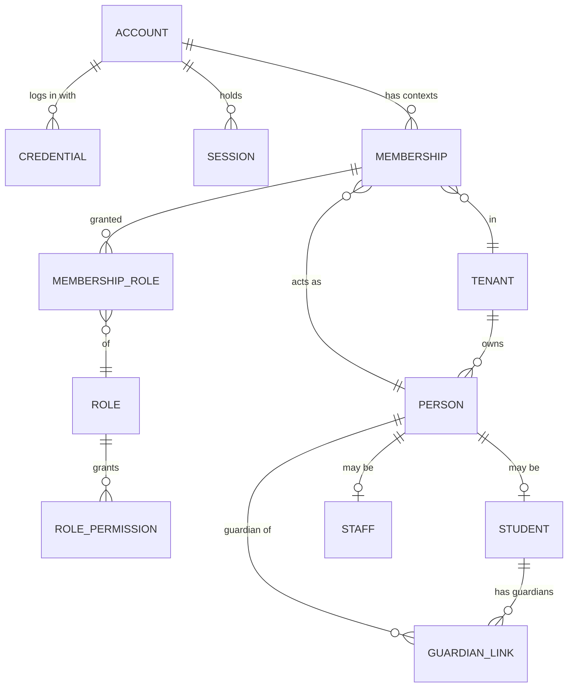
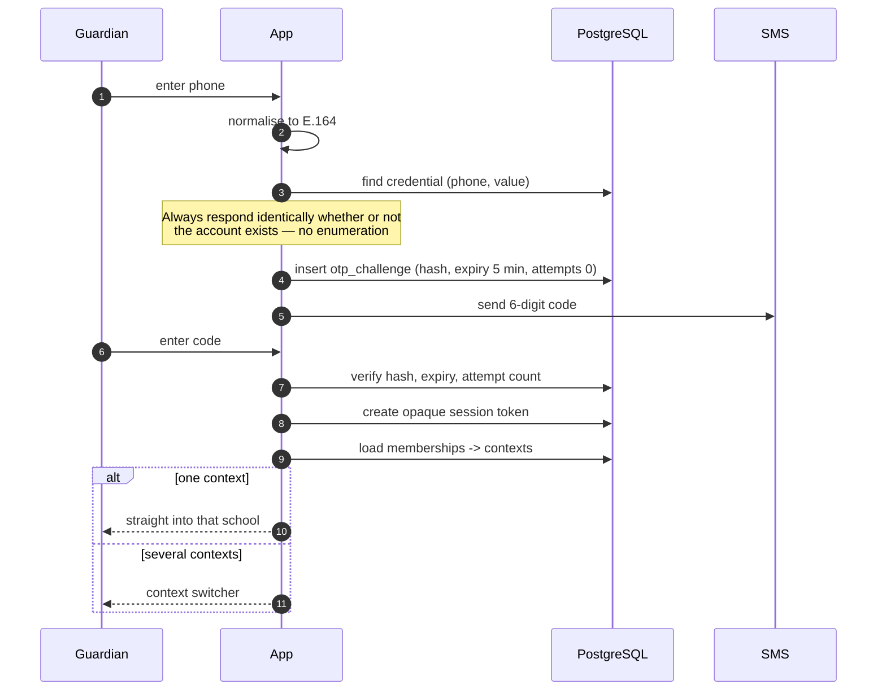

# 8. Identity, authentication and authorization

The brief (§5.4) is right that this is where a Bangladeshi school system diverges
from the textbook design. Five facts break the usual "one user row per person,
scoped to a tenant" model:

1. Most students and many guardians **have no email address**. Phone is primary.
2. **One phone number is shared** between siblings, and often between both
   parents.
3. A person may hold **roles in several tenants** — a teacher at School A whose
   child studies at School B.
4. A guardian wants **one login covering several children**, possibly in
   different schools.
5. **Kindergarten students have no login at all.**

Facts 2 and 3 together rule out the obvious model. If `user` is tenant-scoped
and keyed by phone, then a father with two children in one school is either two
users or one user who cannot be told apart from the mother.

## 8.1 The model

The separation that resolves all five facts: **an account is who logs in; a
person is a human inside one school.** They are different things, and conflating
them is the mistake.



| Entity | Scope | Holds | Notably does **not** hold |
|---|---|---|---|
| `account` | **Global** | Status, locale, MFA state | Any name or personal data |
| `credential` | **Global** | `(kind, value)` where kind is `phone` or `email`, plus verification state and password hash | — |
| `membership` | Tenant | account × tenant × person | — |
| `person` | **Tenant** | Names in `bn` and `en`, date of birth, photo, contact, address | Login details |
| `student` / `staff` | Tenant | Role-specific detail | — |
| `guardian_link` | Tenant | Guardian person → student person, relationship, flags | — |

The privacy consequence is deliberate and was noted in
[§7.7](07-multi-tenancy.md): the only table outside RLS holds a phone number and
a password hash. Every fact *about* a child sits behind row-level security.

## 8.2 The five facts, walked through

**A guardian with three children at one school.**
One `account` with credential `phone:+8801711…`. One `membership` into the
school, pointing at one `person` — the father. Three `guardian_link` rows to
three students. He logs in once and sees three children. Fact 4 satisfied.

**Both parents sharing a handset.**
Two `person` rows — the father and the mother, who are different humans with
different relationships and possibly different communication rights. They share
one login, because they share one phone. The billing guardian flag and the
primary-contact flag distinguish them for fees and SMS. If the mother later
gets her own number, a second account is created and linked to her existing
person; nothing about the student changes. Fact 2 satisfied.

**A teacher at School A whose child attends School B.**
One `account`. Two `membership` rows, one per tenant, each pointing at a
different `person` — because the personnel record at School A and the guardian
record at School B are genuinely different records, owned by different tenants,
under different RLS. After login the account resolves to two contexts and a
switcher appears. Fact 3 satisfied.

**A kindergarten student.**
A `person` and a `student` row, no `account`, no `credential`. Login is enabled
per tenant from a configurable class level upward. Fact 5 satisfied.

**Two siblings, same guardian phone.**
Two `student` rows, two `guardian_link` rows to the same guardian person. When
an absence SMS fires for both, the notification layer deduplicates by resolved
phone number and sends one message naming both children. Fact 2, again — and
this is also where SMS cost is saved.

## 8.3 Uniqueness rules, stated precisely

This is the question the brief asks directly, and the answer is not "yes" or
"no" but "at which scope".

| Value | Unique? | Scope |
|---|---|---|
| Credential `(kind, value)` — e.g. `phone:+8801711…` | **Yes** | Global. One phone is one login |
| A phone number **as a person's contact** | **No** | Many people may list the same number |
| `person` | No natural key | Duplicate detection is a reviewed process, never automatic |
| Student roll number | Yes | Per section per academic year |
| Student ID | Yes | Per school |
| Receipt number | Yes and **gapless** | Per school per fiscal year |
| `membership` | Yes | One per (account, tenant, person) |

The important line is the first two together: **a phone is unique as a login
identifier and non-unique as a contact detail.** Those are different columns in
different tables, and collapsing them is what breaks every naive design.

Phone numbers are normalised to E.164 (`+8801XXXXXXXXX`) on write. Bangladeshi
numbers are entered as `01711…`, `+88 01711…` and `8801711…` interchangeably;
without normalisation the same guardian gets three accounts.

## 8.4 Authentication

| Audience | Method | Reasoning |
|---|---|---|
| Guardian | **Phone OTP only** — no password | Most cannot manage a password. It also solves credential distribution: nothing to hand out |
| Student, senior classes | Student ID + password, provisioned by the school | |
| Teacher, office staff | Phone or email + password, optional OTP | |
| Tenant owner / principal | Password + **MFA** (P2) | |
| Platform operator | Password + **MFA required**, separate host, IP allowlist where practical | |

**Credential distribution at onboarding (FR-2.10) is solved by not having
credentials.** With OTP-first guardian login there are no thousands of passwords
to print, hand out or leak. A guardian receives an SMS saying the portal is live;
they enter their phone number and receive a code. The phone number is already in
the system because the school imported it.

Staff accounts are provisioned with a single-use invite link and set their own
password. **No password is ever transmitted**, by SMS or email.



Controls on that flow: codes are hashed at rest, expire in five minutes, allow
five attempts, are single-use, and are rate-limited per phone **and** per IP.
The response is identical for known and unknown numbers, so the endpoint cannot
be used to test whether a number is enrolled.

### Sessions

Opaque random tokens in an `HttpOnly`, `Secure`, `SameSite=Lax` cookie, with the
session record server-side. **Not JWTs.**

The requirement that decides it: NFR §4.6 demands revocation of a compromised
session platform-wide within one minute. A stateless token cannot be revoked
without a revocation list, and a revocation list is a session table with extra
steps and worse ergonomics. Every request already touches the database.

The session row carries the account, the **active context**, issue and last-use
timestamps, IP and user agent. Switching schools rewrites the active context on
the server; the client cannot select a context it has no membership for.

## 8.5 Authorization

### Permissions are a fixed vocabulary

Permission keys are `resource.action` strings defined **in code** as a
TypeScript union, mirrored into a `permission` table for the role editor UI. A
fixed vocabulary means a typo is a compile error rather than a silent grant.

```ts
type Permission =
  | 'student.read'   | 'student.write'   | 'student.delete'
  | 'attendance.read'| 'attendance.write'| 'attendance.amend'
  | 'mark.read'      | 'mark.write'      | 'mark.lock'      | 'mark.moderate'
  | 'result.publish' | 'result.revise'
  | 'fee.read'       | 'fee.collect'     | 'fee.waive'      | 'fee.refund'
  | 'report.financial.read'
  | 'sms.send'       | 'sms.budget.manage'
  | 'calendar.manage'| 'role.manage'     | 'tenant.settings.manage'
  // ...
```

Note that `fee.collect`, `fee.waive` and `fee.refund` are separate. The office
assistant collects; only the principal waives. Collapsing them into `fee.write`
is how a school loses money.

### Roles are data

System roles are seeded per tenant at provisioning (Principal, Teacher,
Accountant, …). A tenant may create custom roles from the same vocabulary. A
role is a named bundle; a membership may hold several.

### Scope is a separate axis

A permission answers *what*; scope answers *which rows*.

```ts
interface Scope {
  campusIds?:  string[];   // absent = every campus in the tenant
  classIds?:   string[];
  sectionIds?: string[];
  subjectIds?: string[];
}
```

A class teacher's grant is `attendance.write` scoped to their sections. A subject
teacher's is `mark.write` scoped to `{sectionIds, subjectIds}` — the pair
matters, because a teacher may teach Mathematics in 6A and nothing else in 6A.

### One enforcement point

```ts
// Called by every use case. There is no other authorization path.
export function authorize(
  ctx: AuthContext,
  permission: Permission,
  target?: ScopeTarget,
): asserts ctx is AuthorizedContext;
```

Scope is enforced **twice**, deliberately:

- **On the way in** — `authorize()` rejects a write to a section outside scope.
- **On the way out** — list queries receive scope predicates from the context
  (`WHERE section_id = ANY ($scopeSections)`), so a teacher's student list is
  narrowed in SQL rather than filtered in JavaScript after the fact.

The second is what prevents the classic leak where a page fetches all rows and
hides some in the UI.

### Why RLS does not do role scoping

RLS handles **tenant** isolation only. Encoding section-level teacher scope into
RLS policies would mean policies that join through memberships and role
assignments on every row — brittle, hard to reason about, and a performance
problem on large tables.

The division is deliberate and worth stating plainly:

> **RLS answers "whose data is this?" The application answers "may this person
> see it?"** A bug in the second exposes one school's data to the wrong
> colleague. A bug in the first would expose it to a different school. Only one
> of those is unrecoverable, and it is the one made structural.

### Testing authorization

A permission matrix test enumerates every (role × permission × scope) pair from
a fixture and asserts allow/deny. It is table-driven, so adding a permission
without adding its expectations fails the build. Additionally, every use case
must call `authorize()` — checked by a lint rule that flags exported use cases
whose body lacks the call.

## 8.6 Duplicate persons and merging

Duplicates are guaranteed: readmission, a sibling entered twice, a December
import over an existing record, a name spelled in Bangla in one row and English
in another.

**Detection** is a scored candidate search, never an automatic merge:

| Signal | Weight |
|---|---|
| Exact normalised phone match on a guardian link | High |
| Date of birth exact | High |
| Trigram similarity on the Bangla name (`pg_trgm`) | Medium |
| Trigram similarity on a transliteration-normalised Latin key | Medium |
| Same section and academic year | Medium |
| Same birth registration number | Decisive |

Transliteration is the hard part: *মোহাম্মদ* appears as Mohammad, Mohammed, Md.,
Muhammad. A normalisation function folds a known set of variants and removes
honorifics before comparison. It will not be perfect, which is exactly why the
output is a **review queue**, not an action.

**Merging** keeps both rows. The loser is marked `merged_into`, all foreign keys
are repointed inside one transaction, and the operation is recorded with enough
detail to reverse it. Merging financial history requires `fee.read` plus an
explicit confirmation, because merging two students merges their dues.

## 8.7 Threat model — what this design assumes

| Threat | Control |
|---|---|
| Credential stuffing on guardian phones | Rate limit per phone and per IP; OTP only; no password to stuff |
| SIM swap | Accepted residual risk for guardians. Financial actions require staff authentication, never a guardian's |
| Enumeration of enrolled phone numbers | Identical responses; timing normalised |
| A teacher reading another section's marks | Scope predicates in SQL, matrix-tested |
| A staff member escalating their own role | `role.manage` cannot grant a permission the granter lacks; self-grant is blocked and audited |
| A compromised staff session | Opaque sessions, revocable within a minute; sensitive actions re-prompt |
| Operator abuse | `sm_platform` is a separate pool with mandatory reason capture, time-limited impersonation, full audit, and tenant visibility |
| Cross-tenant access via a manipulated context | Context is built from verified memberships only; never from request input |
| Guardian seeing another child's results | `guardian_link` is the only path to a student; every guardian query joins through it |
