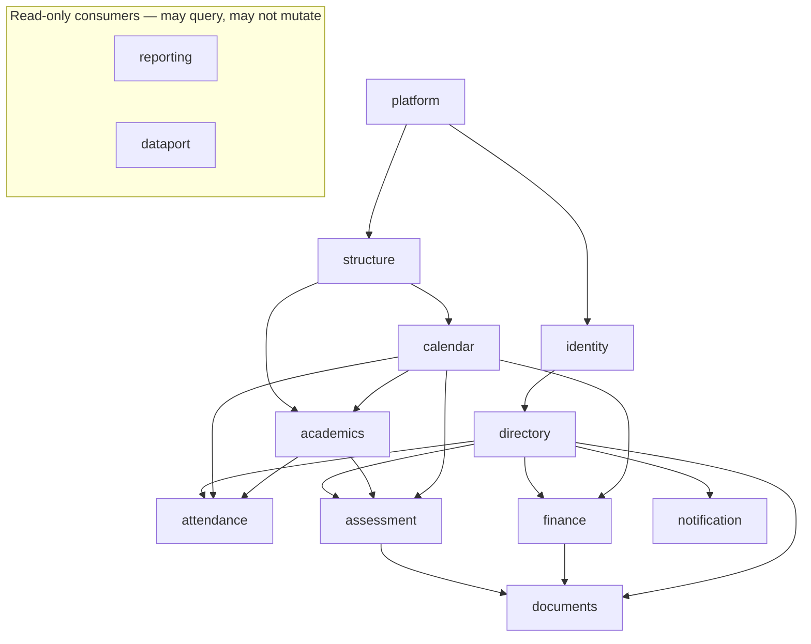

# 9. Domain boundaries and module map

A monolith without boundaries is a big ball of mud with good intentions. This
section defines the modules, what each owns, and — most importantly — **which
direction dependencies are allowed to point**.

## 9.1 The modules

| Module | Owns | Depends on | Band |
|---|---|---|---|
| `platform` | Tenants, plans, feature flags, subscriptions, operator actions, impersonation | — | M |
| `identity` | Accounts, credentials, sessions, memberships, roles, permissions | `platform` | M |
| `directory` | Persons, students, guardians, staff, documents, enrolment, promotion | `identity` | M |
| `structure` | Organizations, schools, campuses, shifts, class levels, sections, academic years | `platform` | M |
| `calendar` | Holidays, weekly-off patterns, terms, events, **the working-day table** | `structure` | M |
| `academics` | Curricula, subjects, subject assignment, books, timetable | `structure`, `calendar` | M |
| `attendance` | Attendance records, corrections, summaries | `directory`, `calendar`, `academics` | M |
| `assessment` | Exams, schemes, components, marks, results, grading, tabulation, promotion rules | `directory`, `academics`, `calendar` | M |
| `finance` | Fee heads, assignments, invoices, payments, receipts, discounts, arrears, reconciliation | `directory`, `calendar` | M |
| `notification` | Templates, campaigns, dispatch, delivery reports, credits, suppression | `directory` | M |
| `documents` | Templates, render jobs, generated artefacts | `assessment`, `finance`, `directory` | M |
| `dataport` | Import staging, validation, commit, duplicate detection, tenant export | most modules, **read-only** | M |
| `reporting` | Report definitions, execution, export | most modules, **read-only** | M |
| `cms` | Pages, blocks, media, publishing | `structure` | P2 |
| `library`, `inventory`, `transport` | Their own domains | `directory`, `finance` | P2 |

Fourteen MVP modules is a lot for two developers. That is the scope observation
from [§1](01-executive-summary.md) restated concretely — the module count is
honest, and the sequencing that makes it survivable belongs to the Phase 1C
roadmap.

## 9.2 Dependency direction



Three rules, enforced by an ESLint boundary configuration that fails CI:

1. **No cycles.** If `finance` needs something from `assessment`, that something
   belongs in a lower module or is passed in by the caller.
2. **`reporting` and `dataport` never mutate another module's tables.** They
   read. Writes go through the owning module's use cases.
3. **No module imports another module's repositories or tables.** Only its
   published use cases and types. The database is not a shared integration bus,
   even though it is one database.

Rule 3 is the one that decays first and matters most. A `JOIN` across module
boundaries inside a repository is how the seams in [§6.6](06-architecture-overview.md)
quietly disappear. Cross-module reads that genuinely need a join — a fee report
that shows section names — go through a **read model** owned by the reading
module and populated from the owner's published data.

## 9.3 The calendar is infrastructure, not a peer

`calendar` sits below `attendance`, `assessment` and `finance` because all three
ask it the same question and must get the same answer:

> Is date *D* a working day for section *S*?

If attendance computes weekends itself, assessment checks exam dates itself, and
finance skips late fees on its own holiday list, they will disagree — and the
disagreement will surface as a late fee charged on a day the school was shut.

The contract each module depends on is small and stable:

```ts
interface CalendarService {
  isWorkingDay(sectionId: string, date: LocalDate): Promise<boolean>;
  workingDays(sectionId: string, range: DateRange): Promise<LocalDate[]>;
  workingDayCount(sectionId: string, range: DateRange): Promise<number>;
  resolve(sectionId: string, date: LocalDate): Promise<DayResolution>;
  // DayResolution: { status, holidayId?, source, reason? } — always explains itself
}
```

`resolve()` returning the *reason* matters: when a teacher cannot take
attendance, the screen must say "Friday — weekly off" or "Eid-ul-Fitr vacation
(school calendar)", not "not a working day". Detail in
[ADR-0013](../adr/0013-calendar-as-infrastructure.md).

## 9.4 Cross-module communication

Three mechanisms, in order of preference:

| Mechanism | Use when | Example |
|---|---|---|
| **Direct use-case call** | Synchronous, same transaction, caller needs the result | `finance` asks `calendar` whether to accrue a late fee |
| **Domain event via the job queue** | Asynchronous, the caller must not wait or fail | `PaymentRecorded` → `notification` sends an SMS |
| **Read model** | Reporting and lists spanning modules | Fee report showing class and section names |

Domain events are enqueued **inside the transaction that produced them**
(pg-boss, same database — [ADR-0010](../adr/0010-job-queue.md)). This removes the
dual-write problem entirely: there is no state in which a payment exists but its
notification job does not, or a job fires for a payment that rolled back.

Events are named in the past tense and carry ids, never denormalised payloads —
a consumer re-reads current state, so a delayed job cannot act on stale data:

```
StudentAdmitted · StudentPromoted · StudentWithdrawn
AttendanceRecorded · AttendanceAmended
MarksLocked · ResultsPublished · ResultRevised
InvoiceGenerated · PaymentRecorded · PaymentReversed · LateFeeAccrued
HolidayConfirmed · CalendarRecomputed
TenantSuspended · TenantReactivated
```

## 9.5 Shared kernel

A small `shared` module that every other module may import. It is deliberately
tiny, because a growing shared kernel is a monolith re-forming inside the
modules:

| Contains | Does not contain |
|---|---|
| `Money` — integer poisha, arithmetic, formatting | Business rules |
| `LocalDate`, `DateRange` — timezone-fixed date types | Calendar resolution |
| `TenantId`, `PersonId`, … branded id types | Repositories |
| `Result<T, E>` and the error taxonomy | Anything that queries |
| Localised name value objects (`bn` / `en`) | Anything module-specific |
| `AuthContext`, `Scope`, `authorize()` | Role definitions |

**`Money` is not optional.** Every amount in the system is `Money`, constructed
from integer minor units, with no implicit conversion to `number`. It is the
type-level enforcement of [ADR-0011](../adr/0011-money-representation.md), and it
is what stops someone writing `total / 3` and losing a poisha.

## 9.6 Folder structure

```
src/
  app/                        Next.js App Router — transport only
    [locale]/(tenant)/...     tenant-facing UI
    [locale]/(platform)/...   operator console
    api/v1/...                REST handlers
  worker/
    index.ts                  pg-boss consumers, second entrypoint
    handlers/
  modules/
    finance/
      domain/                 pure — entities, rules, ports. NO imports of next, drizzle, SDKs
      application/            use cases; one file per business action
      infrastructure/         Drizzle repositories, provider adapters
      index.ts                the module's public surface. Nothing else is importable
    assessment/ calendar/ ...
  shared/                     the kernel from §9.5
  db/
    schema/                   Drizzle table definitions
    migrations/               SQL, forward-only
    rls.ts                    withTenant, pools, policy helpers
```

`modules/*/index.ts` being the only importable entry is enforced by lint. It is
what makes "extract this module into a service" a packaging change: the public
surface is already explicit and already narrow.

## 9.7 What is intentionally not a module

| Not a module | Where it lives instead | Why |
|---|---|---|
| "Users" | `identity` (accounts) and `directory` (persons) | Conflating them is the mistake [§8](08-identity-authn-rbac.md) exists to avoid |
| "Settings" | Each module owns its own configuration | A shared settings blob becomes a dumping ground with no ownership |
| "Common" / "Utils" | `shared`, with a strict membership rule | Unbounded utility modules are how cycles reappear |
| "Notifications" as a queue | `notification` owns intent and content; pg-boss carries it | Transport is infrastructure, not domain |
| An "audit" module | Audit is a cross-cutting concern written by the use-case wrapper | Every module needs it; none should own it |
