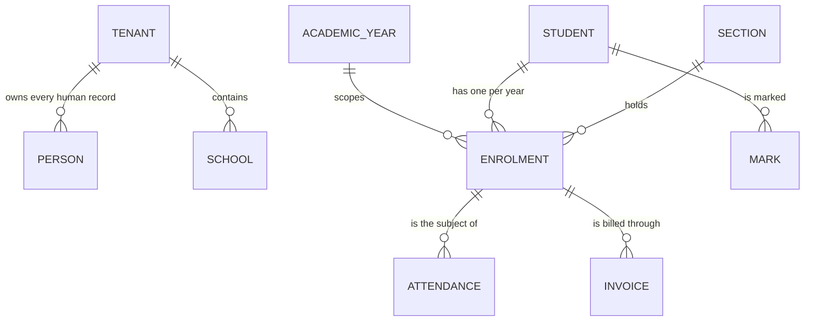
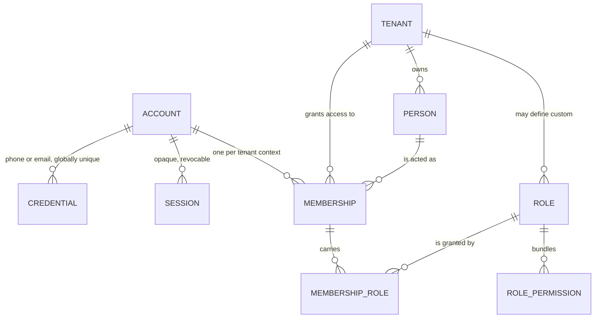
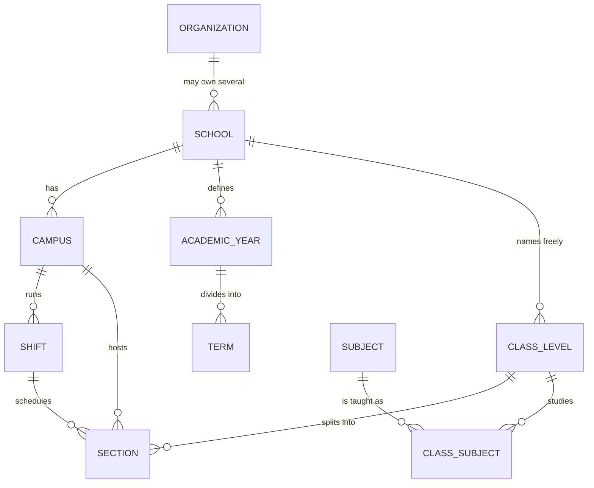
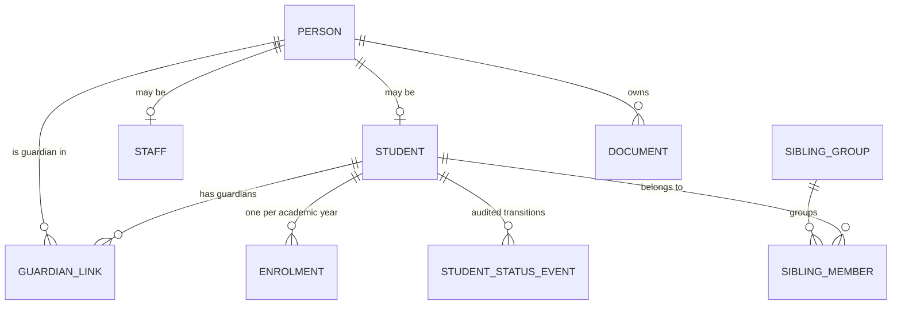
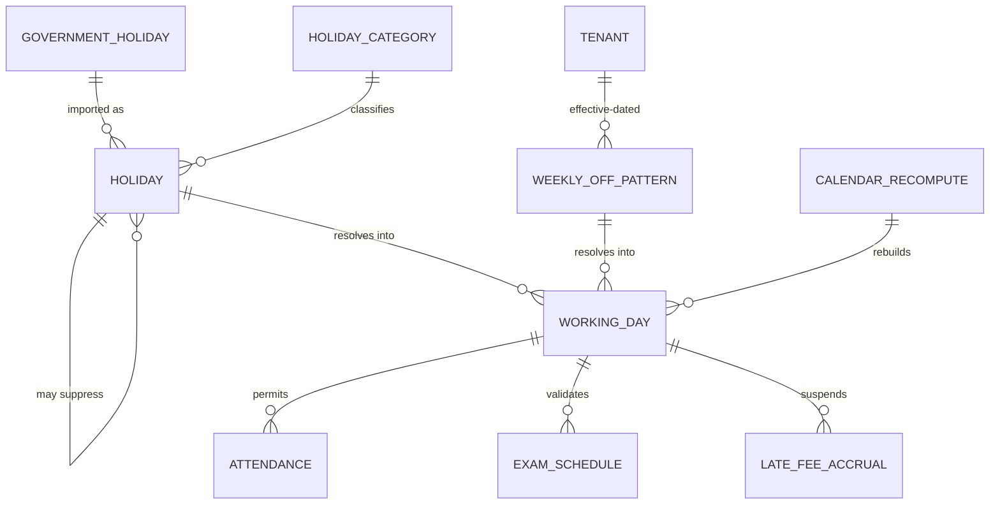
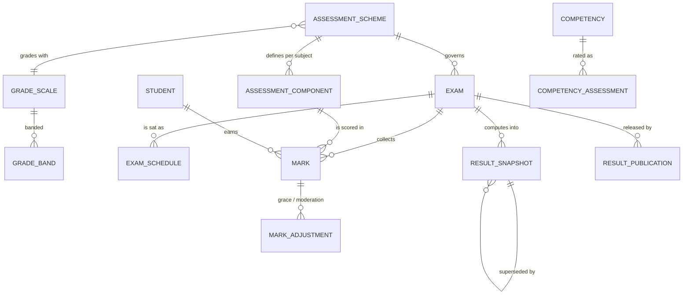
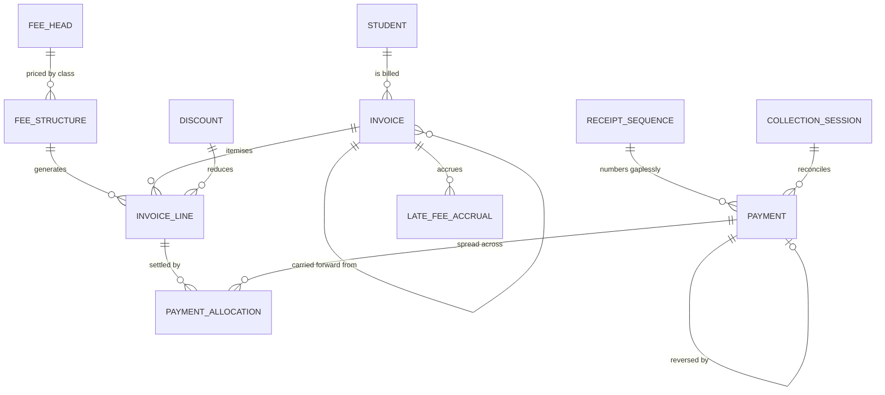

# 12. ERD-style relationship description

One diagram of a hundred tables is unreadable. This section gives six fragments,
each answering a specific question, plus the spine that connects them.

## 12.1 The spine

Almost every record in the system hangs off one of four things. Knowing which
makes the rest of the model predictable.

| Spine element | Everything hanging off it |
|---|---|
| `tenant_id` | Every tenant-owned row, without exception. The RLS key |
| `academic_year_id` | Enrolment, fees, exams, timetable, calendar, promotion |
| `enrolment` | The join that makes history queryable — "which section was this student in when this mark was recorded?" |
| `person` | Students, staff and guardians are all persons with a role table attached |

**`enrolment` is the most important table in the system.** A student is not "in
Class 5, Section A" — a student *has an enrolment* in Section A for 2026 and
another in Section B for 2027. Modelling section as an attribute of student
destroys last year's tabulation sheet the moment this year's promotion runs.

## 12.2 Identity and tenancy

Answers: *how does one login reach several schools?*

| Relationship | Cardinality | Why |
|---|---|---|
| `account` → `credential` | 1 : N | One login may have both a phone and an email |
| `credential (kind, value)` | Globally unique | One phone number is one login |
| `account` → `membership` | 1 : N | A teacher at School A, a parent at School B |
| `membership` → `person` | N : 1 | The person record is tenant-owned; the account is not |
| `membership` → `role` | 1 : N with `scope` | A teacher may also be an exam controller |

The **only** edges crossing a tenant boundary are `account → membership` and
`account → credential`. Everything else is inside one tenant, behind RLS.

## 12.3 Structure and the academic year

Answers: *how does an arbitrary school hierarchy stay configurable?*

`class_level.sequence` is what makes promotion generic. `Play → Nursery → KG →
Class 1` is four rows with sequences 1–4, not an enumeration in code. A school
that adds "Pre-Nursery" inserts a row; nothing else changes.

`section` deliberately references campus **and** shift **and** class level.
A morning Class 5A and a day-shift Class 5A are different sections with
different timetables, different working-day calendars and different teachers.

## 12.4 Directory — the student and their people

Answers: *how do siblings, separated parents and shared phones coexist?*

| Case | How the graph handles it |
|---|---|
| Father and mother, one handset | Two `person` rows, two `guardian_link` rows, one shared `account` |
| Three siblings, one guardian | One guardian `person`, three `guardian_link` rows, one `sibling_group` |
| Separated parents | Both linked; `can_receive_results` and `is_billing_guardian` differ |
| Guardian is also a teacher here | The same `person` has a `staff` row and `guardian_link` rows |
| Student readmitted after leaving | Same `person` and `student`; a new `enrolment` and a status event |

`person → student` and `person → staff` are **1 : 0..1**, not inheritance. A
person may be both — a teacher whose child attends the same school is one person
with a `staff` row and guardian links. Modelling students and staff as separate
unrelated tables duplicates that human and breaks the merge in §8.6.

## 12.5 Calendar — one question, one answer

Answers: *how do five modules agree on whether Thursday is a working day?*

`working_day` is a **materialised projection**, not a source of truth in itself.
Its sources are `holiday`, `weekly_off_pattern` and the academic year bounds; its
consumers are attendance, assessment, finance and notifications.

The self-referencing edge `HOLIDAY → HOLIDAY` is the suppression relationship
required by FR-5.4: a school row that cancels an inherited government holiday,
rather than merely adding another one.

Rebuild triggers, all of which enqueue a `calendar_recompute`:

| Event | Range rebuilt |
|---|---|
| Holiday created, edited, confirmed or cancelled | The holiday's date range |
| Weekly-off pattern changed | From `effective_from` to year end |
| Academic year bounds changed | The whole year |
| Government calendar version imported | The imported ranges, for tenants that subscribed |
| Campus or shift created | That campus/shift for the current year |

## 12.6 Assessment — configuration, marks, results

Answers: *how do differing grading rules avoid becoming code?*

The critical shape: **`assessment_scheme` and its components are inputs**;
`mark` rows are inputs; `result_snapshot` is output. The engine is a pure
function of the two, versioned by `scheme_version`.

`RESULT_SNAPSHOT → RESULT_SNAPSHOT` carries revision history (FR-7.12). Version 1
is never edited; version 2 supersedes it and both remain retrievable, which is
what makes a post-publication correction explainable to a parent.

`competency_assessment` runs **parallel** to `mark`, not instead of it. A school
with descriptive reporting in KG and marks in Class 5 uses both against the same
exam structure — the requirement in FR-7.1 that most designs get wrong by
treating them as alternatives.

## 12.7 Finance — invoice, payment, allocation

Answers: *how do partial payments and multi-year arrears stay correct?*

The load-bearing relationship is **`payment → payment_allocation →
invoice_line`**, many-to-many. It is what allows a guardian to hand over ৳3,000
against ৳5,200 owed across four heads and three months, with the allocation
order configurable per school (FR-8.6) and the remaining balance exactly
attributable per head.

A simpler `payment.invoice_id` would make partial payment across heads
unrepresentable — and partial payment is the normal case in this market, not the
exception.

`INVOICE → INVOICE` (`carried_forward_from_invoice_id`) implements FR-8.7. Last
year's unpaid balance becomes this year's opening line, with a traceable link
back. It is also the shape that the December import writes into for opening dues
(FR-11.1), so imported arrears and system-generated arrears are the same thing.

## 12.8 Cardinality summary for the awkward cases

| Relationship | Cardinality | The thing people get wrong |
|---|---|---|
| account : person | M : N via membership | Not 1:1. One login, several human records |
| phone : person | 1 : N | A phone identifies a *login*, never a human |
| student : section | M : N over time via enrolment | Not an attribute of student |
| student : guardian | M : N via guardian_link | Not "father_name" and "mother_name" columns |
| payment : invoice | M : N via allocation | Not one payment per invoice |
| exam : result | 1 : N versions | Not one row updated in place |
| holiday : working_day | M : N through resolution | Not a direct lookup — precedence and suppression apply first |
| section : shift | N : 1 | Not an attribute of class level |

Each row in that table is a design that looked simpler at first and would have
required a migration under load to fix.
