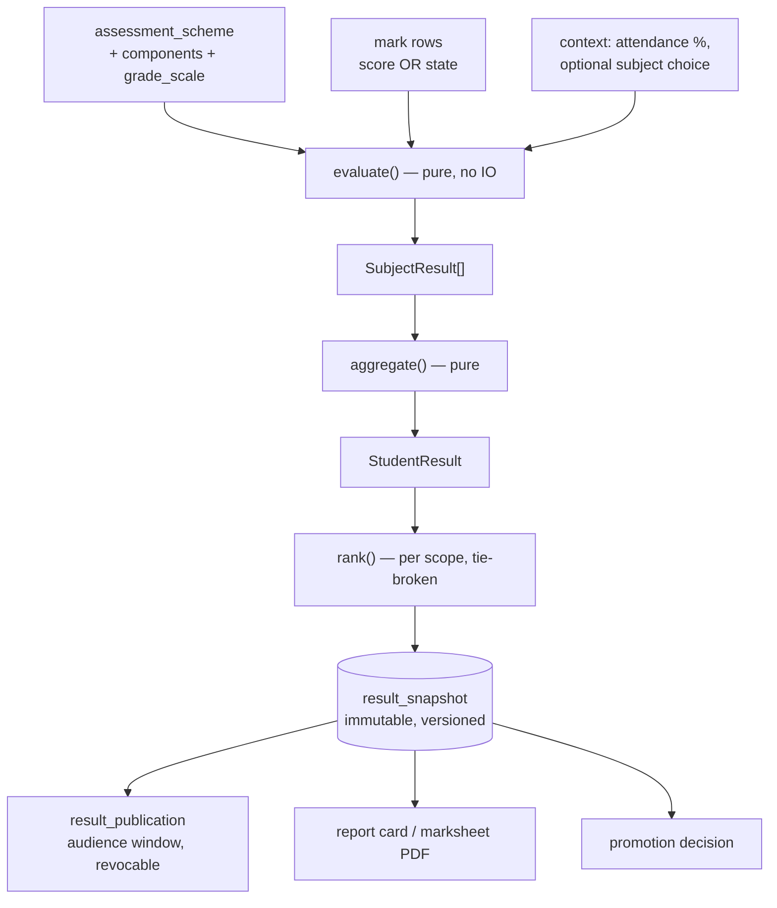
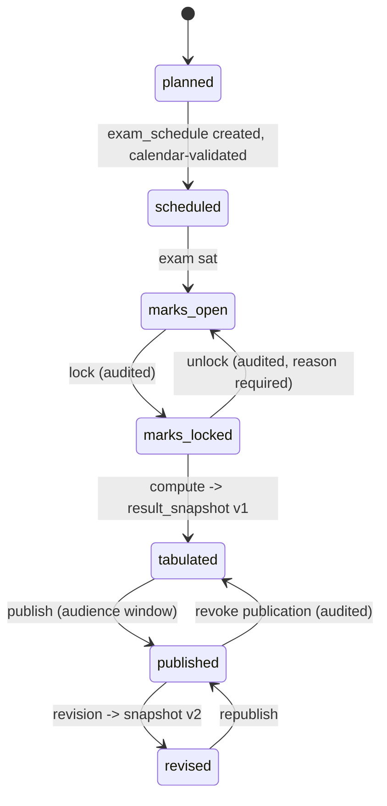

# 15. Assessment and examination engine

The highest-risk module. [ADR-0012](../adr/0012-assessment-engine.md) fixed the
approach — declarative configuration over a fixed vocabulary, evaluated by a
versioned pure function. This section specifies the vocabulary, the pipeline and
the workflows.

## 15.1 The pipeline



Everything left of `result_snapshot` is a pure function of its inputs. That is
what makes it testable against real school configurations, which is the only way
a two-person team can trust this module.

## 15.2 The rule vocabulary

Fixed and closed. A school needing something outside it gets a **vocabulary
extension**, reviewed and versioned — not a branch in application code.

### Component pass rules

```ts
interface AssessmentComponent {
  code: string;                  // 'CQ' | 'MCQ' | 'PRACTICAL' | 'VIVA' | 'CA' | custom
  fullMarksMinor: number;        // marks are integer minor units too — 1 mark = 100
  weightPercent: number;         // contribution to the subject total
  passMarkMinor?: number;        // independent pass requirement (FR-7.2)
  isRequiredToPass: boolean;     // failing this component fails the subject
}
```

The separate `passMarkMinor` is the requirement most systems miss. A Bangladeshi
secondary subject commonly requires passing CQ *and* MCQ separately: 70 total is
not a pass if CQ alone is below its own threshold.

### Aggregation

```ts
type AggregationRule =
  | { kind: 'weighted_sum' }                        // Σ(score/full × weight)
  | { kind: 'average' }
  | { kind: 'best_of_n'; n: number }                // best n of m exams
  | { kind: 'weighted_terms'; weights: Record<TermId, number> };
```

### Optional / fourth subject

```ts
interface OptionalSubjectRule {
  thresholdPercent: number;        // e.g. 33 — marks above the pass mark…
  contributesAbovePoints: number;  // …contribute above this grade point
  maxContributionPoints: number;   // …capped at this much
}
```

Expressed as data because the convention varies and has changed. Hardcoding
"marks above 40 count toward the aggregate" is exactly the §4 failure the brief
warns about.

### Grade scales

```ts
interface GradeBand {
  minPercent: number; maxPercent: number;
  labelBn: string; labelEn: string;
  gradePoint?: number;    // absent for pass/fail and descriptive scales
  isFailing: boolean;
}
```

Four scale kinds coexist in one platform: `gpa`, `letter`, `pass_fail`,
`descriptive`. A tenant running KG descriptively and Class 5 on marks uses two
scales against the same exam structure.

### Ranking

```ts
interface RankingRule {
  scope: 'section' | 'class' | 'campus' | 'school';
  tieBreak: Array<
    | { by: 'total' }
    | { by: 'subject'; subjectId: string }   // e.g. Mathematics decides ties
    | { by: 'dateOfBirth'; order: 'older_first' }
    | { by: 'shared' }                       // both get the same position
  >;
  excludeFailing: boolean;
}
```

`{ by: 'shared' }` as a terminal rule is important: some schools genuinely award
joint positions. Forcing a strict total order invents a distinction the school
did not make, and a parent will notice.

### Promotion

```ts
interface PromotionRule {
  mode: 'automatic' | 'manual';
  minAttendancePercent?: number;         // reads working_day for the denominator
  maxCarryForwardSubjects: number;       // failed subjects allowed to carry
  requiresApprovalRole?: Permission;
}
```

## 15.3 Mark states — the constraint that matters most

```ts
type MarkState = 'entered' | 'absent' | 'exempt' | 'incomplete';
```

| State | Counts toward total? | Counts in the denominator? | Can the student pass? |
|---|---|---|---|
| `entered` (incl. a real 0) | Yes | Yes | Per rules |
| `absent` | **No** | Yes | Normally no — configurable |
| `exempt` | No | **No** — full marks reduced | Yes |
| `incomplete` | No | Yes | Blocks publication until resolved |

The database makes an absent-as-zero row unrepresentable
([§10.11](../phase-1a/10-database-architecture.md)). The engine additionally
refuses to compute a published result while any `incomplete` remains — a
half-entered subject silently scoring zero is the failure mode this whole design
exists to prevent.

`exempt` reducing the denominator is the subtle one: a student exempted from a
practical is graded out of the remaining components, not penalised for the
missing one.

## 15.4 Evaluation, in pseudocode

```
evaluate(scheme, subject, marks, context) -> SubjectResult:
    components = scheme.componentsFor(subject)

    if any component mark is 'incomplete':
        return SubjectResult(status = INCOMPLETE)          # blocks publication

    effectiveFull = 0 ; earned = 0 ; failedComponents = []

    for c in components:
        m = marks[c]
        if m.state == 'exempt':
            continue                                       # out of the denominator
        effectiveFull += c.fullMarks * c.weightPercent
        score = (m.state == 'entered') ? m.score : 0        # ABSENT scores 0 HERE
                                                            # but is never STORED as 0
        earned += score * c.weightPercent

        if c.passMark is set and c.isRequiredToPass:
            if m.state != 'entered' or m.score < c.passMark:
                failedComponents.append(c)

    percent = earned / effectiveFull * 100
    band    = scheme.gradeScale.bandFor(percent)
    passed  = band.isFailing == false and failedComponents.isEmpty()

    return SubjectResult(percent, band, passed, failedComponents,
                         wasAbsent = any(m.state == 'absent'))
```

The commented line is the crux. An absent mark contributes zero **to the
arithmetic**, in a pure function, at computation time — while the stored record
remains `absent` forever. The report card prints "AB", not "0", and the
tabulation sheet can distinguish a student who scored nothing from one who was
not there. Systems that collapse these are unrecoverable after the fact.

## 15.5 Exam lifecycle



| Transition | Guard |
|---|---|
| → `scheduled` | Every subject has a date/time; conflict rules pass at `block` severity |
| → `marks_locked` | No `incomplete` marks remain |
| → `marks_open` (unlock) | Requires `mark.lock` permission **and** a reason. Emits an event |
| → `tabulated` | Computation succeeds for every enrolled student |
| → `published` | Requires `result.publish`. Optional gate: fee clearance per student |
| → `revised` | Requires `result.revise`. Writes snapshot v2; v1 stays retrievable |
| → `tabulated` (revoke) | Requires `result.publish` + reason. Guardians lose access immediately |

Revocation is a supported operation, not an emergency. "Unpublish Class 6, the
tabulation used the wrong scheme version" must be one button with an audit
entry, because it will happen.

## 15.6 Bulk mark entry (FR-7.8)

A first-class requirement, and the screen teachers judge the product by.

| Requirement | Implementation |
|---|---|
| Keyboard-driven grid | Arrow/Tab/Enter navigation; no mouse needed for a full section |
| Paste from spreadsheet | TSV paste maps to the focused rectangle; per-cell validation on paste |
| Per-cell validation | Range against `fullMarksMinor`, immediate, inline |
| Non-numeric states | `a` → absent, `e` → exempt, `i` → incomplete. Typing a letter is faster than opening a menu |
| Resumable after connection loss | Every cell edit writes to IndexedDB immediately; a background sync flushes to the server in batches |
| Concurrent editors | Optimistic locking on `version`; a conflict shows both values and asks |
| Progress | "38 of 42 entered, 2 absent, 2 remaining" — always visible |

The autosave granularity is deliberate: **per cell, locally; batched, remotely.**
Saving every keystroke to the server on a 3G connection makes the grid unusable;
saving only on submit loses an hour of work when the browser is killed.

## 15.7 Tabulation and ranking

Tabulation produces the per-section grid of every subject result for an exam. It
is generated as a background job into `result_snapshot` rows, then rendered as a
document.

Ranking is computed **after** all snapshots for the scope exist, because a
position depends on every other student. The scope is configuration; the
tie-break is an ordered list; students with `incomplete` results are excluded
from ranking, not ranked last.

**Performance note.** A 400-student, 12-subject, 5-component exam is 24,000 mark
rows and 4,800 subject results. That is small, and evaluation is pure and
parallelisable. [OQ-14](../phase-1a/13-open-questions.md) measures it rather than
assuming; if it exceeds a few seconds the job is chunked by section.

## 15.8 Grace marks and moderation

Both are `mark_adjustment` rows — never edits to `mark.score_minor`.

| Kind | Typical use | Requires |
|---|---|---|
| `grace` | Bringing a near-miss to a pass | reason + approver |
| `moderation` | A whole-cohort adjustment after a hard paper | reason + approver + scope |
| `recheck` | Outcome of a re-check request (P2) | reason + approver |
| `correction` | Data-entry error | reason |

Keeping adjustments separate means the tabulation sheet can show the raw mark
and the adjusted mark side by side, which is what an exam controller needs when
a parent challenges a result.

## 15.9 Competency assessment

Runs **parallel** to marks, against the same exam, not instead of them
(FR-7.1). A `competency_assessment` row rates one student against one competency
statement on a scale level. A KG report card renders competency levels; a Class 5
report card renders marks; a school in transition renders both.

Nothing in the marks pipeline knows about competencies, and nothing in the
competency pipeline knows about marks. They meet only in the report card
template, which is per-school anyway ([§24](24-documents-pdf-bangla.md)).

## 15.10 Publication and the read spike

`result_publication` carries an audience (`guardian`, `student`, `staff`) and a
visibility window. Publication:

1. Freezes snapshots (already immutable).
2. Emits `ResultsPublished`.
3. `notification` fans out SMS **at a controlled rate over 30–90 minutes**, which
   is what actually shapes the read spike
   ([§4.3](../phase-1a/04-non-functional-requirements.md)).
4. Guardian result pages are served from the immutable snapshot and are safe to
   cache aggressively behind a signed URL.

Step 3 is the single most important operational decision in this module. The
platform controls the arrival rate because the platform sends the SMS.

## 15.11 What this module refuses to do

| Not supported | Instead |
|---|---|
| Per-school formula scripting | Extend the rule vocabulary, reviewed and versioned |
| Editing a published result in place | Revision creates version 2 |
| Deleting a mark | Set state, or write a `correction` adjustment |
| Ranking students with incomplete results | Excluded until resolved |
| Computing results while marks are unlocked | Lock is a precondition for tabulation |
| Auto-promoting without an attendance denominator | Asks `calendar`; refuses if the year's working days are not materialised |
