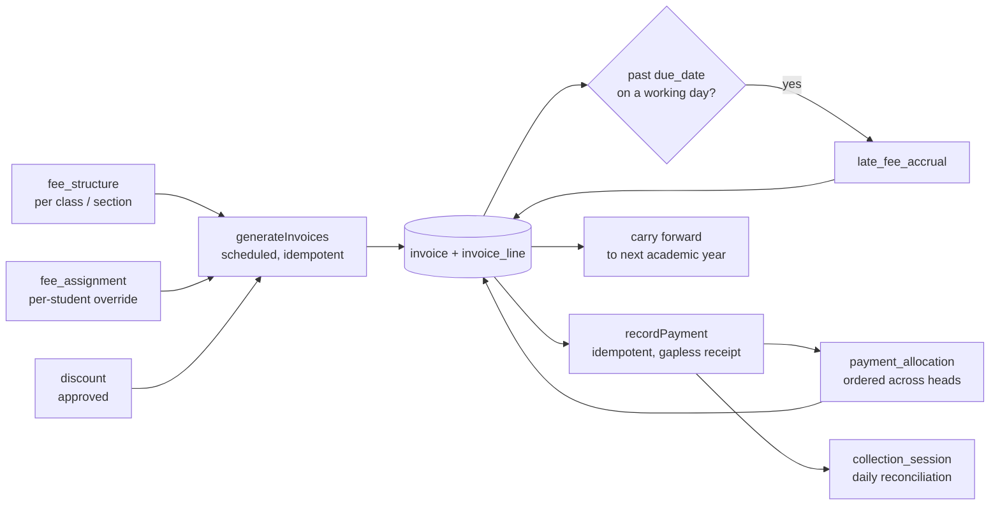
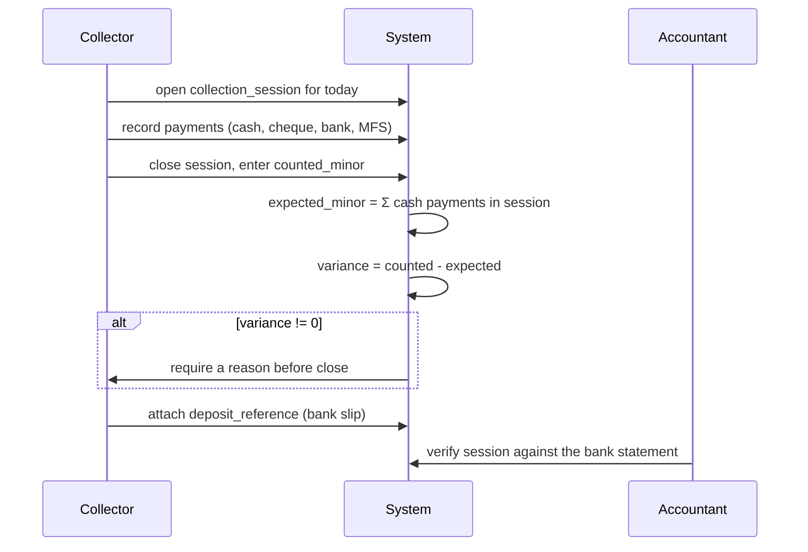
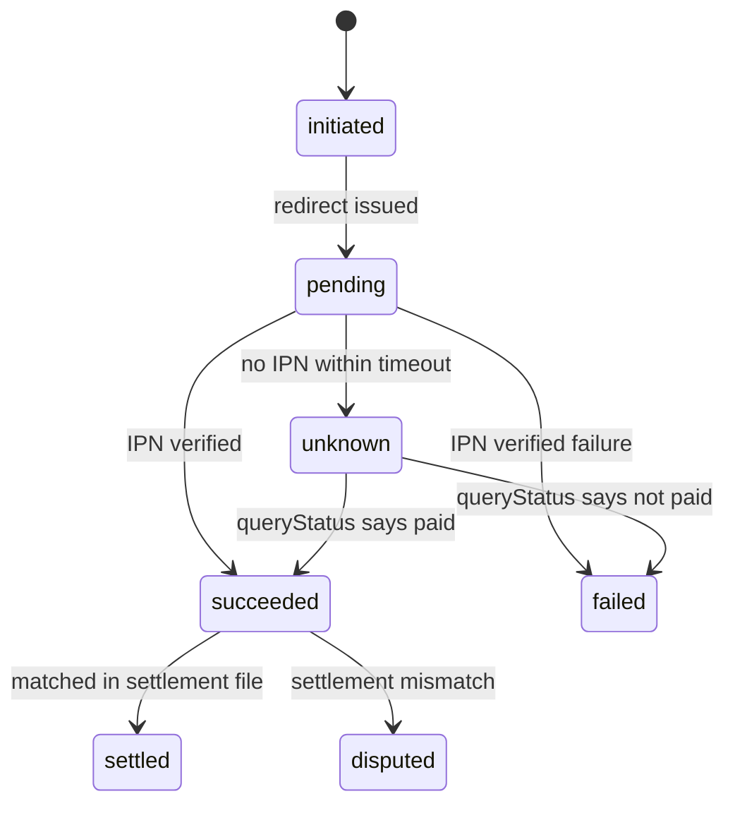

# 17. Fees and finance architecture

Treated with accounting rigour, not as CRUD. Money is `bigint` poisha
([ADR-0011](../adr/0011-money-representation.md)); nothing is hard-deleted;
corrections are reversing entries.

Two money flows exist and **never share a ledger**: schools collecting from
guardians (this section) and the platform collecting subscriptions from schools
([§37, Phase 1C](../README.md)).

## 17.1 The money lifecycle



## 17.2 Invoice generation

Runs as a scheduled job per school per billing period. **Idempotent and
re-runnable** — the single most important property, because it will be re-run
after a fee structure is corrected mid-month.

```
generateInvoices(school, period):
  for each active enrolment in the current academic year:
      heads = fee_structure for (class_level, section) ∪ fee_assignment overrides
      skip heads already invoiced for this (student, head, period)   # idempotency
      apply approved discounts valid on the period start
      create invoice + lines, status = 'issued'
      emit InvoiceGenerated
```

The skip is keyed `(tenant, student, fee_head, period_label)` with a unique
index, so a concurrent double-run cannot double-bill. This is enforced by the
database, not by the job's own bookkeeping.

**Withdrawn and on-leave students are excluded**, and the rule for on-leave is
per-tenant configuration — some schools continue charging tuition during a
medical leave, some do not.

## 17.3 Payment allocation

A guardian hands over ৳3,000 against ৳5,200 owed across four heads and three
months. Where does it go?

```ts
type AllocationOrder =
  | { kind: 'oldest_first' }                       // default
  | { kind: 'head_priority'; headIds: string[] }   // e.g. exam fee before transport
  | { kind: 'proportional' }
  | { kind: 'manual' };                            // collector chooses per line
```

Default is `oldest_first`, because arrears ageing is what the principal actually
tracks. `head_priority` matters where an admit card is gated on the exam fee
being clear — the school wants a partial payment to clear that head first.

Allocation runs in the payment transaction, produces `payment_allocation` rows,
and updates each invoice's `paid_minor` and status. The allocation must sum
exactly to the payment: enforced by a check in the use case and verified by a
nightly reconciliation query that alerts on any drift.

## 17.4 Gapless receipt numbering

```sql
BEGIN;
  SET LOCAL synchronous_commit = 'remote_write';   -- financial RPO 0, §4.5

  SELECT next_value FROM receipt_sequence
   WHERE tenant_id = $1 AND school_id = $2 AND fiscal_year = $3
     FOR UPDATE;                                    -- serialises issuance

  UPDATE receipt_sequence SET next_value = next_value + 1 WHERE ...;
  INSERT INTO payment (..., receipt_no) VALUES (..., $next);
  INSERT INTO payment_allocation ...;
  SELECT pg_boss.send('sms.payment_receipt', ...);  -- same transaction
COMMIT;
```

| Property | How |
|---|---|
| **Gapless** | The counter increments inside the same transaction as the insert. A rollback returns the number |
| Serialised per school | `FOR UPDATE` on one row. Concurrent collectors in the same school queue briefly |
| Fiscal year scoped | Configurable per school — academic year (Jan–Dec) or government fiscal year (Jul–Jun). [OQ-7](../phase-1a/13-open-questions.md) |
| Not a sequence object | PostgreSQL sequences are **not** gapless — they do not roll back. Using one here would be the classic mistake |

Serialisation is affordable: a school issues hundreds of receipts a day, not
thousands a second. Gaplessness is worth the lock because in this market a
missing serial number reads as theft, not as a database quirk.

## 17.5 Late fees

```ts
type LateFeeRule =
  | { kind: 'flat'; amountMinor: number }
  | { kind: 'per_day'; amountMinor: number; capMinor?: number }
  | { kind: 'per_month'; amountMinor: number; capMinor?: number }
  | { kind: 'percent'; percent: number; capMinor?: number };

interface LateFeePolicy {
  rule: LateFeeRule;
  graceDays: number;
  accrueOnNonWorkingDays: boolean;   // default FALSE — asks calendar
  waivableBy: Permission;            // 'fee.waive'
}
```

Accrual is a nightly job. `accrueOnNonWorkingDays: false` is the default and is
why `finance` depends on `calendar`: a school closed for a week should not charge
a week of late fees, and when a holiday is declared retroactively the accruals
for those days are **reversed**, not deleted
([§16.5](16-calendar-engine.md)).

Waivers are approved, reasoned and audited. A waived accrual keeps its row with
`waived_by` and `waive_reason` set — the total charged and the total waived are
both reportable, which is what an owner wants to see.

## 17.6 Arrears across academic years

The requirement that decides whether a principal buys the product
([§2.2](../phase-1a/02-domain-analysis.md)).

| Event | Behaviour |
|---|---|
| Year rolls over | Unpaid invoices are **not** closed. A carry-forward line is created on the new year's first invoice with `carried_forward_from_invoice_id` set |
| Student promoted | Dues follow the **student**, not the enrolment. Promotion never clears a balance |
| Student transferred between sections/campuses | Balance unaffected |
| Student withdrawn | Configurable per tenant: settle, write off with approval, or retain as outstanding. Emits from `StudentWithdrawn` |
| Student becomes alumni | Outstanding balance retained and reportable; no further invoices generated |
| Opening dues imported | Written as a carry-forward invoice with `source = 'import'`, so imported and system-generated arrears are the same shape ([§25](25-data-import.md)) |

The ledger is keyed to `student_id`, not `enrolment_id`. That single choice is
what makes multi-year arrears work; keying to enrolment would orphan every
balance at promotion.

## 17.7 Daily collection reconciliation



Variance is recorded, never silently absorbed. A ৳50 shortfall with a reason is
an operational fact; a ৳50 shortfall that the system rounds away is how trust in
every report is lost.

Non-cash channels are reconciled separately: cheques on clearance, bank deposits
against the statement, MFS against the provider's settlement file.

## 17.8 Refunds, reversals and backdating

| Operation | Mechanism |
|---|---|
| Refund | A new `payment` row with the opposite sign relationship via `reversed_by_payment_id`, its own receipt number, requiring `fee.refund` |
| Cancel a wrong receipt | Reversal, not deletion. The original receipt number stays consumed — that is what "gapless" means |
| Backdated entry | Permitted, audited. `collected_at` is the business date; `recorded_at` is when it was typed. Reports use `collected_at`; the audit uses both |
| Backdating limit | Configurable per tenant — beyond N days requires `fee.waive`-level approval |
| Write-off | An adjustment with approval and reason; never a deletion |

## 17.9 Payment provider abstraction (P2)

The provider is not the hard part. The **lost callback** is.

```ts
interface PaymentProvider {
  readonly code: 'sslcommerz' | 'bkash' | 'nagad' | 'aamarpay' | 'shurjopay';
  createSession(req: ChargeRequest): Promise<{ redirectUrl: string; providerRef: string }>;
  verifySignature(raw: string, headers: Headers): boolean;
  parseCallback(raw: string): ProviderEvent;
  queryStatus(providerRef: string): Promise<ProviderStatus>;   // the repair path
  refund(providerRef: string, amount: Money): Promise<RefundResult>;
  parseSettlementFile(csv: Buffer): SettlementRow[];
}
```

`queryStatus` is the method that matters most, and the one that is easy to skip
when integrating the happy path.

### State machine



`unknown` is a first-class state, not an error. It is where "money taken,
callback lost" lives, and it is resolved by a reconciliation job that calls
`queryStatus` for every `pending` transaction older than the timeout, then by a
settlement-file match, then — if both fail — by a **manual repair workflow** with
approval and audit.

### Webhook handling rules

| Rule | Why |
|---|---|
| Verify the signature **before** parsing | An unverified payload is attacker-controlled input |
| `UNIQUE (provider, provider_ref, event_type)` on `payment_gateway_event` | The unique index **is** the replay protection. A duplicate IPN conflicts and is ignored |
| Store the raw payload | Disputes are settled by what the provider actually sent |
| Respond 200 fast, process asynchronously | Providers retry aggressively on slow responses, multiplying load |
| Never trust the amount in the callback alone | Cross-check against the initiated charge |
| Idempotent application | Applying the same event twice must not create two payments |

Only after all of that does a verified `succeeded` event flow into the ordinary
`recordPayment` path — so an online payment and a cash payment produce the same
receipt, the same allocation and the same audit trail.

## 17.10 Reports this module must serve

| Report | Consumer | Note |
|---|---|---|
| Daily collection | Accountant, principal | By collector, by channel, by head |
| Outstanding dues | Principal | Aged buckets; the headline number |
| Defaulter list | Office | Filterable by class/section; drives SMS campaigns |
| Head-wise collection | Owner | Tuition vs exam vs transport |
| Discount and waiver register | Owner, audit | Who approved what, and why |
| Reconciliation variance | Accountant | Sessions with non-zero variance |
| Refunds and reversals | Audit | Every negative movement |

All read-through [`reporting`](26-reporting-data-path.md), which points at the
replica.

## 17.11 The upgrade path to double-entry

Not built now (FR-8.17), but not foreclosed. Every row that moves money is
immutable-with-reversal and carries an optional `gl_code`. A `ledger_entry` table
can therefore be **derived** for any historical period, because no information
has been destroyed.

Had rows been mutated in place — a payment edited, an invoice recalculated — that
derivation would be impossible and adopting double-entry would mean starting the
books from a cut-off date. That is the reason for the immutability discipline,
stated once so it is not mistaken for ceremony.

**Revisit when** a tenant needs a trial balance or a statutory audit, or when the
platform starts holding funds on a school's behalf.
