# 18. Notification and communication architecture

SMS is the primary interface for the largest user group. Email and push are
secondary in this market and are designed for, not depended on
([§2.4](../phase-1a/02-domain-analysis.md)).

Two things make this module harder than it looks: **Bangla SMS costs 3× what
authors expect**, and **siblings share a phone**.

## 18.1 Pipeline

```mermaid
flowchart LR
    ev["domain event<br/>or campaign"] --> aud["resolve audience<br/>class / section / individual"]
    aud --> pref["apply channel preference<br/>+ suppression list"]
    pref --> dedup["deduplicate by<br/>resolved recipient"]
    dedup --> tpl["render template<br/>per recipient locale"]
    tpl --> cost["count segments<br/>check tenant budget"]
    cost --> q[["queue: notification_message"]]
    q --> disp["dispatch worker<br/>rate-shaped"]
    disp --> prov["provider adapter"]
    prov -.->|"delivery report"| st["update status"]
```



Every stage is separable and every message row persists, so "did this guardian
get the result SMS?" is answerable with one query. That question is asked
constantly in support.

## 18.2 Bangla SMS economics

| Encoding | Chars per segment | Typical use |
|---|---|---|
| GSM-7 (Latin) | 160 (153 concatenated) | English templates |
| **UCS-2 (Bangla)** | **70 (67 concatenated)** | Every Bangla message |

A 200-character Bangla notice is **3 segments**. Sent to 400 guardians that is
1,200 billed messages, not 400. An author who does not see this before pressing
send will produce the tenant's top complaint and the platform's top support
burden.

Therefore:

- The composer shows **live segment count, recipient count and estimated cost**
  as the author types, in the same way a character counter works — not on a
  confirmation screen afterwards.
- `notification_campaign` stores `estimated_segments` and
  `estimated_cost_minor` at authoring time; the actual cost is summed from
  `notification_message.cost_minor` after dispatch, and the two are compared in
  the SMS spend report.
- Templates are linted: a Bangla template whose rendered length crosses a
  segment boundary for typical variable values raises a warning at save time.
- Mixed Bangla and Latin in one message is UCS-2 for the whole message. Writing
  "Result published: ৳" in an otherwise English template triples its cost, so
  the linter flags stray Bangla characters in `en` templates.

## 18.3 Deduplication

Siblings share a guardian phone. Two absent siblings must produce **one** SMS.

```
dedup_key = hash(tenant, event_type, business_date, resolved_phone)
```

`notification_message.dedup_key` has a partial unique index over undelivered
rows. The second insert conflicts and is dropped, and the surviving message uses
a template variant that names both children:

> আপনার সন্তান রাহিম ও সাদিয়া আজ অনুপস্থিত ছিল।

This is a template-selection decision made after audience resolution, not a
string concatenation at send time — the plural form differs and Bangla
pluralisation is not English pluralisation.

Dedup applies to absence alerts, result notifications and fee reminders. It
deliberately does **not** apply to per-student documents like an admit card
link, where two children need two distinct links.

## 18.4 Budget, credits and throttling

| Control | Behaviour |
|---|---|
| `sms_credit_ledger` | Per-tenant balance, debited on dispatch, credited on top-up |
| Low-balance alert | At a configurable threshold, to tenant owner and platform operator |
| Hard cap | Plan-derived monthly ceiling. Dispatch **refuses** past it — no overdraft |
| Per-campaign confirmation | Above a cost threshold, requires `sms.budget.manage` |
| Rate shaping | Global and per-tenant messages/second caps |
| Failure budget | If provider failure rate exceeds a threshold, pause and alert rather than burning credits |

Refusing rather than overdrafting is deliberate. A school that discovers a
৳40,000 SMS bill it did not authorise will not renew, and recovering the money is
worse than not sending the messages.

## 18.5 Rate shaping and the result-publication spike

The single most important operational lever in the platform
([§4.3](../phase-1a/04-non-functional-requirements.md)).

```ts
interface DispatchPolicy {
  messagesPerSecond: number;        // provider-permitting
  spreadOverMinutes?: number;       // results: 30–90
  priority: 'transactional' | 'bulk';
  quietHours?: { fromHour: number; toHour: number };  // Asia/Dhaka
}
```

| Class | Policy |
|---|---|
| OTP | `transactional`, immediate, never queued behind bulk |
| Payment receipt | `transactional`, immediate |
| Absence alert | `bulk`, batched after the attendance window closes |
| **Result publication** | `bulk`, **spread over 30–90 minutes** |
| Fee reminder campaign | `bulk`, respects quiet hours |
| Notice / announcement | `bulk`, schedulable |

Transactional and bulk use **separate queues with separate worker concurrency**,
so a 20,000-message result fan-out cannot delay a login OTP. That is the
difference between a slow evening and users unable to sign in.

Quiet hours default to 21:00–08:00 Asia/Dhaka for bulk. An SMS at 23:00 is a
complaint regardless of its content.

## 18.6 Provider abstraction

```ts
interface SmsProvider {
  readonly code: string;
  send(msg: OutboundSms): Promise<{ providerRef: string; segments: number }>;
  sendBatch(msgs: OutboundSms[]): Promise<BatchResult>;
  parseDeliveryReport(raw: unknown): DeliveryReport[];
  balance?(): Promise<Money>;
}
```

At least two Bangladeshi providers implemented, selectable per tenant and
failover-capable. Rationale: **BTRC masked-sender approval is a per-provider,
per-sender-id process with an unpredictable lead time**
([OQ-5](../phase-1a/13-open-questions.md)), and a tenant blocked on one
provider's approval can ship on another.

Provider concerns kept out of the domain: sender id, template pre-registration
where required, segment accounting differences, and delivery-report formats —
which are all different and none of which the notification domain should know.

**Start the masked-sender process in week one**, before the product is finished.
It is the longest-lead external dependency in the project.

## 18.7 Templates and localisation

```
notification_template (code, channel, locale, body, variables, version)
```

- Keyed `(code, channel, locale)`. Missing `bn` falls back to `en` with a
  warning surfaced in the localisation QA report ([§22](22-i18n-architecture.md)).
- Variables are declared and validated: rendering with an unknown variable fails
  at save time, not at send time to 400 guardians.
- Versioned. `notification_message` records the template version used, so a
  message can always be explained.
- Platform-provided defaults (`tenant_id NULL`) that a tenant may override.

Variable set is deliberately small and safe: student name, class, section, date,
amount, due date, exam name, school name. **No free-form interpolation of
arbitrary record fields** — that is how PII ends up in a message to the wrong
recipient.

## 18.8 Audience targeting

```ts
type Audience =
  | { kind: 'section'; sectionIds: string[] }
  | { kind: 'class'; classLevelIds: string[] }
  | { kind: 'shift'; shiftId: string }
  | { kind: 'status'; studentStatus: StudentStatus }
  | { kind: 'defaulters'; minOutstandingMinor: number; asOf: LocalDate }
  | { kind: 'individual'; studentIds: string[] }
  | { kind: 'staff'; roleIds: string[] };
```

Resolved to recipients at **dispatch time**, not authoring time, so a campaign
scheduled for Thursday reaches Thursday's actual defaulter list. The resolved
recipient set is snapshotted onto the campaign for auditability.

Recipient resolution respects `guardian_link.is_primary_contact` and
`can_receive_results` — a guardian flagged not to receive results does not
receive them, regardless of audience ([§11.4](../phase-1a/11-entity-model.md)).

## 18.9 Delivery reports and status

| Status | Meaning |
|---|---|
| `queued` | Accepted, not yet dispatched |
| `sent` | Handed to the provider |
| `delivered` | Handset confirmed via delivery report |
| `failed` | Provider or handset rejected; reason recorded |
| `suppressed` | Opt-out, invalid number, or dedup |

Delivery reports arrive asynchronously and are ingested by an endpoint keyed on
`provider_ref`. Persistent failures for a number (invalid, switched off for
weeks) increment a counter and eventually add it to `notification_suppression`,
with the school notified so they can correct the record — a wrong phone number in
the student file is a data problem, not a messaging problem.

## 18.10 Opt-out

Guardians may opt out of `bulk` categories. They may **not** opt out of
transactional messages tied to their own child — payment receipts, OTPs, result
availability — because those are the school discharging an obligation, not
marketing.

Opt-out is per (tenant, channel, value) so a guardian with children at two
schools can silence one without the other.

## 18.11 Email and in-app

**Email** is staff-facing: invites, password resets, report deliveries, platform
invoices. Same template and rendering pipeline, different adapter. Delivery is
not assumed — anything critical that goes by email also has an in-app or SMS
path.

**In-app notices** are the cheapest channel and the only one with no marginal
cost. Notices and announcements render in the app and are also the fallback
surface when a tenant's SMS budget is exhausted.

**Web push** is P2 and useful mainly for staff on desktop. Guardian push
requires an installed PWA and reliable service workers on low-end Android, which
is not a dependency worth taking ([§27](27-mobile-offline.md)).
