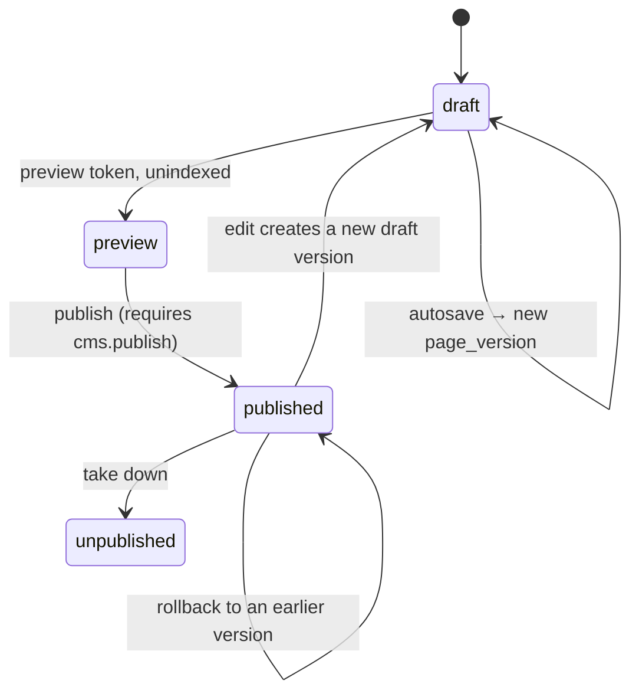

# 21. Puck CMS architecture

**Status: Phase 2.** Not in the MVP ([§1](../phase-1a/01-executive-summary.md)) —
schools do not change vendors for a website builder. Designed now so the data
model and routing do not preclude it, and so nothing built in the MVP has to be
undone.

## 21.1 What it is for

A tenant-authored public site: home, about, admission, notices, FAQ, contact,
results announcement, teacher list. Today most target schools have either no
website or an abandoned one. The value is that the site is **fed by live data** —
notices, exam routines and admission dates come from the same tables the school
already maintains, rather than being retyped.

That is also the architectural constraint: CMS pages compose **blocks that read
tenant data**, not just static text.

## 21.2 Content model

```sql
page (id, tenant_id, slug, locale, title, status CHECK IN ('draft','published'),
      seo jsonb, published_at, published_by)
page_version (id, tenant_id, page_id, version, puck_data jsonb,
              created_by, created_at, note)
  -- Puck's document IS the version payload. No parallel block tables.
page_alias (tenant_id, from_slug, to_page_id)     -- renames keep old URLs alive
media (id, tenant_id, storage_key, mime, width, height, alt_bn, alt_en,
       size_bytes, uploaded_by)
```

Storing Puck's document as `jsonb` in `page_version` rather than shredding it
into per-block rows is deliberate: the editor owns the document shape, and a
schema that mirrors it would need migrating every time a block gains a field.
Queries against page content are not a requirement; rendering is.

Slugs are **per locale**, so `/admission` and `/ভর্তি` are distinct rows for the
same logical page, linked by a shared `page_group_id`. Localised slugs matter for
search in Bangla.

## 21.3 Block library

Two categories, and the split is the interesting part.

| Static blocks | Data-bound blocks |
|---|---|
| Hero, RichText, ImageGallery, Accordion/FAQ, ContactForm, MapEmbed, CTA | **NoticeList**, **ExamRoutine**, **AdmissionDates**, **ResultLookup**, **StaffDirectory**, **FeeStructureTable**, **AcademicCalendar** |

Data-bound blocks are configured, not authored: `NoticeList` takes a category and
a count, then renders live rows through a **read-only, public projection** of the
tenant's data. They never accept a query from the editor.

```ts
// Every data-bound block resolves through a narrow, audited surface.
interface PublicProjection {
  notices(tenantId, opts): Promise<PublicNotice[]>;
  examRoutine(tenantId, classLevelId): Promise<PublicRoutineRow[]>;
  staffDirectory(tenantId): Promise<PublicStaff[]>;   // name + designation only
  lookupResult(tenantId, examId, token): Promise<PublicResult | null>;
}
```

`PublicStaff` returning name and designation only is the shape of the whole
approach: **the projection decides what is public**, and it is a hand-written
allowlist rather than a filter over full records.

## 21.4 The security boundary

Tenant-authored content rendered on a tenant subdomain is the largest untrusted-
input surface in the platform. Rules:

| Rule | Reason |
|---|---|
| **No raw HTML block.** Rich text is a constrained schema, sanitised on save *and* on render | A raw-HTML block is a stored-XSS feature request |
| No script embeds, no iframes except an allowlist (maps, video) | Same |
| Strict CSP per tenant site, no `unsafe-inline` | Defence in depth |
| Public pages served from a **separate route group with no session cookie access** | A CMS page cannot read a staff session |
| Media validated on upload: MIME sniffing, re-encode images, strip EXIF | EXIF on a student photo carries GPS |
| Data-bound blocks read only `PublicProjection` | Never the tenant's tables directly |
| Contact-form submissions are rate-limited, captcha-gated and stored, never emailed raw | Open relay prevention |

The load-bearing decision is the second-to-last: a CMS block physically cannot
reach a student record, because the only interface available to it does not
expose one.

## 21.5 Routing and serving

```
<slug>.sm.example.com/            → tenant public site (unauthenticated)
<slug>.sm.example.com/app/…       → the authenticated application
<custom-domain>/                  → tenant public site (P2)
```

| Concern | Approach |
|---|---|
| Resolution | Middleware maps host → tenant, same as the app ([§7.3](../phase-1a/07-multi-tenancy.md)) |
| Rendering | Static generation per page version, revalidated on publish |
| Caching | Cloudflare edge cache keyed by host + path + locale |
| Invalidation | Publish emits `PagePublished`; a targeted purge follows. Data-bound blocks additionally revalidate on a short TTL |
| Custom domains | P2: verification by DNS TXT, certificates via Cloudflare for SaaS or Caddy on-demand TLS |
| Suspended tenant | Public site returns a neutral holding page, not an error — the school's parents are not party to a billing dispute |

Public pages are the **only** part of the platform served from cache without a
session, which makes them the cheapest traffic in the system and the right place
to absorb an admission-season spike.

## 21.6 Editing workflow



Every save is a new `page_version`, so rollback is selecting an older row. Puck
supplies the editing canvas; the platform supplies versioning, permissions,
preview tokens and publication — which is the correct division and the reason
Puck is a good fit rather than a framework to fight.

## 21.7 SEO and localisation

- Per-page title, description, OG image, canonical
- `hreflang` between `en` and `bn` variants via `page_group_id`
- Sitemap generated per tenant, robots per tenant status
- Structured data for `School` and `Event` where the data-bound blocks supply it
- Bangla slugs kept as Unicode, not transliterated — Bangla search queries match
  Bangla slugs

## 21.8 Why this is deferred, restated

The MVP question is "will a principal pay for this in month one?" — and the
answer is no. But the **cost of designing it now is one page**, and the cost of
*not* designing it is that the public-projection boundary gets invented in a
hurry later, probably by exposing a real query interface to a template. That is
the mistake this section exists to prevent.

**Build when:** twenty tenants are live and retention conversations mention the
school website, or a sales conversation is lost over it.
