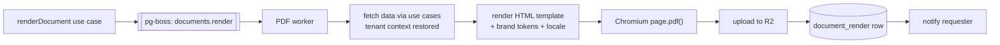

# 24. Documents, PDF and Bangla typography

Report cards, marksheets, tabulation sheets, admit cards, ID cards, money
receipts, certificates and transfer certificates. To the buyer, **these
artefacts are the product** ([§2.1](../phase-1a/02-domain-analysis.md)).

Engine: **headless Chromium with pinned Noto Bengali fonts**
([ADR-0009](../adr/0009-pdf-rendering.md)).

## 24.1 Why this is a correctness problem

Bangla requires OpenType shaping. A shaping engine reorders and substitutes
glyphs; a naive PDF library places code points left to right.

| Feature | Example | Naive output |
|---|---|---|
| Conjunct (যুক্তাক্ষর) | ক্ষ = ক + ্ + ষ | ক্ ষ — visibly broken |
| Ya-phala | ব্য | ব ্ য |
| Reph | র্ক — the ra rides **above the following** consonant | ্র ক — wrong order |
| Matra reordering | কি — the vowel sign renders **before** its consonant | ক ি |
| Hasant clusters | স্ত্র | three separate glyphs |

`pdfmake`, `PDFKit` and `jsPDF` do none of this. Output is not "slightly off" —
it is wrong in a way every Bangladeshi reader notices immediately, on the
document a parent keeps.

**[OQ-12](../phase-1a/13-open-questions.md) is the week-one spike** that proves
the chosen stack handles all five rows above at print resolution, in the
container, with the pinned fonts.

## 24.2 Pipeline



Rendering is **always a job**, never inline with a request. A report card batch
is minutes of work, and Chromium's memory profile must not sit inside the web
process.

The worker restores tenant context from the job payload and reads through the
same use cases as the app — so a document cannot contain data the requester was
not entitled to see.

## 24.3 Templates

```sql
document_template (id, tenant_id NULL, code, kind, name,
                   body_html, styles_css, page_size, version, is_active)
```

- **HTML + CSS**, using the same layer-2 and brand tokens as the app
  ([§23.3](23-theme-branding.md)). A school's colour appears on its report card
  with no separate configuration.
- `tenant_id NULL` rows are platform defaults; a tenant row overrides by `code`.
- Versioned, and `document_render` records the version used — a reprint two years
  later reproduces the original layout, not the current one.
- Rendered with a **restricted template syntax over a typed context**, not
  arbitrary code. Templates are tenant-authored content and get the same
  treatment as CMS blocks ([§21.4](21-cms-architecture.md)): no scripts, no
  network access, no data reachable beyond the supplied context.

Context is explicit per document kind:

```ts
interface ReportCardContext {
  school: { nameBn; nameEn; address; logoUrl; eiin };
  student: { nameBn; nameEn; roll; className; sectionName; photoUrl };
  exam:    { nameBn; nameEn; academicYear };
  subjects: Array<{
    nameBn; nameEn;
    components: Array<{ name; obtained: string | 'AB' | 'EX'; full: string }>;
    total: string; grade: string; gradePoint?: string; passed: boolean;
  }>;
  summary: { totalMarks; percent; gpa?; position?; result: 'PASS'|'FAIL' };
  attendance: { present: number; workingDays: number };   // from working_day
  competencies?: Array<{ statement; level }>;              // KG / descriptive
  numerals: 'bn' | 'latin';
}
```

Note `obtained` is `string | 'AB' | 'EX'`. The absent state travels all the way
to the template, so the report card prints **AB**, never 0
([§15.3](15-assessment-engine.md)). A context typed as `number` would have
destroyed that distinction at the last step.

## 24.4 Fonts

| Rule | Reason |
|---|---|
| **Pinned by version, baked into the worker image** | A font update that changes shaping would silently alter every future document |
| Never fetched at render time | A failed fetch at 23:00 during a batch produces boxes |
| Same font files as the web app | Preview and print cannot diverge |
| `@font-face` with `local()` disabled | The host's fonts must never be substituted |
| Fallback chain contains only Bangla-capable faces | A Latin fallback renders boxes, not an approximation |

Fonts: Noto Serif Bengali (display and documents), Noto Sans Bengali (body),
with Latin companions ([§22.4](22-i18n-architecture.md)).

## 24.5 The golden-image test

The mechanism that keeps 24.1 true over time. Runs in CI on every change to the
renderer, the fonts, the templates or the container image.

```
fixtures/bangla-shaping.html   contains, at minimum:
  ক্ষ  ব্য  র্ক  কি  স্ত্র  ঞ্জ  ন্ত্র      conjuncts, ya-phala, reph, matra, clusters
  ০১২৩৪৫৬৭৮৯                                Bangla numerals
  "Class 5 — পঞ্চম শ্রেণি"                   mixed script on one line
  a long Bangla name in a narrow column     wrapping and line-breaking
  ৳১,২৩,৪৫৬.৭৮                              currency with Indic grouping
```

Rendered to PNG, compared pixel-wise against a committed reference with a small
tolerance. A font bump, a Chromium bump or a CSS change that alters shaping
**fails the build** rather than reaching a parent.

Indic digit grouping (`১,২৩,৪৫৬` — lakh/crore, not thousands) is in the fixture
because it is a formatting bug that looks like a typo and survives review.

## 24.6 Batch generation

| Concern | Approach |
|---|---|
| Chunking | ~50 documents per job; a section at a time |
| Page pool | Fixed number of Chromium pages, recycled; the browser restarts every N documents to cap memory |
| Concurrency | Bounded per tenant, so one school's 500-card batch cannot starve another ([§7.4](../phase-1a/07-multi-tenancy.md)) |
| Progress | Per-chunk, visible to the requester |
| Resumability | Completed chunks are not re-rendered on retry |
| Output | Individual PDFs plus an optional merged file for printing |
| Target | ≥ 500 report cards in ≤ 10 minutes ([§4.1](../phase-1a/04-non-functional-requirements.md)) |

Memory is the constraint being managed here, and [OQ-13](../phase-1a/13-open-questions.md)
measures it. If it destabilises the host, the renderer moves to its own machine —
it is already a separate process with a queue in front
([§6.6](../phase-1a/06-architecture-overview.md)).

## 24.7 Document kinds

| Document | Trigger | Notes |
|---|---|---|
| **Money receipt** | On payment | Printed at the counter. Amount in words in Bangla. Never regenerated with a new number |
| **Report card** | Result publication | The flagship artefact. Per-school layout |
| **Marksheet** | Per student, per exam | Subject and component detail |
| **Tabulation sheet** | Marks locked | Wide landscape grid; the exam controller's working document |
| **Admit card** | Exam scheduled | Optionally gated on fee clearance |
| ID card | Admission, annually | P2. Photo, tenant branding, barcode |
| Transfer certificate, testimonial | On request | P2. Requires alumni data years later — hence the archival policy in [§10.8](../phase-1a/10-database-architecture.md) |

## 24.8 Storage and retention

| Rule | Detail |
|---|---|
| Stored in R2 under `tenant/<id>/documents/…` | Private bucket, signed URLs only ([ADR-0015](../adr/0015-object-storage.md)) |
| Authorization before signing | Always. The URL is the last step, never the check |
| Receipts | Retained for the tenant's full retention period. Never regenerated with a new number — a reprint reproduces the original |
| Report cards | Retained; regenerable from the immutable `result_snapshot` |
| Bulk exports | Expire after 7 days |
| Signed URL lifetime | Minutes |
| Tenant offboarding | Included in the export bundle, then deleted per SLA |

Because report cards regenerate deterministically from an immutable snapshot,
storage is an optimisation rather than a system of record — which keeps the
retention policy simple and the storage bill small.

## 24.9 Print fidelity

- A4 default; receipt roll format supported; margins configurable per template
- `@page` rules for size, margins and orientation; tabulation sheets are landscape
- Explicit page-break control — a student's subject block never splits across pages
- Repeating table headers on multi-page tabulation sheets
- Backgrounds print only where intended (`print-color-adjust: exact` on the
  header band, off elsewhere) — schools print on cheap lasers and a full-bleed
  background is a toner complaint
- **The same HTML renders in the browser print view**
  ([§20.10](20-frontend-architecture.md)), so what staff see and what downloads
  cannot diverge
