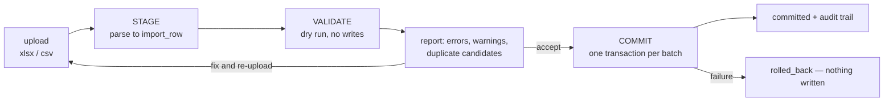

# 25. Data import and migration architecture

An **MVP capability**, not a later phase. A school arriving in December brings
Excel files and expects them loaded before January, and the switching window is
annual ([§2.3](../phase-1a/02-domain-analysis.md)). Import quality decides
whether onboarding takes two days or three weeks — which, at 1–2 people, decides
how many schools can be onboarded per season.

## 25.1 Three-phase model



Staging is not an optimisation. It is what lets the operator sit with a school's
office manager, run the file, show them 43 problems, fix them together, and re-run
— without ever having written a partial record into the live system.

| Phase | Writes | Reversible |
|---|---|---|
| Stage | `import_row` only | Delete the batch |
| Validate | Nothing | n/a |
| Commit | Real entities, in one transaction | By compensating batch action |

## 25.2 Templates

Downloadable XLSX per kind, with a header row, an example row, and per-column
data validation built into the sheet.

| Kind | Key columns | Note |
|---|---|---|
| Students | student_code, name_bn, name_en, dob, gender, class, section, roll | Class/section matched by name, created only if the operator opts in |
| Guardians | student_code, relationship, name_bn, name_en, phone, is_billing, is_primary_contact | Multiple rows per student |
| Staff | employee_code, name_bn, name_en, designation, phone, joining_date | |
| Fee structure | class, fee_head, amount, frequency, due_day | |
| **Opening dues** | student_code, fee_head, period_label, amount_outstanding | **The row everyone forgets** |
| Historical results | student_code, exam, subject, component, marks | P2 |

**Opening dues is the entry that blocks go-live.** A school switching in December
carries arrears from the old system; without importing them, every fee report is
wrong from day one and the principal loses confidence in the product in week one.
It is imported as carry-forward invoices with `source = 'import'`, so imported and
system-generated arrears are structurally identical
([§17.6](17-finance-architecture.md)).

Templates accept **both Bangla and English** column values where the domain has
both, and always Latin digits for numbers and dates
([§22.3](22-i18n-architecture.md)).

## 25.3 Validation

Three tiers, reported together so the office manager fixes everything in one pass
rather than discovering problems serially.

| Tier | Blocks commit? | Examples |
|---|---|---|
| **Error** | Yes | Missing required column; unparseable date; amount not a number; unknown fee head; duplicate `student_code` within the file |
| **Warning** | No — requires acknowledgement | Possible duplicate of an existing person; phone shared with an unrelated student; roll number gap; dob implying an unusual age for the class |
| **Info** | No | New section will be created; 12 rows use a default value |

Errors are reported **per cell**, localised, with the row number and the original
value:

```jsonc
{ "row": 47, "column": "dob", "value": "৩১/০২/২০১৮",
  "code": "INVALID_DATE",
  "message": "৩১/০২/২০১৮ — ফেব্রুয়ারি মাসে ৩১ তারিখ নেই" }
```

The rendered report is downloadable as an annotated copy of the original
spreadsheet with a comment on each bad cell — because the person fixing it works
in Excel, not in the app.

## 25.4 Duplicate detection

Runs during validation, against existing records **and** within the file.

| Signal | Weight |
|---|---|
| Birth registration number exact | Decisive |
| Normalised phone on a guardian link + same dob | High |
| Date of birth exact + trigram similarity on `name_bn` > 0.6 | High |
| Trigram on transliteration-normalised Latin key | Medium |
| Same section and academic year | Medium |

Transliteration normalisation folds the common variants before comparison:

```
মোহাম্মদ / মুহাম্মদ  ↔  Mohammad, Mohammed, Muhammad, Md., Md, Mohd
আবদুল / আব্দুল       ↔  Abdul, Abdool
রহমান                ↔  Rahman, Rehman, Rohman
```

plus honorific stripping, whitespace collapsing and NFC normalisation
([§22.5](22-i18n-architecture.md)).

It will not be perfect, which is why the output is a **review queue with a
suggested action**, never an automatic merge. Merging is a separate, audited,
reversible operation ([§8.6](../phase-1a/08-identity-authn-rbac.md)) — and merging
two students merges their dues, so it requires `fee.read` and explicit
confirmation.

## 25.5 Commit

| Property | Mechanism |
|---|---|
| All-or-nothing per batch | One transaction. A batch is chunked only if it exceeds the size ceiling, and then each chunk is its own atomic batch with a shared `import_batch` parent |
| Idempotent | The commit endpoint takes an `Idempotency-Key`; a re-submitted batch replays its original result |
| Ids known in advance | ULIDs generated during staging, so the full object graph — student, guardians, enrolment, opening dues — is built and cross-referenced before any write ([ADR-0016](../adr/0016-identifier-strategy.md)) |
| Ceiling | 5,000 rows / 20 MB per batch ([§4.1](../phase-1a/04-non-functional-requirements.md)) |
| Per-tenant concurrency | Capped, chunked and re-enqueued so an import cannot starve interactive work ([§7.4](../phase-1a/07-multi-tenancy.md)) |
| Audit | `import_row.target_id` records what each row became; `import_batch` records who, when and with which file |

**Undo.** Because every created entity is linked back to its `import_row`, a
committed batch can be reversed by a compensating action that soft-deletes what
it created — provided nothing has since been built on top of it. The check for
"has this been used?" (a payment against an imported invoice, a mark against an
imported student) is part of the undo, and a blocked undo explains which rows
prevent it.

## 25.6 Photos and documents

Bulk photo upload is a ZIP whose filenames match `student_code`
([OQ-10](../phase-1a/13-open-questions.md)). Unmatched files are reported rather
than dropped. Images are re-encoded, EXIF stripped and resized on ingest
([ADR-0015](../adr/0015-object-storage.md)).

## 25.7 Export

The mirror of import, and it serves three separate purposes — which is why it is
one mechanism rather than three:

| Purpose | Requirement |
|---|---|
| **Tenant offboarding** (FR-1.10) | Complete, open format, ≤ 72 h SLA |
| **Single-tenant backup/restore** ([§7.5](../phase-1a/07-multi-tenancy.md)) | Same code path, exercised continuously rather than only in emergencies |
| Routine data export | Per-entity CSV for the school's own use |

Format: a ZIP of CSVs, one per entity, plus `manifest.json` recording schema
version, row counts, export timestamp and a checksum. CSV headers are **English
only** — the file is opened in Excel and often re-imported, and stable headers
matter more than localisation ([§22.6](22-i18n-architecture.md)).

Documents and photos are included by reference in the manifest with a signed
download bundle, so the export is not a multi-gigabyte single file.

That the offboarding export and the emergency restore path are the same code is
deliberate: an export routine only exercised during offboarding is one nobody
has tested when it is actually needed.

## 25.8 What import deliberately does not do

| Not supported | Reason |
|---|---|
| Direct database-to-database migration from a competitor | Every incumbent is different; a spreadsheet export is the universal interface |
| Automatic merge of detected duplicates | Merging students merges dues. Always a human decision |
| Partial commit of a validated batch | Half-imported cohorts are worse than none. Fix the file and re-run |
| Import into a closed academic year | Blocked; reopen the year explicitly, with audit |
| Import while a tenant is suspended | Read-only means read-only |
