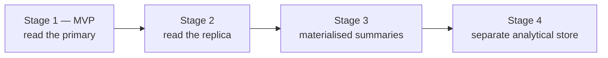

# 26. Reporting and analytics data path

The brief asks for an explicit decision on where reports read from, **with the
trigger metric for moving between stages**. This section gives the staged path
rather than jumping to a warehouse nobody has time to operate.

## 26.1 The staged path



| Stage | What | Trigger to move on | Cost |
|---|---|---|---|
| **1. Primary** | Reports query the primary with `statement_timeout` and keyset pagination | Report queries exceed **10% of primary CPU**, or any interactive p95 degrades during report runs | Zero |
| **2. Replica** | `reporting` module points at the streaming replica that already exists for financial durability ([§4.5](../phase-1a/04-non-functional-requirements.md)) | Replica lag during report runs exceeds **30 s**, or a single report exceeds **60 s** | Zero — the replica exists anyway |
| **3. Materialised summaries** | Nightly rollups: daily collection, monthly attendance, exam aggregates | Rollup maintenance exceeds ~2 h nightly, or ad-hoc analytical questions become routine | Low |
| **4. Analytical store** | ClickHouse/DuckDB or a warehouse, fed by CDC or nightly export | — | High: an ETL pipeline is a system that breaks silently, and there is nobody to watch it |

**Start at stage 1 and move only on the trigger.** At 100 schools the entire
database fits comfortably in RAM on the target host; a warehouse would add an
operational burden with no query it could answer faster.

Stage 2 is nearly free and is the expected home for most of year one. It is worth
noting that the replica was justified by *financial durability*, and reporting is
a second return on the same US$5–8/month.

## 26.2 Report execution model

Two classes, decided by a measured threshold rather than by guesswork.

| Class | Budget | Delivery |
|---|---|---|
| **Interactive** | ≤ 3 s | Rendered in the page, server component |
| **Background** | ≤ 5 min | pg-boss job → file in R2 → in-app + optional SMS/email notification |

```
runReport(def, params, ctx):
    if def.estimatedRows(params) > INTERACTIVE_ROW_LIMIT      # ~5,000
       or def.class == 'background':
        enqueue reports.generate ; return { jobId }
    else:
        return execute against the replica, with statement_timeout
```

A report that crosses the threshold is **not** allowed to run interactively and
time out. It is promoted to a job, and the user is told so — because a spinner
that ends in an error after fifteen seconds is worse than an honest "this will
take a couple of minutes, we will tell you when it is ready."

## 26.3 Report definitions

Declarative, so a report is data rather than a bespoke endpoint:

```ts
interface ReportDefinition {
  code: string;
  module: ModuleName;
  requiredPermission: Permission;
  params: ZodSchema;                       // validated, whitelisted
  scopeAware: true;                        // teacher-scoped reports are narrowed in SQL
  columns: Array<{ key; labelKey; type: 'text'|'money'|'date'|'number'|'percent' }>;
  query: (params, ctx) => SQL;             // parameterised, never interpolated
  class: 'interactive' | 'background';
  exports: Array<'xlsx' | 'pdf' | 'csv'>;
}
```

Three properties are enforced by this shape rather than by review:

- **Permission is declared**, so a report cannot exist without an access rule.
- **Scope is applied in SQL** — a class teacher running the attendance report
  gets their sections, narrowed by predicate, not filtered in the UI
  ([§8.5](../phase-1a/08-identity-authn-rbac.md)).
- **RLS still applies underneath.** Even a report with a bug returns only this
  tenant's rows ([ADR-0003](../adr/0003-tenancy-model.md)).

## 26.4 The MVP report set

Derived from what a principal actually asks for
([§2.2](../phase-1a/02-domain-analysis.md)), in priority order.

| Report | Class | Consumer |
|---|---|---|
| Daily collection summary | Interactive | Accountant, principal |
| **Outstanding dues, aged** | Interactive | Principal — the headline number |
| Defaulter list by section | Interactive | Office; feeds SMS campaigns |
| Head-wise collection | Interactive | Owner |
| Attendance summary, monthly | Interactive | Class teacher, principal |
| Student attendance detail | Interactive | Class teacher |
| Exam tabulation sheet | Background | Exam controller |
| Result summary and pass statistics | Background | Principal |
| Admission funnel | Interactive | Admission officer |
| Discount and waiver register | Interactive | Owner, audit |
| Reconciliation variance | Interactive | Accountant |
| SMS spend and delivery | Interactive | Owner |

## 26.5 Caching and invalidation

| Data | Strategy |
|---|---|
| Reference data — class levels, fee heads, grade scales | In-process LRU, invalidated on mutation |
| `working_day` ranges | In-process LRU, invalidated by `CalendarRecomputed` |
| Published result pages | Immutable — cached hard, at the edge, behind signed URLs |
| Report results | Cached by `(definition, params, tenant)` with a short TTL; invalidated by the module's events |
| Dashboard tiles | 60-second TTL. A collection total that is a minute stale is fine; one that costs a query per page view is not |

Nothing in this list is required for correctness. Every cached value has a source
of truth in PostgreSQL, so a cold cache is a performance event
([ADR-0014](../adr/0014-defer-redis.md)).

## 26.6 Export

| Format | Use | Note |
|---|---|---|
| **XLSX** | The default. Schools live in Excel | Typed cells — money as numbers with a format, not strings |
| PDF | Documents to be printed or filed | Through the same renderer ([§24](24-documents-pdf-bangla.md)) |
| CSV | Re-import and interchange | English headers, Latin digits |

Large exports stream rather than buffering, and land in R2 with a signed,
expiring URL.

## 26.7 Analytics for the platform, not the tenant

Distinct from tenant reporting, and deliberately minimal in MVP:

| Metric | Source | Use |
|---|---|---|
| Active students per tenant per month | Nightly meter ([§14.2](14-module-architecture.md)) | Billing |
| SMS sent, storage used | Nightly meter | Billing and limits |
| Tenant health: last login, attendance-taken rate, fee-entry rate | Nightly rollup | **Churn prediction** — a school that stops taking attendance in March has stopped using the product |
| Feature adoption | Event counts | Roadmap |

The third row is the most valuable and the cheapest. A tenant whose
attendance-taken rate falls below a threshold gets a support call before they
decide not to renew — which at this ARPU is the difference between a business
and a hobby.

No third-party analytics SDK ships to guardian or teacher routes: it costs
bundle budget on the exact devices that cannot afford it
([§4.4](../phase-1a/04-non-functional-requirements.md)), and it would send
children's usage data to a third party.
