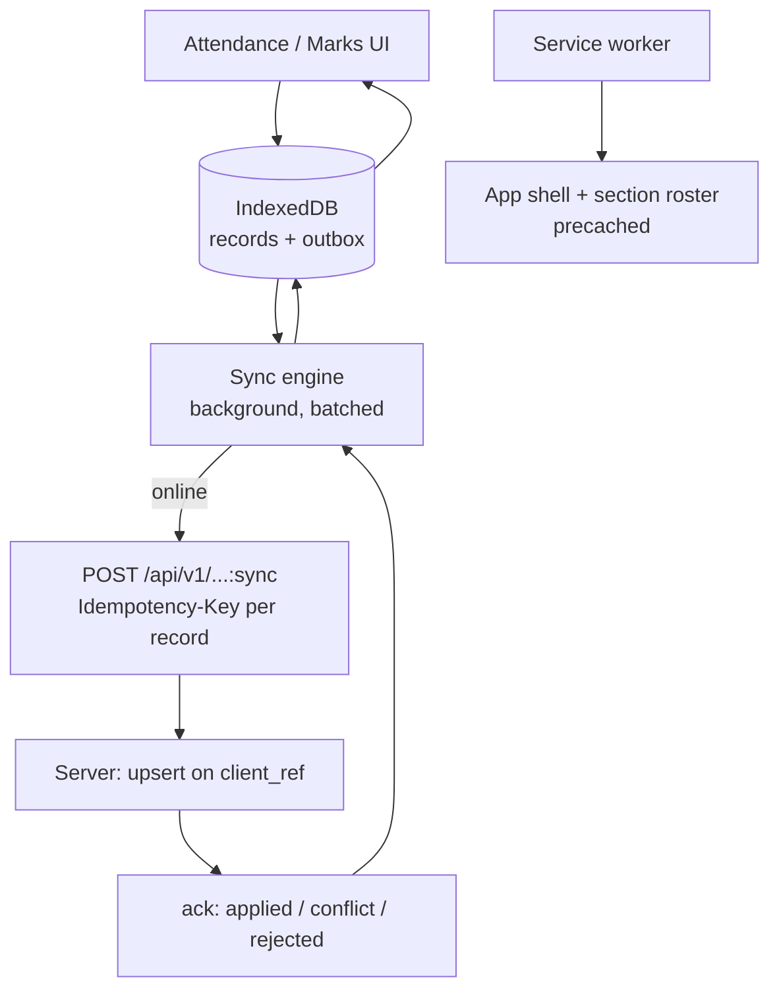

# 27. Mobile and offline strategy

Decision: **PWA, not native apps** ([ADR-0017](../adr/0017-pwa-not-native.md)),
with a purpose-built offline queue for the two flows that must survive connection
loss — **attendance capture** and **marks entry**.

## 27.1 Audiences and what each actually needs

| Audience | Device | Needs | Offline? |
|---|---|---|---|
| Guardian | Low-end Android, shared handset, intermittent data | Read results, dues, notices. **Mostly reached by SMS** | No — read-only, retryable |
| Class teacher | Personal low-end Android, patchy data at 08:30 | Attendance for one section, fast | **Yes — mandatory** |
| Subject teacher | Same | Bulk marks entry in long sessions | **Yes — mandatory** |
| Office staff | Shared desktop, wired or wifi | Receipts, admissions, reports | No |
| Principal | Desktop and phone | Dashboards | No |

Only two flows need offline. Building an offline-first architecture for the whole
product would be a large cost paid by every screen for the benefit of two — so
offline is a **capability of specific flows**, not a property of the app.

## 27.2 Why not native

| | PWA (chosen) | Native |
|---|---|---|
| Install friction | A URL; installable to home screen | Play Store account, ~30–60 MB download on a metered connection |
| Update | Instant, server-controlled | Store review; users on stale versions for months |
| Cost for 1–2 devs | One codebase | A second and third codebase, plus release process |
| Offline capture | Service worker + IndexedDB — sufficient | Better, but not needed for this |
| Push | Limited on some Android browsers | Reliable |
| Storage headroom | Adequate for a section's queue | Larger |

The deciding reason is install friction, not developer cost. A guardian will not
install an app to check results twice a year; they will open an SMS link. And the
teacher flow — a section's worth of attendance — fits comfortably in IndexedDB.

**Push notifications are the real loss**, which is why SMS remains the primary
channel ([§18](18-notification-architecture.md)) rather than a fallback.

## 27.3 Offline architecture



**Local write first, always.** The UI writes to IndexedDB and returns
immediately; the network is never on the interaction path. A teacher marking 40
students sees 40 instant responses regardless of connectivity.

### The record

```ts
interface QueuedRecord {
  clientRef: string;        // ULID generated on the device — the idempotency key
  kind: 'attendance' | 'mark';
  tenantId: string;
  payload: unknown;
  capturedAt: string;       // device clock — see §27.5
  attempts: number;
  status: 'pending' | 'syncing' | 'applied' | 'conflict' | 'rejected';
  serverError?: { code: string; message: string };
}
```

`clientRef` is the whole mechanism. It is generated before the device has
connectivity, travels as the idempotency key, and lands in
`attendance.client_ref` with a unique index
([§11.6](../phase-1a/11-entity-model.md)). Replaying a queue is therefore safe:
duplicates conflict on the index and are acknowledged as already applied.

### Sync protocol

| Property | Behaviour |
|---|---|
| Batch size | ~100 records per request |
| Ordering | Per section, in capture order |
| Trigger | On reconnect, on app foreground, and every 60 s while pending |
| Backoff | Exponential with jitter, capped at 5 minutes |
| Partial success | Per-record acknowledgement. One bad record does not block the batch |
| Auth | Session may have expired offline — a 401 preserves the queue and prompts re-login. **The queue is never dropped on auth failure** |
| Visibility | A persistent badge shows pending count; tapping it lists unsynced records |

The auth rule matters. A teacher who captures attendance offline, arrives at
school an hour later and finds their session expired must not lose the data. The
queue survives logout and is re-attached on the next login for the same account.

## 27.4 Conflict resolution

[OQ-17](../phase-1a/13-open-questions.md) asked for the rules. They are:

| Situation | Resolution |
|---|---|
| Same `client_ref` replayed | Idempotent — acknowledged as applied, no change |
| Two teachers marked the same student, same date, different device | **Last write by `capturedAt` wins**, and the loser is written as a superseded row with both values retained |
| A record arrives for a date that has since become a holiday | Accepted, then reclassified by the calendar recompute ([§16.5](16-calendar-engine.md)). Never silently discarded |
| A record arrives after marks/attendance were locked | **Rejected** with a clear reason; the record stays in the queue as `rejected` and is shown to the teacher |
| Student left the section between capture and sync | Rejected with a reason; needs a human decision |
| Device clock is wrong | See §27.5 |

Nothing is resolved by silently discarding data. Every non-applied record remains
visible to the person who captured it, with a reason and an action. A sync
engine that quietly drops records is worse than one that fails loudly.

## 27.5 The device clock problem

Low-end Android clocks drift, and some are set wrong outright. `capturedAt` from
the device cannot be trusted for conflict ordering or for the attendance date.

| Rule | Reason |
|---|---|
| The **business date** comes from the server-side working-day resolution, not the device | A wrong device date must not file attendance under the wrong day |
| The device sends `capturedAt` **and** a monotonic sequence number | Ordering within one device is reliable even when its clock is not |
| On sync, the server records `clock_skew = received_at − captured_at` | Large skew flags the record for review rather than trusting it |
| The UI shows the resolved date it is capturing for, prominently | The teacher catches the error before submitting |
| Capture for a date more than N days old requires confirmation | Prevents a badly-set clock filing a month of attendance |

## 27.6 Service worker scope

Deliberately narrow. An over-eager service worker serving a stale app shell is a
support burden with no offline benefit.

| Cached | Strategy |
|---|---|
| App shell, JS, CSS, fonts | Cache-first, versioned by build id |
| Section rosters for the teacher's own sections | Stale-while-revalidate, refreshed on login and daily |
| Attendance and marks screens | Precached |
| Everything else — fees, reports, guardian views | **Network-only** |
| API mutations | Never cached; they go through the outbox |

Cache is versioned by build and purged on activation, so a deploy cannot leave a
user on a shell that talks to an incompatible API.

Storage headroom ([OQ-18](../phase-1a/13-open-questions.md)): a section of 50
students for 30 days is well under a megabyte. The realistic ceiling is browser
eviction under storage pressure, mitigated by requesting persistent storage and
by syncing promptly rather than accumulating weeks of queue.

## 27.7 Performance budget on the target device

Reference device: a ~US$80 Android phone, 2 GB RAM, on a 400 kbps / 400 ms-RTT
profile ([§4.4](../phase-1a/04-non-functional-requirements.md)).

| Metric | Budget |
|---|---|
| LCP, attendance screen | ≤ 3.5 s cold, ≤ 1 s warm (service worker) |
| TTI | ≤ 5 s cold |
| First-load JS, teacher routes | ≤ 180 KB gzipped |
| Interaction to next paint | ≤ 200 ms |
| Attendance capture, 40 students | ≤ 60 s of teacher time, fully offline |
| Memory | No leak across a 30-minute marks session |

Measured in CI on a throttled profile, with the bundle check failing the build.
A budget that is not enforced is a wish.

## 27.8 Installability

- Web app manifest, maskable icons from tenant branding
  ([§23.2](23-theme-branding.md))
- Prompt to install shown to **staff only**, after several sessions — never to
  guardians on first visit, where it reads as spam
- Works fully in a browser tab; installation is an optimisation, not a
  requirement
- Guardian entry point remains an SMS link that opens directly to the relevant
  page

## 27.9 Explicitly out of scope

| Not doing | Why |
|---|---|
| Offline fee collection | Receipt numbers must be gapless and server-issued ([§17.4](17-finance-architecture.md)). An offline receipt number is unsound |
| Offline reports | Stale financial figures are worse than no figures |
| Offline admissions | Complex validation and duplicate detection need the server |
| Full local database replication | Enormous complexity for two flows |
| Background sync API | Inconsistent across the target browsers; foreground sync plus a visible badge is more predictable |

The first row is the important one: it is technically feasible and deliberately
refused, because gapless numbering and offline issuance are incompatible, and
gaplessness is the property a school trusts.
