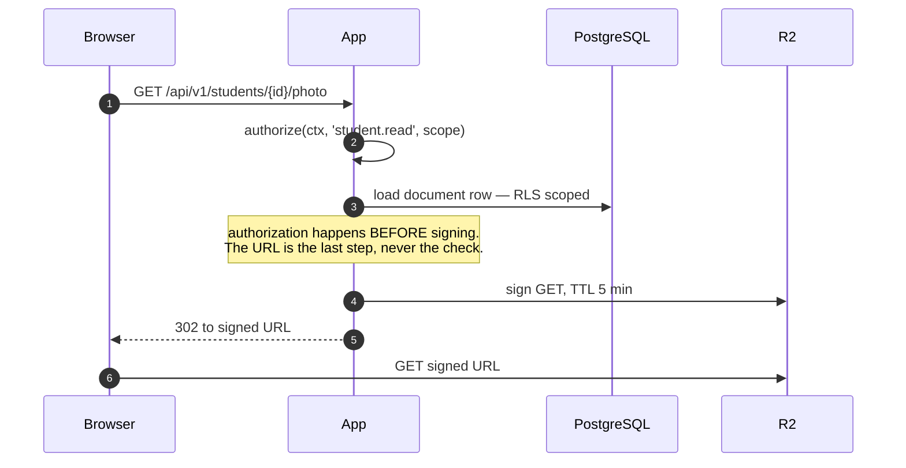

# 29. File and media architecture

Cloudflare R2 behind an S3-compatible interface
([ADR-0015](../adr/0015-object-storage.md)). This section specifies the key
layout, the access path, validation and quotas.

The governing fact: most of what this system stores is **personal data about
children** — photos, birth certificates, transcripts. Nothing is public, ever.

## 29.1 What is stored where

| Content | Store | Why |
|---|---|---|
| Student and staff photos | R2 | Binary, served often, cacheable per-user |
| Guardian and student documents | R2 | Birth certificates, transcripts, national IDs |
| Generated PDFs | R2 | Report cards, receipts, admit cards |
| School logos, branding | R2 | Public-ish but still signed |
| Import files, export bundles | R2 | Large, short-lived |
| WAL archive, base backups | R2, separate bucket | [§36](36-backup-dr.md) |
| Anything under ~1 KB and structured | PostgreSQL | Not a file |

**Never in PostgreSQL:** binaries of any size. A database that holds photos has
slow backups, a large restore window and a bloated page cache — all of which cost
more than the convenience is worth.

## 29.2 Key layout

```
tenant/<tenant_id>/student/<student_id>/photo/<ulid>.webp
tenant/<tenant_id>/student/<student_id>/document/<ulid>.pdf
tenant/<tenant_id>/staff/<staff_id>/document/<ulid>.pdf
tenant/<tenant_id>/generated/report-card/<exam_id>/<student_id>/<ulid>.pdf
tenant/<tenant_id>/generated/receipt/<fiscal_year>/<receipt_no>.pdf
tenant/<tenant_id>/import/<batch_id>/<original-name>
tenant/<tenant_id>/export/<job_id>/<bundle>.zip
platform/branding/<tenant_id>/logo/<ulid>.webp
```

Tenant-first prefixing is deliberate and does three jobs at once:

1. **Export** — one prefix listing enumerates everything a tenant owns
   ([§25.7](../phase-1b/25-data-import.md)).
2. **Deletion** — offboarding is a prefix delete, not a graph walk.
3. **Quota** — usage per tenant is a prefix size sum, computed nightly.

ULID filenames mean a re-upload never overwrites; the previous object stays until
retention removes it, so "they replaced the photo with the wrong one" is
recoverable.

## 29.3 Access path



| Rule | Detail |
|---|---|
| **No public buckets** | Ever. No exceptions for logos |
| Signed URL TTL | 5 minutes for documents, 60 minutes for generated PDFs a user is actively downloading |
| Authorization precedes signing | The signature is not the access control; the use case is |
| Signed URLs are not logged | The URL is a bearer credential for its lifetime |
| Uploads | Signed PUT direct to R2, so large files never transit the app |
| Upload confirmation | The client calls back; the app verifies size and type from R2 metadata before creating the `document` row |

Direct-to-R2 upload matters on the target connections: a 4 MB scanned birth
certificate over a slow uplink would otherwise occupy an app worker for minutes.

## 29.4 Validation and processing

Applied on the confirmation step, before the row is created:

| Check | Rule |
|---|---|
| MIME sniffing | Content-based, not extension or client-declared |
| Allowlist | `image/jpeg`, `image/png`, `image/webp`, `application/pdf`. Nothing else |
| Size caps | Photo 5 MB, document 10 MB, import 20 MB |
| Image re-encode | To WebP, resized to a max dimension, **EXIF stripped** |
| PDF | Not re-encoded; scanned as-is, page count recorded |
| Filename | Never trusted; the stored key is a ULID and the original name is a column |
| Virus scanning | **P2** — ClamAV in the worker. The upload surface is authenticated staff, so this is deferred rather than absent |

**EXIF stripping is not optional.** A photo taken on a phone carries GPS
coordinates. Storing a child's home location as a side effect of an ID photo
upload is a privacy failure that nobody would notice until it mattered.

## 29.5 Quotas and retention

| Plan limit | Enforcement |
|---|---|
| Storage bytes per tenant | Checked at upload against the nightly meter plus in-flight; refuses over quota with a clear message |
| Per-file caps | Above |

| Content | Retention |
|---|---|
| Student documents | Tenant retention policy; default = life of the record plus the archival window ([§10.8](../phase-1a/10-database-architecture.md)) |
| Generated report cards | 12 months, then purged — **regenerable from the immutable `result_snapshot`** |
| Generated receipts | Full retention. A receipt is an auditable document and is never regenerated with a new number |
| Import files | 90 days |
| Export bundles | 7 days |
| Backups | [§36](36-backup-dr.md) |

The report-card row is the interesting one: because they regenerate
deterministically, storage is an optimisation rather than a system of record, so
the retention policy can be aggressive without losing anything.

## 29.6 CDN and caching

Generated PDFs and photos are served through Cloudflare with the signed URL as
the cache key. A published result's report card is identical for every viewer of
that student and immutable once published, so it caches hard at the edge — which
is part of how result-publication day stays survivable
([§4.3](../phase-1a/04-non-functional-requirements.md)).

Nothing tenant-scoped is cached without the signature in the key. A cache key
that omits it would serve one student's report card to whoever asked next.

## 29.7 Failure behaviour

| Failure | Behaviour |
|---|---|
| R2 unavailable on read | Documents unavailable; the rest of the app works. Explicit error, not a blank page |
| R2 unavailable on write | Uploads fail loudly and are retryable; no partial `document` row is created |
| R2 unavailable during a PDF batch | The job retries with backoff; rendered output is re-uploaded, never lost — the render is cheap to repeat |
| Object missing but row exists | Detected by a nightly consistency sweep over recent rows; alerts rather than 404-ing silently |
| Object exists but row deleted | Orphan sweep reclaims after the retention window |

## 29.8 Local development and residency

MinIO in Docker Compose for local development. This is not only convenience — it
keeps the S3-compatible path continuously exercised, so the
[OQ-1](../phase-1a/13-open-questions.md) fallback (onshore self-hosted storage,
if a data-residency ruling requires it) is a configuration change against a code
path that already runs every day.
