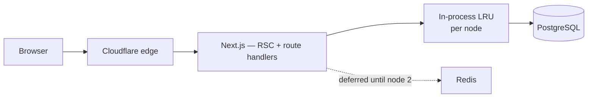

# 31. Caching strategy

One rule governs everything here:

> **No cached value is required for correctness.** Every one has a source of
> truth in PostgreSQL. A cold or wrong cache is a performance event, never a
> wrong answer.

That rule is what makes deferring Redis safe rather than merely cheap
([ADR-0014](../adr/0014-defer-redis.md)), and it is the reason money and result
figures are never read from cache.

## 31.1 Layers



| Layer | Holds | Invalidation |
|---|---|---|
| Cloudflare edge | Static assets, published result pages, signed document URLs | Immutable keys, or purge on publish |
| Next.js data cache | RSC fetch results, tagged | `revalidateTag` on mutation |
| In-process LRU | Reference data, working days, entitlements | Event-driven + short TTL |
| PostgreSQL | Everything | — |

## 31.2 What is cached, and for how long

| Data | TTL | Invalidated by | Cache? |
|---|---|---|---|
| Class levels, sections, subjects, fee heads, grade scales | 10 min | Mutation of the entity | Yes — read constantly, changes rarely |
| `working_day` ranges | 30 min | `CalendarRecomputed` | Yes — the hottest lookup in the system |
| Tenant record, branding, plan entitlements | 5 min | Tenant mutation, plan change | Yes |
| Role/permission definitions | 10 min | `role.manage` mutations | Yes |
| Session → `AuthContext` | **Not cached** | — | No. Revocation must take effect in ≤ 60 s ([§4.6](../phase-1a/04-non-functional-requirements.md)) |
| Dashboard tiles (collection totals, attendance %) | 60 s | Time only | Yes — "as of a minute ago" is fine and honest |
| Report results | 5 min, keyed `(definition, params, tenant)` | Owning module's events | Yes |
| **Published** result pages | Immutable | Revocation purges | Yes, aggressively — at the edge |
| **Unpublished** results, marks in progress | **Never** | — | No |
| **Outstanding dues, receipts, payments** | **Never** | — | **No** |
| SMS credit balance | **Never** | — | No — a stale balance overspends |

The three "never" rows are the important ones. Anything a user will act on
financially, and anything not yet published, is read live. A guardian shown a
cached balance who then pays the wrong amount is a support call the cache did not
earn.

## 31.3 Cache keys must carry tenant

```ts
// Every key. No exceptions.
const key = `t:${ctx.tenantId}:feeheads:v1`;
```

A key without `tenant_id` serves one school's data to another — the same failure
RLS prevents at the database layer, reintroduced above it. The `Cache` interface
in the shared kernel takes the `AuthContext` and prefixes the key itself, so a
caller cannot forget.

Keys carry a `:v1` suffix so a shape change is a new namespace rather than a
migration or a stale-decode bug.

## 31.4 Invalidation

Event-driven where correctness benefits, TTL where it does not.

| Approach | Used for | Why |
|---|---|---|
| Event-driven | Working days, reference data, entitlements | The event already exists ([§14.16](../phase-1b/14-module-architecture.md)); staleness here is user-visible |
| Short TTL | Dashboard tiles, report results | Simpler, and 60 s of staleness is acceptable and disclosed |
| Immutable keys | Published results, generated documents | Nothing to invalidate — the key changes when content does |
| Purge | Revoked publication, CMS publish | Rare, explicit, audited |

**Stampede control.** A popular key expiring under load must not send every
request to the database. Single-flight per key per process, plus jitter on TTLs
so a thousand keys do not expire in the same second.

## 31.5 What the edge caches

| Content | Rule |
|---|---|
| JS, CSS, fonts | Immutable, content-hashed, 1 year |
| Tenant logos | 1 day, signed key |
| Published report card PDFs | Cache with the signature in the key, TTL = signature lifetime |
| Published result pages | Cacheable per student token; the largest lever on result day |
| **Any authenticated HTML** | **Never cached at the edge** |
| API responses | Never cached at the edge |

The last two rows are absolute. An authenticated page cached at a shared edge is
the classic multi-tenant data leak, and it is one misconfigured header away at
all times. The origin sends `Cache-Control: private, no-store` on every
authenticated response, and that header is asserted by a test.

## 31.6 When Redis arrives

Trigger: **a second application node** ([ADR-0014](../adr/0014-defer-redis.md)),
because in-process caches stop being coherent and in-process rate limits stop
being global at exactly that moment.

Migration is small because the interfaces already exist:

| Today | With Redis |
|---|---|
| `Cache` → in-process LRU | `Cache` → Redis adapter, same interface |
| `RateLimiter` → in-process counter | `RateLimiter` → Redis token bucket |
| Sessions → PostgreSQL | Unchanged, optionally read-through cached |
| pg-boss | Unchanged unless [ADR-0010](../adr/0010-job-queue.md) triggers fire |

Sequencing matters and is recorded here so it is not discovered during an
incident: **Redis is added before the second node serves traffic, not after.**

## 31.7 Anti-patterns explicitly rejected

| Rejected | Why |
|---|---|
| Caching `AuthContext` or permissions per session | Revocation and role changes must be immediate |
| Caching anything financial | A stale balance causes a wrong payment |
| Caching across tenants under one key | The leak RLS exists to prevent |
| Long TTLs on `working_day` without event invalidation | A retroactive holiday must propagate ([§16.5](../phase-1b/16-calendar-engine.md)) |
| Caching unpublished results | Publication is a controlled event; a cache would leak it early |
| Warming caches on deploy | Adds a slow, failure-prone startup path for a benefit that a few requests provide anyway |
