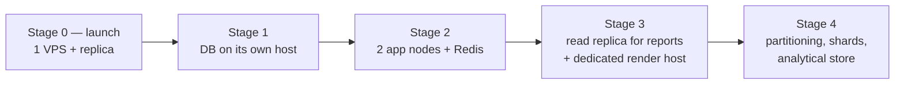

# 32. Scalability strategy, with trigger metrics

The brief asks for the **trigger metric** at which each component becomes
necessary, not a list of things that might eventually help. This section is that
list, and it is the operating manual for growing the platform.

Governing principle, restated from [§1](../phase-1a/01-executive-summary.md):

> **Model the schema for millions of students. Provision infrastructure for one
> hundred schools. Never buy capacity ahead of its trigger.**

## 32.1 The staged path

| Stage | Shape | Trigger to advance | Est. tenants |
|---|---|---|---|
| **0** | 1× 8 GB VPS (app + worker + render + PostgreSQL) + 1 small replica | — | 1–150 |
| **1** | PostgreSQL moves to its own host | DB CPU > 60% in school hours, **or** host memory pressure causing swap | 150–400 |
| **2** | 2 app nodes behind a load balancer, **Redis added first** | App CPU > 60% sustained, **or** p95 API latency > 300 ms server-side | 400–800 |
| **3** | Reporting to a read replica; PDF renderer on its own host | Report queries > 10% of primary CPU; renderer peak > 1.2 GB or batches degrading interactive p95 | 800–2,000 |
| **4** | Table partitioning, tenant shards, analytical store | Per-component triggers below | 2,000+ |

Stage 0 is sized by measurement, not guess:
[OQ-13](../spikes/oq-13-pdf-memory/README.md) fixed the 8 GB minimum
([ADR-0002](../adr/0002-hosting-and-region.md)).

## 32.2 Component trigger table

| Component | Trigger metric | Notes |
|---|---|---|
| **Redis** | A second application node is *planned* | Added **before** it serves traffic ([ADR-0014](../adr/0014-defer-redis.md)) |
| **PgBouncer** | Pool saturation, or the second app node | Transaction-mode compatible from day one — `set_config(..., true)` is transaction-scoped ([§7.2](../phase-1a/07-multi-tenancy.md)) |
| **Read replica for reporting** | Report queries > 10% of primary CPU | The replica already exists for financial durability; this is a connection-string change ([ADR-0021](../adr/0021-reporting-data-path.md)) |
| **Dedicated PDF host** | Sustained peak > 1.2 GB, or interactive p95 degrading during batches, or concurrent batches needed | Already a separate process with a queue in front |
| **`attendance` partitioning** | > 50 M rows | ~8.8 M rows/year at 100 schools — years away |
| **`audit_log` partitioning** | > 100 M rows, or retention pruning costing IO | Monthly range partitions |
| **BullMQ + Redis for jobs** | Sustained enqueue > 500/s, or job churn a material share of DB IO | Split high-volume non-transactional work; money and results stay on pg-boss |
| **Search engine** (Meilisearch/ES) | Search p95 > 500 ms, or cross-tenant operator search over millions of rows | `pg_trgm` covers the current need |
| **Tenant sharding** | One tenant > 15% of DB size or IO | `tenant.shard_id` exists from day one ([§7.6](../phase-1a/07-multi-tenancy.md)) |
| **Analytical store** | Rollup maintenance > 2 h nightly, or routine ad-hoc analytics | [ADR-0021](../adr/0021-reporting-data-path.md) stage 4 |
| **Second region** | A residency ruling, or a customer contract | Not a scale trigger |
| **Kubernetes** | Multiple nodes **and** a person hired to own them | Both conditions, not either ([ADR-0002](../adr/0002-hosting-and-region.md)) |

## 32.3 The two seasonal peaks

Restating [§4.3](../phase-1a/04-non-functional-requirements.md) as an operating
plan rather than a description.

### Admission season — sustained writes, Nov–Jan

| Pressure | Response |
|---|---|
| Bulk imports | Chunked, per-tenant concurrency capped ([§30.3](30-queues-jobs.md)) |
| Document uploads | Direct-to-R2; never through the app ([§29.3](29-file-media.md)) |
| Sustained write load | Vertical scale **ahead** of the season — it is a known date, not a surprise |
| Support load | The real constraint at 1–2 people. Onboarding capacity, not CPU, is the bottleneck |

The honest observation: at this team size **admission season is limited by human
onboarding capacity long before it is limited by infrastructure.** Scaling the
VPS is the easy half.

### Result publication — read spike

| Lever | Effect |
|---|---|
| **Rate-shaped SMS fan-out over 30–90 min** | The dominant control. The platform sends the SMS, so it sets the arrival rate |
| Immutable `result_snapshot` | Cacheable hard, at the edge |
| Per-student signed URLs | Edge-cacheable without leaking |
| Staff writes prioritised over guardian reads under saturation | A half-written mark is a correctness problem; a guardian retry is not |

Without rate shaping, 10,000 concurrent readers on one VPS is a genuine outage.
With it, the peak is a few hundred cacheable requests per second.

## 32.4 What scales badly, and the plan for each

Honest list of the places this design has known limits.

| Bottleneck | Limit | Plan |
|---|---|---|
| **Gapless receipt numbering** | Serialised per school via `FOR UPDATE` | Fine at hundreds/day. Would not survive thousands/second — and does not need to ([§17.4](../phase-1b/17-finance-architecture.md)) |
| **Single PostgreSQL primary** | Vertical only | Stage 1 gives it a whole host; stage 4 shards by tenant |
| **PDF rendering** | ~120 docs/min per renderer | Measured. Horizontal by adding renderer hosts |
| **pg-boss throughput** | Low thousands/s | Trigger at 500/s; BullMQ split |
| **SMS provider rate** | Provider-set | Multi-provider, rate-shaped |
| **Result computation** | CPU-bound per exam | Pure function, chunk by section, parallelisable |
| **Single-region latency** | Physics | Nothing to do; Singapore is the choice ([ADR-0002](../adr/0002-hosting-and-region.md)) |

## 32.5 Load shedding

When saturated, degrade deliberately rather than uniformly:

| Priority | Traffic |
|---|---|
| 1 — never shed | Authentication, payment recording, attendance and mark submission |
| 2 | Staff reads |
| 3 | Guardian reads — retry cheaply |
| 4 — shed first | Report generation, bulk exports, non-urgent bulk SMS |

Implemented as queue priorities plus per-endpoint rate limits, not as a manual
switch. The ordering follows the tie-break in
[§1](../phase-1a/01-executive-summary.md): correctness before convenience.

## 32.6 Capacity signals to watch

The dashboard that tells an operator which trigger is approaching:

| Signal | Warn | Act |
|---|---|---|
| DB CPU, school hours | 45% | 60% → stage 1 |
| App CPU sustained | 45% | 60% → stage 2 |
| p95 API latency, server-side | 200 ms | 300 ms |
| Host memory | 70% | 80% or any swap |
| Replica lag | 10 s | 30 s |
| Queue oldest-pending, `critical` | 30 s | 60 s |
| Largest tenant share of DB | 10% | 15% → shard |
| `attendance` row count | 30 M | 50 M → partition |
| Disk | 60% | 75% |

Every one of these has a number, and the number is the decision. That is the
whole point of the section: growth decisions get made by a dashboard, not by an
argument in a planning meeting.
