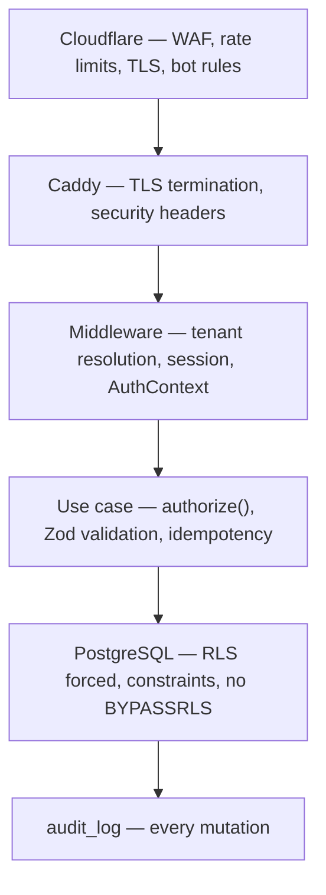

# 33. Security architecture

This system holds **records about children** — names, photos, addresses,
guardians' phone numbers, birth certificates — and it moves money. Those two
facts set the bar, not the size of the team.

Identity and authorization are designed in
[§8](../phase-1a/08-identity-authn-rbac.md); tenant isolation in
[§7](../phase-1a/07-multi-tenancy.md). This section covers everything else and
ties them together.

## 33.1 Threat model

| Threat | Likelihood | Impact | Primary control |
|---|---|---|---|
| **Cross-tenant data access** | Medium — a developer bug | **Catastrophic** | RLS, enabled *and forced*, verified in CI ([§7.2](../phase-1a/07-multi-tenancy.md)) |
| Credential stuffing on guardian phones | High | Medium | OTP-only for guardians — no password to stuff; rate limits per phone and per IP |
| A teacher reading another section's marks | Medium | Medium | Scope predicates applied in SQL, matrix-tested |
| SQL injection | Low | Catastrophic | Parameterised queries only; whitelisted sort/filter fields ([§19.6](../phase-1b/19-api-architecture.md)) |
| Stored XSS via tenant content | Medium | High | No raw-HTML block; sanitise on save *and* render ([ADR-0022](../adr/0022-cms-public-projection.md)) |
| Insider / operator abuse | Low | High | Impersonation controls ([§38](38-support-console.md)); separate audited pool |
| Stolen staff session | Medium | High | Opaque server-side sessions, revocable in ≤ 60 s |
| SIM swap on a guardian number | Low | Medium | **Accepted residual.** Financial actions require staff auth, never a guardian's |
| Payment webhook forgery | Medium | High | Signature verification before parsing; amount cross-check ([ADR-0020](../adr/0020-payment-provider-abstraction.md)) |
| Enumeration of enrolled phone numbers | Medium | Medium | Identical responses, normalised timing |
| Supply-chain compromise of a dependency | Low | Catastrophic | Lockfiles, Dependabot, minimal dependency surface |
| Ransomware / destructive insider | Low | Catastrophic | Offsite immutable backups, PITR ([§36](36-backup-dr.md)) |
| Physical loss of the VPS | Low | High | RTO ≤ 4 h from backups |

The top row is the one the architecture is shaped around. Everything else is
industry-standard hygiene; cross-tenant isolation is the property that cannot be
recovered from after the fact.

## 33.2 Defence in depth

Each layer assumes the one above it may have failed. The database layer in
particular assumes the application is buggy — which, over a multi-year build by
two people, it will be.

## 33.3 Data classification and encryption

| Class | Examples | At rest | In transit | Extra |
|---|---|---|---|---|
| **Special** | National ID, birth registration number, bank account | Full-disk **+ application-level encryption** (AES-256-GCM, key in the secret store) | TLS 1.2+ | Never logged, never in exports without an explicit flag, decrypted only in the use case that needs it |
| **Sensitive** | Student names, photos, addresses, guardian phones, marks, financial records | Full-disk; R2 server-side encryption | TLS 1.2+ | Never in logs; RLS-scoped |
| **Internal** | Configuration, templates, audit metadata | Full-disk | TLS | |
| **Public** | CMS pages a tenant published | — | TLS | |

Application-level encryption is applied narrowly and deliberately. Encrypting
every column would break search, sort and indexing on data that full-disk
encryption plus RLS already protects; encrypting **nothing** leaves national ID
numbers readable to anyone who obtains a database dump. The line is drawn at
fields that are high-harm and never queried.

**Passwords:** Argon2id, per-user salt, tuned parameters. **OTP codes:** hashed
at rest, single-use, 5-minute expiry, five attempts. **Session tokens:** random,
stored hashed.

## 33.4 Secrets

| Rule | Detail |
|---|---|
| Never in Git | Enforced by [`scripts/check-docs.sh`](../../../scripts/check-docs.sh) in CI |
| Runtime source | Environment variables from a root-owned `.env` on the host, mode `0600`, injected by Compose |
| Rotation | Documented per secret; DB credentials and provider keys rotate on staff change |
| **A leaked credential is rotated, not deleted** | Removing the file leaves the blob reachable in every clone |
| Separate credentials per role | `sm_app`, `sm_migrator`, `sm_readonly`, `sm_platform` ([§7.2](../phase-1a/07-multi-tenancy.md)) |
| CI secrets | GitHub Actions secrets; never echoed; masked in logs |

A managed secret store is deferred — at one host, a `0600` root-owned file is the
honest equivalent, and adding Vault would be a system nobody has time to operate.
Trigger to revisit: more than one host, or more than two people with production
access.

## 33.5 HTTP hardening

Set at Caddy and asserted by a test, because headers silently regress:

| Header | Value |
|---|---|
| `Strict-Transport-Security` | `max-age=31536000; includeSubDomains; preload` |
| `Content-Security-Policy` | `default-src 'self'`; no `unsafe-inline`; nonce-based scripts; `frame-ancestors 'none'` |
| `X-Content-Type-Options` | `nosniff` |
| `Referrer-Policy` | `strict-origin-when-cross-origin` |
| `Permissions-Policy` | Deny geolocation, camera, microphone by default |
| `Cache-Control` (authenticated) | `private, no-store` — **asserted by test** ([§31.5](31-caching.md)) |

| Control | Detail |
|---|---|
| Cookies | `HttpOnly`, `Secure`, `SameSite=Lax`, host-scoped |
| CSRF | Double-submit token on state-changing requests; server actions carry framework protection |
| CORS | Same-origin only. No wildcard |
| Uploads | Signed direct-to-R2; MIME sniffed; re-encoded; EXIF stripped ([§29.4](29-file-media.md)) |

## 33.6 Dependencies and build

| Control | Detail |
|---|---|
| Lockfile committed; CI installs frozen | No drift between machines |
| Dependabot on security advisories | Weekly; patches applied promptly |
| `npm audit` / `osv-scanner` in CI | High and critical block the build |
| Minimal surface | Every dependency is a decision. The stack was chosen partly for this ([§5.4](../phase-1a/05-technology-review.md)) |
| Pinned base images by digest | Not by tag |
| Fonts vendored with checksums | [ADR-0009](../adr/0009-pdf-rendering.md) |

## 33.7 Privacy obligations specific to this domain

Beyond generic security, because the subjects are children:

| Obligation | Implementation |
|---|---|
| Data minimisation | Collect what a school needs. National ID is optional |
| Purpose limitation | Tenant data is never used for cross-tenant analytics or model training |
| Guardian communication rights | `can_receive_results` respected everywhere ([§11.4](../phase-1a/11-entity-model.md)) |
| Right to a copy | Tenant export ([§25.7](../phase-1b/25-data-import.md)) |
| Deletion on offboarding | Published SLA: export ≤ 72 h, delete ≤ 30 days, purged from backups ≤ 12 months |
| No PII in logs | Ids and tenant context only — asserted by a log-redaction test |
| No third-party analytics on guardian/teacher routes | Would send children's usage to a third party ([§26.7](../phase-1b/26-reporting-data-path.md)) |
| Photo EXIF stripped | GPS in a student photo is a home address |
| Impersonation is visible to the tenant | [§38](38-support-console.md) |

**A withheld transcript is not an acceptable debt-collection tool.** A suspended
tenant keeps read access to results and receipts
([§37](37-saas-billing.md)) — a child's record is not leverage in a vendor
dispute.

## 33.8 Incident response

| Phase | Action |
|---|---|
| Detect | Sentry alert, uptime probe, or a report ([§34](34-observability.md)) |
| Triage | Is it one tenant or the platform? `tenant_id` on every log line answers this in under a minute |
| Contain | Revoke sessions, disable a feature flag, suspend an integration, block an IP at Cloudflare |
| Assess | Which tenants, which data classes, what was actually accessed — the audit log is the record |
| Notify | Affected tenants directly, with facts. Timeline per the (open) regulatory position — [OQ-1](../phase-1a/13-open-questions.md) |
| Recover | [§36](36-backup-dr.md) |
| Learn | Written post-incident note; a new ADR if a decision changed |

**Cross-tenant leak is the declared worst case** and has a standing response:
freeze deploys, identify scope from the audit log, notify affected tenants,
publish the fix, and add the regression to the generated RLS test suite so it
cannot recur silently.

## 33.9 What is deliberately not done, and why

| Not done | Reason | Revisit when |
|---|---|---|
| Managed secret store (Vault) | One host; a `0600` root file is equivalent | > 1 host, or > 2 people with prod access |
| Formal penetration test | No budget at launch. Stated, not implied | First enterprise contract, or 100 tenants |
| SOC 2 / ISO 27001 | No buyer asks in this market | An enterprise or NGO buyer asks |
| MFA for all staff | Friction against low adoption; **required for operators and tenant owners** | Any tenant requests it |
| Field-level encryption everywhere | Breaks search and indexing for little gain over disk encryption + RLS | A residency or regulatory ruling |
| WAF rule tuning beyond Cloudflare defaults | Diminishing returns for the team size | Observed targeted attacks |
