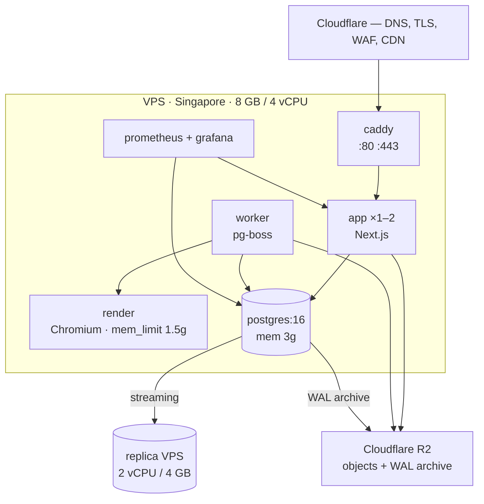

# 35. Deployment architecture

Docker Compose on a single VPS in Singapore, no orchestrator
([ADR-0002](../adr/0002-hosting-and-region.md)). Minimum host size **8 GB**, set
by measurement ([OQ-13](../spikes/oq-13-pdf-memory/README.md)).

The test every choice here has to pass: **can one person diagnose and fix this at
02:00, alone, from a laptop on a hotel wifi?**

## 35.1 Topology



| Container | Memory limit | Restart | Notes |
|---|---|---|---|
| `caddy` | 128 MB | always | TLS termination, security headers |
| `app` | 1 GB | always | Scaled to 2 replicas during deploy |
| `worker` | 512 MB | always | pg-boss consumers |
| `render` | **1.5 GB** | always | Hard cap is the critical control ([§24.6](../phase-1b/24-documents-pdf-bangla.md)) |
| `postgres` | 3 GB | always | `shared_buffers` 2 GB |
| `prometheus`+`grafana` | 512 MB | unless-stopped | Non-critical |

**Every container has an explicit memory limit.** Without one, Chromium sizes its
caches to available host memory and will expand until PostgreSQL starves — the
single most likely way this host falls over.

## 35.2 Environments

| Env | Where | Data | Purpose |
|---|---|---|---|
| Local | Developer machine, Compose | Seeded fixtures + MinIO | Development |
| **CI** | GitHub Actions ephemeral | Fresh DB per run | Tests, migration checks |
| **Staging** | Smallest VPS, same region | **Anonymised** production-shaped dump | Migration rehearsal, release verification |
| Production | The VPS above | Real | — |

Staging is not optional, and it exists for one specific reason: **a migration
that passes on an empty database and fails on real data is the normal case, not
the exception** ([§10.9](../phase-1a/10-database-architecture.md)). Staging is
where that is caught.

Its data is anonymised — names, phones and documents scrubbed — because a staging
box is less hardened and it would otherwise hold children's records.

## 35.3 Deploy

```
1. Merge to main            → CI: lint, typecheck, test, build, scan
2. Tag vX.Y.Z               → build image, push to registry, digest recorded
3. Deploy staging           → migrate, smoke test, verify /readyz
4. Deploy production        (single command, or a manually-approved CI job)
     a. pull the image by digest
     b. run migrations      (sm_migrator, lock_timeout set)
     c. start app replica #2 on the new image
     d. wait for /readyz
     e. Caddy shifts traffic; drain and stop replica #1
     f. restart worker and render (idempotent jobs — safe)
5. Verify                   → /healthz/deep, error rate, a real login
```

**Low-downtime, not zero-downtime.** Step (c–e) gives a rolling app swap of a few
seconds. Genuine zero-downtime would need a second host and shared session
state — which exists at
[stage 2](32-scalability.md) and is not worth its cost before then. The honest
number is in the availability target: 99.5% in school hours
([§4.2](../phase-1a/04-non-functional-requirements.md)).

Deploys happen **outside 07:00–15:00 Asia/Dhaka**. School hours are when
attendance and fee collection happen; a five-second blip then is a support call,
and at 19:00 it is nothing.

## 35.4 Migrations under multi-tenancy

One schema, so one migration — the payoff of
[ADR-0003](../adr/0003-tenancy-model.md). There is no fan-out across thousands of
schemas, which is precisely what made the other tenancy models unaffordable at
this team size.

| Rule | Reason |
|---|---|
| Forward-only, sequential SQL | Down-migrations are written under stress and rarely tested |
| **Backwards compatible for one release** | Add column → deploy → backfill → deploy the code that uses it → drop later. Never in one step |
| Rollback = deploy the previous tag | Which only works because of the rule above |
| `lock_timeout` on the migration session | A blocked migration fails fast rather than freezing the school day |
| Indexes `CONCURRENTLY` on populated tables | Avoids blocking writes |
| RLS added in the same migration as the table | Verified by the catalogue test ([§7.2](../phase-1a/07-multi-tenancy.md)) |
| Rehearsed on a restored production-shaped dump | Before every release containing a migration |
| Run by `sm_migrator`, never `sm_app` | Role separation |

Backfills of large tables run as chunked background jobs, not inside the
migration. A migration that rewrites ten million attendance rows in one
transaction is an outage.

## 35.5 Configuration

| Kind | Where |
|---|---|
| Secrets | Root-owned `.env`, mode `0600`, injected by Compose ([§33.4](33-security.md)) |
| Non-secret config | Committed per environment |
| **Feature flags** | Database, plan-derived, evaluated server-side ([§14.2](../phase-1b/14-module-architecture.md)) |
| Tenant settings | Database, per tenant |

Feature flags live in the database rather than in config so they can be toggled
**without a deploy** — which matters when the containment step of an incident is
"turn that feature off" ([§34.6](34-observability.md)).

## 35.6 TLS and DNS

| Concern | Approach |
|---|---|
| Apex and `*.sm.example.com` | Cloudflare DNS, proxied |
| Certificates | Cloudflare edge; Caddy holds an origin certificate |
| Tenant subdomains | Wildcard — provisioning a tenant needs **no DNS change** |
| Custom domains (P2) | DNS TXT verification, then Cloudflare for SaaS or Caddy on-demand TLS |
| Expiry | Automated; alert 14 days out as a backstop |

Wildcard subdomains are what make tenant provisioning a database insert rather
than an infrastructure operation — important when onboarding is meant to take
minutes.

## 35.7 Rollback

| Scenario | Action | Time |
|---|---|---|
| Bad application release | Deploy the previous tag | ≤ 5 min |
| Bad migration, backwards compatible | Deploy previous tag; schema is tolerant | ≤ 5 min |
| **Bad migration, destructive** | Restore from PITR ([§36](36-backup-dr.md)) | Hours |
| Bad data from a bulk operation | Compensating batch action ([§25.5](../phase-1b/25-data-import.md)) | Minutes |
| Bad tenant config | Operator console revert | Minutes |

Row three is why the backwards-compatibility rule is absolute. A destructive
migration converts a five-minute rollback into a multi-hour restore, and the only
reliable way to avoid it is to never write one.

**Production always runs a tagged commit, never a branch tip**
([CONTRIBUTING.md](../../../CONTRIBUTING.md)) — the tag *is* the rollback target.

## 35.8 What is deliberately not used

| Not used | Reason | Revisit when |
|---|---|---|
| Kubernetes | A cluster is a full-time role | Multiple nodes **and** someone to own them |
| Blue/green with duplicate stacks | Doubles cost for seconds of downtime | Contractual uptime commitment |
| Managed PostgreSQL | 3–5× cost; needs superuser-level control for RLS roles and per-transaction `synchronous_commit` | ARPU proves higher ([OQ-2](../phase-1a/13-open-questions.md)) |
| Terraform / IaC | One host. A documented provisioning script is the right size | Second host |
| Autoscaling | Load is diurnal and predictable; manual vertical scaling ahead of admission season is cheaper | Unpredictable load |
| Container registry scanning beyond CI | Diminishing returns | Enterprise buyer |

The provisioning script is not IaC, but it is committed, version-controlled and
runnable — which delivers most of the reproducibility benefit at a fraction of
the learning cost.
