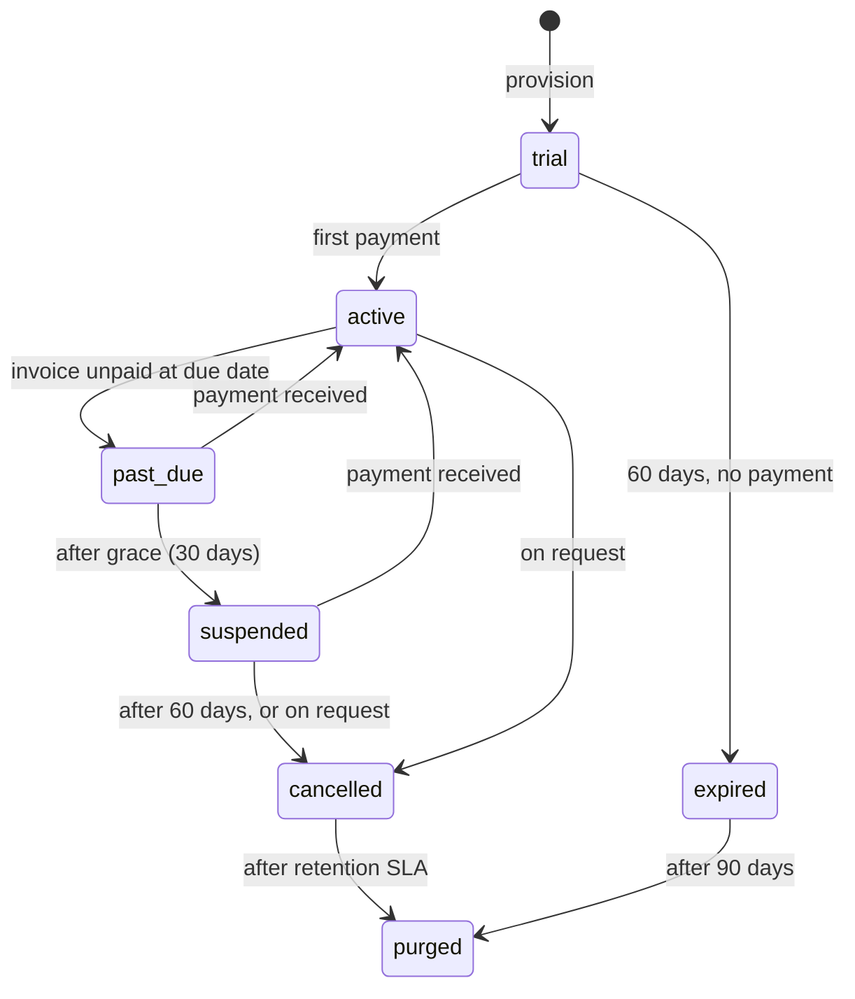

# 37. SaaS billing, metering and tenant lifecycle

**This is not the fee module.** Schools collecting from guardians
([§17](../phase-1b/17-finance-architecture.md)) and the platform collecting from
schools are two different money flows, and they share no tables, no sequences and
no reports. The brief insists on this and it is right: mixing them makes both
sets of books unauditable.

## 37.1 Plans and entitlement

```sql
plan (code, name, price_minor, billing_period, is_public)
plan_feature (plan_id, feature_key, enabled, limit_value)
tenant_feature_override (tenant_id, feature_key, enabled, limit_value,
                         reason, expires_at)
```

| Plan | Students | SMS/mo | Storage | Features |
|---|---|---|---|---|
| Trial | 100 | 200 | 1 GB | Everything, 60 days |
| Basic | 300 | 2,000 | 5 GB | Core: attendance, fees, results, SMS |
| Standard | 800 | 6,000 | 20 GB | + multi-campus, custom roles, scheduled reports |
| Institution | Unlimited | Metered | 100 GB | + org dashboards, priority support |

Illustrative — real tiers depend on [OQ-2](../phase-1a/13-open-questions.md).
The **structure** is the decision: student count as the primary meter, SMS and
storage as secondary, features as flags.

Entitlement is one server-side function:

```ts
can(ctx, 'sms_monthly')  // → { enabled, limit?, used? }
```

The client may *render* from the answer; every gated use case re-checks. A flag
enforced only in the UI is a flag that a `curl` request ignores.

`tenant_feature_override` exists because sales reality outruns plan design — a
school negotiating a feature for a term needs a row with a reason and an expiry,
not a new plan.

## 37.2 Metering off the hot path

| Metric | Definition | Collected |
|---|---|---|
| `active_students` | Students with status `active` on the last day of the period | Nightly batch, 02:00 |
| `sms_sent` | Messages dispatched | Summed nightly from `notification_message` |
| `storage_bytes` | Prefix size per tenant in R2 | Nightly sweep |

**Nothing increments a counter on the request path.** A per-request meter write
would add contention to exactly the endpoints that matter, for data needed once a
month. The nightly job writes `tenant_usage_meter`, and the invoice reads it.

Billing on **end-of-period active students** rather than a peak or an average is
a deliberate simplicity choice: it is trivially explainable to a principal, and
"explainable" is worth more than precision at this ARPU.

## 37.3 Billing in BDT, collected locally

No international card rails. Collection mirrors how schools actually pay:

| Channel | Reconciliation |
|---|---|
| **Bank transfer** | Manual match against the statement; the default at launch |
| Mobile financial services | Reference match, manual confirmation |
| Cash / cheque | Recorded by an operator with a reference |
| Online gateway | P2, via the same abstraction as school fees ([ADR-0020](../adr/0020-payment-provider-abstraction.md)) |

**Manual-first is the right call and not a compromise.** At 20 tenants, a monthly
invoice run and a bank statement is an hour of work; automating it before that
volume is effort spent on the wrong problem. Trigger to automate: **>50 tenants,
or reconciliation exceeding half a day per month.**

Invoices are BDT, sequentially numbered per platform per fiscal year, and carry
whatever tax treatment [OQ-1's](../phase-1a/13-open-questions.md) VAT question
resolves to. That question is unanswered, so the invoice template is built with a
tax line that can be enabled without a schema change.

## 37.4 Tenant lifecycle



| Transition | Trigger | Notifications |
|---|---|---|
| `trial → active` | First payment | Welcome |
| `active → past_due` | Due date passed | Day 0, 7, 14, 21 to the tenant owner |
| `past_due → suspended` | 30 days past due | 3 days' warning, then on the day |
| `suspended → cancelled` | 60 days suspended, or request | Final export reminder |
| `cancelled → purged` | Retention SLA elapsed | Confirmation |

Every transition is audited with actor and reason, and every one is reversible up
to `purged`.

## 37.5 What a suspended tenant can still do

The most important table in this section, because it is where a commercial
mechanism meets an ethical constraint.

| Capability | Trial expired | Past due | **Suspended** | Cancelled |
|---|---|---|---|---|
| Staff login | Yes | Yes | **Yes** | 60 days |
| Read students, attendance, marks | Yes | Yes | **Yes** | Yes |
| **Read published results and receipts** | Yes | Yes | **Yes** | Yes |
| Full data export | Yes | Yes | **Yes** | Yes |
| Record attendance / marks / payments | No | Yes | **No** | No |
| Send SMS | No | Yes | **No** | No |
| Generate documents | No | Yes | **Read cached only** | No |
| Guardian portal | No | Yes | **Read-only** | No |

**Suspension is read-only plus export. It is never data denial.**

A school in a billing dispute still has children whose parents need a report card
and whose transcripts may be requested years later. Withholding a child's record
to force payment is not a lever this platform will pull — it is stated here so
that the position survives a future commercial conversation, and it is why
`suspended` retains result and receipt access explicitly rather than by
oversight.

The pressure that *is* applied: no new data in, no SMS out, and a banner. That is
enough — a school that cannot take attendance will pay or leave, and either is a
legitimate outcome.

## 37.6 Dunning

| Day | Action |
|---|---|
| 0 | Invoice issued: email + SMS to the owner |
| +7 | Reminder |
| +14 | Reminder, warning of suspension |
| +21 | Final notice with the suspension date |
| +30 | Suspend |
| +90 | Cancel; export reminder |

Deliberately gentle by SaaS standards, for a market reason: a Bangladeshi school
office pays by bank transfer on a rhythm that may not match a due date, and
aggressive dunning against a customer who was always going to pay costs more in
goodwill than the float is worth.

Dunning is paused for a tenant with an open support ticket about billing —
otherwise the system suspends a school that is actively trying to sort out a
mis-posted transfer.

## 37.7 Offboarding

| Step | SLA |
|---|---|
| Export bundle generated on request | ≤ 72 h |
| Bundle contents | CSVs per entity, `manifest.json` with schema version, counts, checksum, plus documents and generated PDFs ([§25.7](../phase-1b/25-data-import.md)) |
| Live data deleted | ≤ 30 days after cancellation grace |
| Backup copies purged | ≤ 12 months ([§36.7](36-backup-dr.md)) |
| Confirmation of deletion | Written, to the tenant owner |

The export is the same code path as single-tenant restore, so it is exercised
continuously rather than only when a customer is leaving — which is the worst
possible time to discover it is broken.

## 37.8 Churn signals

Cheap, and worth more than any dashboard of revenue metrics
([§26.7](../phase-1b/26-reporting-data-path.md)):

| Signal | Meaning |
|---|---|
| **Attendance-taken rate falling below ~50% of working days** | The strongest single predictor. A school that stops taking attendance has stopped using the product |
| No fee entry for > 14 days in term time | The office reverted to the register |
| Staff logins concentrated in one account | Adoption never spread beyond the champion |
| SMS spend at zero for a month | The feature they bought for is unused |
| Support tickets about the same workflow repeatedly | A usability problem, not a support problem |

These fire a **human follow-up**, not an automated email. At 100 tenants and one
support person, a phone call to a school whose attendance rate is dropping is the
highest-return activity available — and it costs nothing but the metric that
surfaces it.
