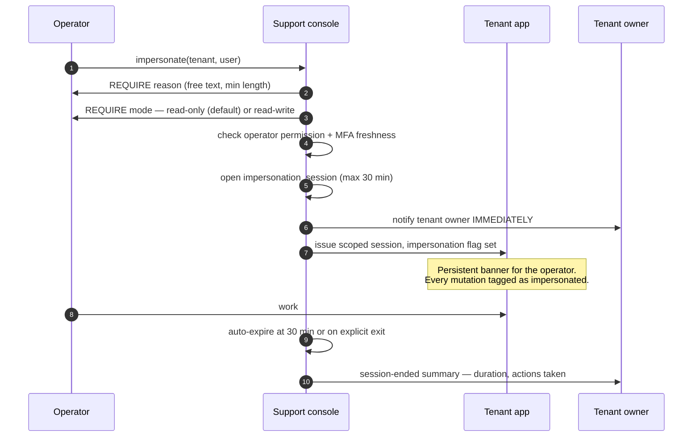

# 38. Support console and impersonation controls

The internal operations surface. It runs on a **separate host, with separate
credentials, a separate connection pool and its own audit trail**
([§7.2](../phase-1a/07-multi-tenancy.md)).

This is the one place in the platform that can legitimately cross tenant
boundaries, so it is designed to make that crossing **deliberate, narrow and
visible** rather than convenient.

## 38.1 Capabilities

| Area | Capability | Band |
|---|---|---|
| Tenants | Provision, view, suspend, reactivate, cancel, purge | M |
| Plans | Change plan, set feature overrides with reason and expiry | M |
| Health | Per-tenant error rate, job failures, last login, storage, SMS balance | M |
| Usage | Meters, invoices, payment history | M |
| Data repair | Re-run a failed job, replay a DLQ item, reverse an import batch | M |
| Calendar | Publish and version the government holiday calendar ([§16.7](../phase-1b/16-calendar-engine.md)) | M |
| Diagnostics | Look up a request id, a notification, a payment across tenants | M |
| **Impersonation** | Enter a tenant as a user, read-only or read-write | **P2** |
| Bulk ops | Platform-wide announcements, forced migrations | P2 |

Impersonation is P2 deliberately. Before it exists, support runs on shared
screens and exported diagnostics — which is slower but has no privacy surface.
When it does land, the controls below are not optional extras; they are the
feature.

## 38.2 Operator access

| Control | Rule |
|---|---|
| Separate host | `platform.<domain>`, not a route inside a tenant subdomain |
| **MFA required** | No exceptions, no "temporarily disabled" |
| Named accounts only | No shared `admin` login — the audit trail is worthless without an individual |
| Session lifetime | 4 h idle, 12 h absolute. Shorter than staff sessions |
| IP allowlist | Where the team has stable addresses; otherwise a documented compensating control |
| Separate DB role | `sm_platform`, holds `BYPASSRLS`, unreachable from tenant request paths |
| Operator permissions | Same `resource.action` vocabulary, distinct role set |
| Every action audited | `operator_audit`: who, what, which tenant, when, why |

`sm_platform` is the only credential in the system that can see across tenants,
and it is deliberately awkward to use: distinct pool, distinct connection string,
never injected into the tenant app containers.

## 38.3 Impersonation — the controls are the design

Impersonation means an operator seeing a real child's records. The brief calls it
privacy-sensitive; it is the most privacy-sensitive capability in the platform.

| Control | Rule |
|---|---|
| **Mandatory reason** | Free text, minimum length, recorded. Ideally a ticket reference |
| **Time limit** | 30 minutes maximum; no extension without a new reason |
| **Read-only by default** | Read-write requires a separate permission and a stronger reason |
| **Tenant notified at start** | Not afterwards, not in a monthly digest — **at the moment it begins** |
| Tenant notified at end | With duration and a summary of actions |
| Tenant-visible log | The tenant owner can see every impersonation session, always |
| Full audit | Every action carries the impersonation session id and the real operator id |
| Banner | The operator always sees they are impersonating; it cannot be dismissed |
| **Cannot impersonate to read financial exports or bulk-download documents** | Those need an explicit, separately-audited operator action |
| Not permitted for guardian accounts by default | A guardian view shows one family's private data; requires an elevated permission and a stronger reason |
| Cooling-off alerting | Repeated impersonation of one tenant raises a review flag |

Two of these are the ones that actually matter, and both are about **the tenant,
not the operator**: notification at the start, and a log the tenant can read
without asking. Controls that are only visible internally protect the company; a
tenant-visible log protects the customer. The brief asks for tenant visibility
explicitly and it is the right requirement.

**Every mutation made while impersonating is tagged.** `audit_log` records both
the impersonated person and the real operator, so "who changed this mark" never
resolves to a teacher who was not at their desk.

## 38.4 Data repair

Support inevitably means fixing data. The rules keep that from becoming an
unaudited back door:

| Rule | Reason |
|---|---|
| Repairs go through **use cases**, never raw SQL | The same validation, audit and events apply |
| Any repair needs a reason | Recorded in `operator_audit` |
| Bulk repairs are jobs with a batch id | Reversible, like every other bulk operation |
| No `UPDATE` against production by hand | If a repair needs SQL, it needs a use case — which becomes a feature |
| Money and result repairs need a second operator's approval | Two-person rule on the things that outrank everything else |

The last row is the one worth defending at a two-person company: it is
inconvenient precisely when it is most needed, and it is the only real control
against a single person silently altering a payment or a published result.

## 38.5 Per-tenant health view

What an operator sees when a school calls:

| Panel | Content |
|---|---|
| Status | Plan, lifecycle state, trial/due dates, feature overrides |
| Adoption | Attendance-taken rate, fee entries, active staff, last login per role |
| **Churn signals** | The [§37.8](37-saas-billing.md) list, flagged |
| Errors | Error rate, recent Sentry issues scoped to this tenant |
| Jobs | Failures, DLQ items, queue depth attributable to this tenant |
| Calendar | Academic year state, working days materialised, pending recomputes |
| Comms | SMS balance, recent delivery failures |
| Storage | Usage against quota |

The first question on a support call is nearly always "is it them or is it us",
and this view answers it before the caller finishes describing the problem
([§34.6](34-observability.md)).

## 38.6 What the console cannot do

Constraints that exist so the console is not a way around the architecture:

| Cannot | Reason |
|---|---|
| Read a tenant's data without an audited action | No silent browsing |
| Disable a tenant's audit logging | Not a toggle. There is no code path |
| Delete audit records | Append-only |
| Change a published result directly | Goes through the revision workflow with versioning ([§15.5](../phase-1b/15-assessment-engine.md)) |
| Issue or alter a receipt number | Gapless sequencing is owned by the finance module |
| Export a tenant's data without notifying them | Export is an audited, tenant-visible event |
| Impersonate without a reason and a time limit | Enforced, not policy |
