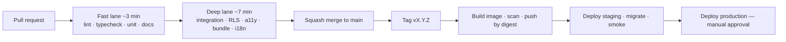

# 40. CI/CD strategy

GitHub Actions. Trunk-based with short-lived branches and squash merges
([CONTRIBUTING.md](../../../CONTRIBUTING.md)).

The constraint that shapes it: at 1–2 developers, **CI is the code review.**
There is rarely a second pair of eyes, so anything that must not regress has to
be a failing build rather than a reviewer's memory.

## 40.1 Pipeline

Two lanes so the common failure — a typo, a lint error — comes back in three
minutes rather than ten. The deep lane runs in parallel jobs against the same
checkout.

## 40.2 Jobs

| Job | Runs | Blocks merge | Budget |
|---|---|---|---|
| `docs` | Always | **Yes** | 10 s |
| `lint` | Always | **Yes** | 1 min |
| `typecheck` | Always | **Yes** | 1 min |
| `unit` | Always | **Yes** | 1 min |
| `integration` (real PostgreSQL service) | Always | **Yes** | 4 min |
| **`rls`** — generated isolation suite | Always | **Yes** | 1 min |
| `permissions` — role × permission matrix | Always | **Yes** | 30 s |
| `migrations` — against a restored shaped dump | On `db/**` change | **Yes** | 3 min |
| `bundle` — size budgets per route group | On `src/**` change | **Yes** | 2 min |
| `a11y` — axe, contrast, keyboard | On `src/**` change | **Yes** | 3 min |
| `i18n` — key parity, ICU, bare text | On `messages/**` or `src/**` | **Yes** | 30 s |
| `security` — `osv-scanner`, secret scan | Always | **Yes** (high/critical) | 1 min |
| `pdf-golden` — Bangla shaping diff | On renderer/font/template change | **Yes** | 2 min |
| `e2e` — Playwright, both locales | Always | **Yes** | 5 min |

`docs` runs today ([`scripts/check-docs.sh`](../../../scripts/check-docs.sh)) and
is the only job that exists yet — Phase 1 is architecture. The rest land with the
code they guard.

## 40.3 Required checks and branch protection

Configured once in repository settings:

- Require a pull request before merging
- Require the jobs above to pass
- Require the branch to be up to date
- Block force pushes and branch deletion
- **Squash merge only** — `main` stays one commit per PR and bisectable
- Required approvals: **0** while the team is 1–2 people

The last point is deliberate and explained in
[CONTRIBUTING.md](../../../CONTRIBUTING.md): mandating an approval with no second
reviewer means either nothing merges or everyone learns to bypass protection. Set
it to 1 the day a third developer joins.

## 40.4 Speed

CI that takes twenty minutes gets worked around. Budget: **≤ 10 minutes to a
merge decision.**

| Technique | Effect |
|---|---|
| Two lanes | Fast feedback on cheap failures |
| Dependency cache keyed on the lockfile | Saves ~90 s |
| Next.js build cache | Saves ~2 min |
| Playwright browsers cached | Saves ~60 s |
| Path filters on expensive jobs | Skip `pdf-golden` unless the renderer changed |
| Parallel matrix for E2E | 5 min instead of 15 |
| Concurrency group per branch | Cancels superseded runs |

## 40.5 Release

| Step | Detail |
|---|---|
| Versioning | `vMAJOR.MINOR.PATCH` on `main` |
| Trigger | Tag push |
| Image | Built once, pushed **by digest**; the same digest is deployed to staging and production |
| Notes | Generated from squashed commit subjects — which is why the commit convention is one clear imperative line |
| Staging | Automatic on tag; migrations run; smoke test; `/readyz` verified |
| Production | **Manual approval**, then the deploy job ([§35.3](35-deployment.md)) |
| Rollback | Re-run the deploy job with the previous tag ([§35.7](35-deployment.md)) |
| Window | Outside 07:00–15:00 Asia/Dhaka |

One image built once, deployed by digest, means staging genuinely tests the
artefact that reaches production — not a rebuild of the same source.

## 40.6 Secrets in CI

| Rule | Detail |
|---|---|
| GitHub Actions secrets only | Never in the repository |
| Deploy credentials are a dedicated key | Not a personal key |
| **`pull_request` jobs receive no production secrets** | A fork PR must not be able to exfiltrate them |
| Masked in logs | Verified by a test that greps output for known prefixes |
| Rotation | On any team change |

## 40.7 What CI enforces that a reviewer would otherwise have to remember

The honest justification for the job list. At this team size these are not
process; they are the substitute for a second reviewer:

| Guard | Would otherwise be |
|---|---|
| RLS on every tenant table | "Did you remember the policy?" |
| Permission declared for every report and use case | "Did you add authorization?" |
| Bundle budget | "Is this heavy on a low-end phone?" |
| `en`/`bn` key parity | "Did you translate it?" |
| Contrast under hostile brand colours | "Does this still pass WCAG?" |
| Bangla shaping golden image | "Do the conjuncts still render?" |
| No PII in logs | "Did you log a student name?" |
| Backwards-compatible migration | "Can we roll this back?" |
| No secret-shaped files tracked | "Is that a real key?" |

Each of those questions has been asked and answered once, in a test. That is the
only way the answers survive a two-year build.
