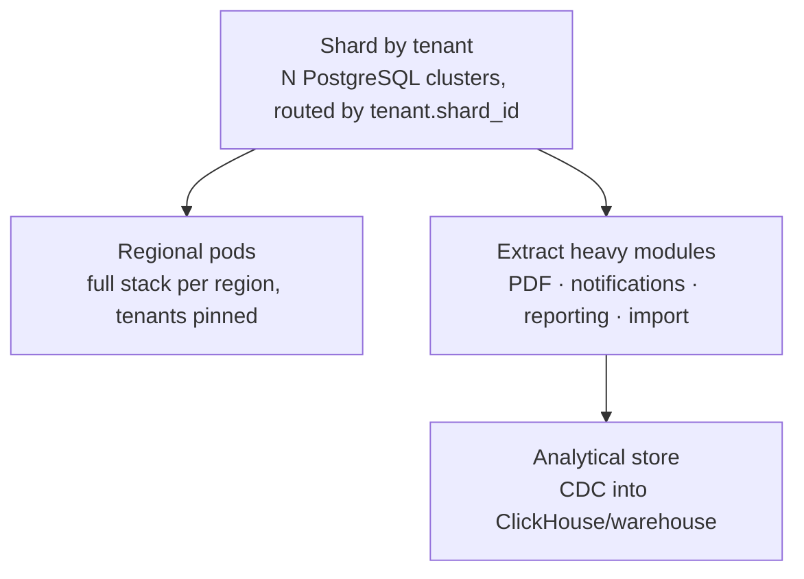

# 44. Future scalability path

[§32](32-scalability.md) covers stages 0–4 with their trigger metrics — the
growth path that is planned for. This section looks past that: what the
architecture permits **without a rewrite**, what would genuinely require one, and
what should never be built.

The distinction matters because the brief asks the design to be built for
hundreds of schools while not precluding thousands.

## 44.1 What the design already permits

| Future need | Enabled by | Difficulty |
|---|---|---|
| One tenant on dedicated infrastructure | `tenant.shard_id` from day one ([§7.6](../phase-1a/07-multi-tenancy.md)) | Operational procedure, no code change |
| Horizontal app scaling | Stateless app; server-side sessions; transaction-scoped tenant context | Add nodes + Redis |
| Connection pooling at scale | `set_config(..., true)` is transaction-scoped, so PgBouncer transaction mode works | Drop it in |
| Reporting isolated from transactions | Replica exists; `reporting` is read-only by construction | Connection string |
| Partitioning attendance, audit, notifications | No unique constraint omits the partition key; SQL migrations | Ordinary DDL |
| A second region | Stateless app, standard PostgreSQL, S3-compatible storage | Provisioning work |
| A native mobile app | Versioned REST over the same use cases ([ADR-0007](../adr/0007-api-style.md)) | New client, no server redesign |
| Public/partner API | Same surface, plus keys and quotas | Additive |
| Extracting PDF, notifications, reporting or import as services | Already separate processes behind queues and interfaces ([§6.6](../phase-1a/06-architecture-overview.md)) | Packaging |
| A third or fourth language | Message files + paired columns ([ADR-0019](../adr/0019-i18n-content-split.md)) | Migration, no redesign |
| Double-entry ledger | Immutable rows with reversals mean it can be **derived** retroactively ([§17.11](../phase-1b/17-finance-architecture.md)) | New module over existing data |
| Analytical store | CDC or nightly export from a normalised schema | Additive |

The common thread: each of these was made possible by a small decision taken
early — a column, an interface, an immutability rule — rather than by building
the capability itself. That is what "designed for, not built" means in practice.

## 44.2 The path to thousands of tenants

Beyond [§32](32-scalability.md)'s stage 4, at roughly 2,000+ schools and a real
engineering team:

| Step | Trigger | Note |
|---|---|---|
| **Shard by tenant** | One cluster at capacity | Routing already exists. Rebalancing tooling is the new work |
| Regional pods | Residency rules, or a second country | A pod is the whole stack; tenants never span pods |
| Extract heavy modules | Independent scaling or release cadence needed | The seams are already marked |
| Analytical store | Cross-tenant analytics become a product | Fed from the primaries, never queried by tenants |

Sharding by tenant is the right axis because **no query in this system crosses
tenants** — the constraint RLS enforces for security turns out to be the same one
that makes horizontal partitioning straightforward. Operator cross-tenant views
become a fan-out, which is acceptable for the handful of screens that need them.

## 44.3 What would genuinely require a rewrite

Honest about the limits.

| Requirement | Why it breaks the design |
|---|---|
| **Real-time collaborative editing** of marks or timetables | Request/response with optimistic locking is the wrong substrate. Would need CRDTs or OT and a persistent connection layer |
| **Strong multi-region consistency** for one tenant | Single-primary PostgreSQL. Would need a distributed database and a different consistency model for money |
| **Sub-50 ms latency outside South Asia** | Single-region by choice. Multi-region active-active changes the financial-durability design |
| **Per-tenant custom code / plugin marketplace** | Deliberately foreclosed. Configuration is the extension mechanism; executing tenant code needs sandboxing and a different security model entirely |
| **Cross-tenant student identity** (a national student ID) | The identity model keeps person records tenant-scoped for privacy ([ADR-0006](../adr/0006-identity-model.md)). Would need a global link table and a consent model |
| **Offline-first for the whole product** | Offline is a capability of two flows ([ADR-0018](../adr/0018-offline-sync-model.md)). Making everything offline-first is a different architecture |

None of these is likely. They are listed so that if one becomes a requirement, it
is recognised as a **redesign decision** rather than attempted as a feature.

## 44.4 Things to refuse

Every SaaS accumulates pressure to build these. Each is recorded as a "no" now,
with the reasoning, so that saying no later is a reference rather than an
argument:

| Pressure | Why refuse |
|---|---|
| Per-school custom code | The failure mode the whole configuration design prevents. One exception and the business stops scaling |
| A UI page builder for the *application* | Every support call would start with "what does your screen look like?" Document templates are the bounded exception |
| Real-time everything | Cost and complexity with no user asking for it |
| Microservices before ~6 engineers | Distributed transactions across the fee ledger, staffed by nobody |
| An analytics warehouse before rollups hurt | An ETL pipeline is a system that breaks silently |
| Native apps before PWA metrics justify them | Two more codebases ([ADR-0017](../adr/0017-pwa-not-native.md)) |
| Live vehicle tracking | Out of scope entirely. A different product |
| Withholding student records for non-payment | An ethical line, recorded in [§37.5](37-saas-billing.md) |

## 44.5 The ten-year view

If this platform is still running in ten years, the parts most likely to survive
unchanged are the ones that came from the **domain** rather than from the budget:

- `enrolment` as the join that history hangs from
- Account/person/membership separation, because Bangladeshi families still share
  phones
- Assessment as versioned configuration with immutable published snapshots
- The materialised working-day table as the single answer to "is this a working
  day?"
- Money as integer poisha, and `ABSENT` never becoming zero

The parts most likely to be replaced are the ones that came from the
**constraints**: the single VPS, the deferred Redis, the manual billing, the
absence of a warehouse. Every one of those has a trigger metric attached, and
each is expected to fire eventually.

That split is the intended shape of the design. The domain model is built to last;
the infrastructure is built to be outgrown.
