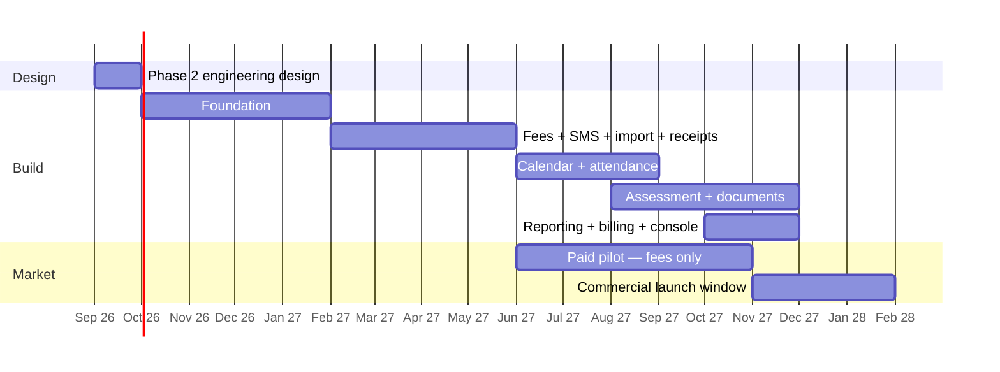

# 45. Roadmap — MVP, Phase 2, Phase 3

Sized against **~1.5 FTE** ([`CONSTRAINTS.md`](../CONSTRAINTS.md)) and against the
fact that dominates this business: **schools switch software in November–January
or not at all** ([§2.3](../phase-1a/02-domain-analysis.md)).

## 45.1 The scheduling problem, stated plainly

Effort estimates for the MVP module list at 1.5 FTE:

| Module | Weeks |
|---|---|
| Foundation — tenancy, identity, RBAC, structure, directory | 14 |
| Fees and finance | 10 |
| Assessment and examination | 12 |
| Calendar engine | 4 |
| Attendance, incl. offline | 5 |
| Notifications and SMS | 4 |
| Documents and PDF | 4 |
| Data import and export | 5 |
| Reporting | 4 |
| SaaS billing and operator console | 6 |
| **Total** | **~68 weeks ≈ 15 months** |

Phase 2 (engineering design) is 3–4 weeks. Starting Phase 3 around **October
2026**, the full MVP lands around **December 2027**.

**That means the November 2026 – January 2027 onboarding window is not
reachable.** No amount of sequencing changes it: the foundation alone is a
quarter, and fee collection cannot exist without students, guardians and
enrolment beneath it.

Pretending otherwise would produce a rushed half-product entering the one window
that matters, which is worse than entering the next one properly.

## 45.2 The insight that makes the plan work

Not every module is season-locked:

| Module | Can a school adopt it mid-year? |
|---|---|
| **Fee collection** | **Yes.** Opening dues are imported; collection starts any month |
| SMS notices | **Yes** |
| Attendance | Awkward mid-year, workable |
| **Assessment / results** | **No.** Needs a full session of marks to be meaningful |
| Promotion | **No.** A January event |

So **the beachhead product is fee collection plus SMS** — the two pains ranked
first and third in [§2.2](../phase-1a/02-domain-analysis.md), and the only
combination a school can adopt in, say, June.

That gives a pilot in mid-2027 with real schools paying real money, a full year
before the commercial launch window — which de-risks R8 (seasonal concentration)
and R1 (scope) simultaneously.

## 45.3 The plan

### Phase 2 — engineering design · Sept 2026 · 3–4 weeks

Final technology decisions, Drizzle schema, API contracts, DTOs, auth flow,
component strategy, folder scaffolding. **No complete codebase.**

Also in this window, because they have long lead times and block later work:

- **Start BTRC masked-sender approval** ([OQ-5](../phase-1a/13-open-questions.md)) — the longest external dependency
- **Get the data-residency legal opinion** ([OQ-1](../phase-1a/13-open-questions.md)) — two ADRs hang on it
- Validate ARPU with five real pricing conversations ([OQ-2](../phase-1a/13-open-questions.md))
- Measure Dhaka → Singapore RTT ([OQ-11](../phase-1a/13-open-questions.md))

### Phase 3a — foundation · Oct 2026 – Jan 2027

| Ships | Why first |
|---|---|
| Tenancy with RLS, provisioning, the generated isolation test suite | Everything sits on it; retrofitting isolation is not possible |
| Identity: account/person/membership, OTP, sessions, RBAC | The unusual part of the model — get it wrong early and cheaply |
| Structure: org, school, campus, shift, class, section, academic year | |
| Directory: students, guardians, staff, enrolment, promotion | |
| Deployment, CI, backups, restore drill #1 | Operable before it holds real data |

**Exit criterion:** a tenant can be provisioned, staff can log in, and a school's
students and guardians exist — with the isolation suite green.

### Phase 3b — the beachhead · Feb – May 2027

| Ships |
|---|
| Fee heads, structures, invoice generation, discounts |
| Payment recording — cash, bank, cheque, MFS — with **gapless receipts** |
| Allocation, arrears, late fees, daily reconciliation |
| Money receipt PDF (Bangla), print at the counter |
| SMS: provider abstraction, templates, dedup, budgets |
| **Import: students, guardians, opening dues** |
| Minimal reporting: collection, outstanding dues, defaulters |

**Exit criterion:** a real school collects a term's fees through the product and
the accountant trusts the numbers.

### Pilot · Jun – Oct 2027

Two to four friendly schools, **paying**, on fees plus SMS. Hands-on onboarding.
The goal is not revenue; it is discovering what the architecture got wrong while
it is still cheap to change — and producing real assessment configurations to use
as fixtures.

### Phase 3c — calendar and attendance · Jun – Aug 2027

Calendar engine first (attendance depends on working days), then attendance with
the offline outbox and absence SMS.

### Phase 3d — assessment · Aug – Nov 2027

The largest and riskiest module. Schemes, components, grade scales, mark entry
grid, tabulation, ranking, publication, report card PDFs, promotion. Built
against the pilot schools' **real** grading rules.

### Phase 3e — commercial readiness · Oct – Nov 2027

SaaS billing, operator console, remaining reports, hardening, load rehearsal for
result day.

### Commercial launch · Nov 2027 – Jan 2028

Target **15–20 schools** — the onboarding ceiling for one person in one season
([§42.4](42-cost-model.md)), not an infrastructure limit.

## 45.4 Phase 4 and beyond

| Band | Contents | When |
|---|---|---|
| **P2** | Online payment gateway · Puck CMS · impersonation console · web push · scheduled reports · ID cards · certificates · timetable · library · inventory · transport · biometric ingestion · custom domains · duplicate merge UI · MFA for staff | 2028 |
| **P3** | Analytics warehouse · per-tenant custom reports · double-entry ledger · re-check workflow · timetable generation | Trigger-driven |
| **Out** | Live vehicle tracking · payroll · hostel · alumni portal · native apps · marketplace | — |

P2 ordering is set by what tenants ask for during the pilot, not by this list.

## 45.5 Decision points

Moments where the plan should be re-derived rather than followed:

| When | Question |
|---|---|
| End of Phase 2 | Did [OQ-1](../phase-1a/13-open-questions.md) come back requiring onshore hosting? If so, add 2–4 weeks and re-cost |
| End of Phase 3a | Is the foundation actually 14 weeks? If it took 20, the whole plan shifts a season — decide then, not in month ten |
| **After the pilot** | Do schools pay for fees-only? If yes, consider selling it standalone through 2027 rather than waiting for the full MVP |
| Before Phase 3d | Do the pilot schools' grading rules fit the vocabulary ([ADR-0012](../adr/0012-assessment-engine.md))? |
| Nov 2027 | Did the season deliver 15+ schools? If not, the constraint is sales, not product |

## 45.6 What this roadmap deliberately refuses

| Refused | Reason |
|---|---|
| Rushing a partial MVP into the Nov 2026 window | A bad first impression in an annual market costs a year of reputation, not a quarter |
| Building assessment before fees | Fees sells and can be adopted mid-year; assessment cannot |
| Parallel module development | At 1.5 FTE, three modules at 80% is worth nothing |
| CMS, library, inventory, transport in the MVP | No school switches vendors for them |
| Timetable generation | A constraint-solver project of its own |
| Deferring import | It is a sales requirement, not a feature ([ADR-0024](../adr/0024-import-staging-model.md)) |
| Deferring the operator console to "later" | Support at 1–2 people is impossible without it |
