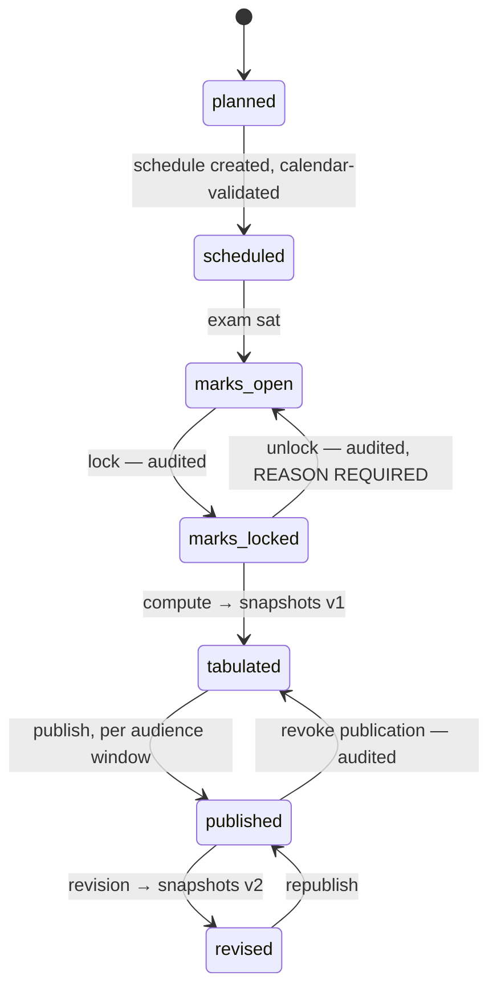

# 19. Assessment — lifecycle and API contracts (Phase 3d)

## 19.1 Exam lifecycle



| Transition | Guard | Permission |
|---|---|---|
| → `scheduled` | Every subject has a date/time; all `block`-severity conflict rules pass ([§14.7](../phase-2b/14-calendar-attendance.md)) | `scheme.manage` |
| → `marks_open` | Exam date has passed, or an explicit override | `mark.lock` |
| → `marks_locked` | **No marks in state `incomplete`** | `mark.lock` |
| → `marks_open` (unlock) | Reason required; emits an event | `mark.lock` |
| → `tabulated` | Locked; computation succeeds for every enrolled student | `result.tabulate` |
| → `published` | Tabulated; audience and window supplied | `result.publish` |
| → `tabulated` (revoke) | Reason required; guardians lose access immediately | `result.publish` |
| → `revised` | Reason required; writes v2, supersedes v1 | `result.revise` |

Revocation is a **supported operation, not an emergency**. "Unpublish Class 6,
the tabulation used the wrong scheme version" must be one button with an audit
entry, because it will happen.

## 19.2 Endpoints

| Method | Path | Permission | Notes |
|---|---|---|---|
| `GET`/`POST` | `/api/v1/grade-scales` | `scheme.read` / `scheme.manage` | |
| `GET`/`POST` | `/api/v1/assessment-schemes` | `scheme.read` / `scheme.manage` | |
| `POST` | `/api/v1/assessment-schemes/:id:publish` | `scheme.manage` | Freezes the version |
| `POST` | `/api/v1/assessment-schemes/:id:fork` | `scheme.manage` | New version from a published one |
| `POST` | `/api/v1/assessment-schemes/:id:validate` | `scheme.read` | Dry-run: band tiling, weight sums |
| `GET`/`POST` | `/api/v1/exams` | `scheme.read` / `scheme.manage` | |
| `POST` | `/api/v1/exams/:id/schedule` | `scheme.manage` | Returns conflicts with severity |
| `GET` | `/api/v1/exams/:id/marks?sectionId=&subjectId=` | `mark.read` | Feeds the grid |
| `PUT` | `/api/v1/exams/:id/marks` | `mark.write` | **Batch upsert**, scope-checked |
| `POST` | `/api/v1/exams/:id:lockMarks` | `mark.lock` | 422 if any `incomplete` |
| `POST` | `/api/v1/exams/:id:unlockMarks` | `mark.lock` | Reason required |
| `POST` | `/api/v1/marks/:id/adjustments` | `mark.moderate` | Grace / moderation |
| `POST` | `/api/v1/exams/:id:tabulate` | `result.tabulate` | **Idempotency-Key**; async |
| `GET` | `/api/v1/exams/:id/tabulation?sectionId=` | `result.tabulate` | The grid |
| `POST` | `/api/v1/exams/:id:publish` | `result.publish` | **Idempotency-Key** |
| `POST` | `/api/v1/exams/:id:revokePublication` | `result.publish` | Reason required |
| `POST` | `/api/v1/exams/:id:revise` | `result.revise` | Reason required |
| `GET` | `/api/v1/students/:id/results` | `result.read` | Guardian path — via `guardian_link` |
| `POST` | `/api/v1/exams/:id:computePromotions` | `enrolment.promote` | Dry run by default |
| `POST` | `/api/v1/promotions:apply` | `enrolment.promote` | **Idempotency-Key**; batch, undoable |

## 19.3 Mark entry contract

```ts
export const MarkValueSchema = z.discriminatedUnion('state', [
  z.object({ state: z.literal('entered'),    scoreMinor: zMoney }),
  z.object({ state: z.literal('absent')     }),
  z.object({ state: z.literal('exempt')     }),
  z.object({ state: z.literal('incomplete') }),
]);

export const SaveMarksSchema = z.object({
  sectionId: zUlid<'section'>(),
  subjectId: zUlid<'subject'>(),
  entries: z.array(z.object({
    studentId:   zUlid<'student'>(),
    componentId: zUlid<'assessmentComponent'>(),
    value:       MarkValueSchema,
    version:     z.number().int().optional(),   // optimistic lock on overwrite
  })).min(1).max(2000),
}).strict();
```

The discriminated union is the API-level expression of invariant 4: **there is no
shape in which a client can send a score together with `absent`.** The database
`CHECK` and the TypeScript type say the same thing, in two places, deliberately.

Batch upsert rather than per-cell POST: the grid autosaves per cell locally and
flushes in batches, so a 3G connection carries tens of requests per section, not
thousands ([§12.3](../phase-2b/12-component-inventory.md)).

Scope is enforced on the pair: a subject teacher may write only
`(section, subject)` combinations in `ctx.scope`
([§9.3](../phase-2a/09-permissions-and-roles.md)).

### Errors

| Code | HTTP | When |
|---|---|---|
| `MARKS_LOCKED` | 423 | Exam is locked |
| `SCORE_EXCEEDS_FULL_MARKS` | 422 | Per cell, with the component's full marks |
| `INCOMPLETE_MARKS_REMAIN` | 422 | On lock; returns the list |
| `SCHEME_NOT_PUBLISHED` | 422 | Tabulating against a draft scheme |
| `RESULTS_ALREADY_PUBLISHED` | 409 | Re-publishing without revise |
| `OUT_OF_SCOPE` | 403 | Section/subject not in the teacher's scope |
| `WORKING_DAYS_NOT_MATERIALISED` | 422 | Auto-promotion without a denominator |

## 19.4 Publication

```ts
export const PublishResultsSchema = z.object({
  version: z.number().int().positive(),
  audiences: z.array(z.object({
    audience:    z.enum(['guardian','student','staff']),
    visibleFrom: z.string().datetime(),
    visibleTo:   z.string().datetime().optional(),
    requiresFeeClearance: z.boolean().default(false),
  })).min(1),
  notify: z.object({
    sms: z.boolean().default(true),
    /** Spread the fan-out. The platform sends the SMS, so the platform
     *  controls when guardians arrive — this is the load-shaping lever, not
     *  a nicety (§4.3). */
    spreadOverMinutes: z.number().int().min(0).max(180).default(60),
  }),
}).strict();
```

Publishing:

1. Freezes snapshots (already immutable).
2. Writes `result_publication` rows per audience.
3. Emits `ResultsPublished`.
4. `notification` fans out **at the requested rate**.
5. Guardian result pages serve the immutable snapshot, cacheable behind a signed
   URL.

`requiresFeeClearance` gates per student at read time, not at publication time —
so a guardian who clears dues on the evening of results day sees them
immediately, without an operator re-publishing anything.

## 19.5 Guardian read path

```
GET /api/v1/students/:studentId/results
  → guardian_link join enforces the relationship (§9.2)
  → only publications whose window is currently open
  → only the latest non-superseded snapshot version
  → 404 if fee clearance is required and dues are outstanding,
    with code FEE_CLEARANCE_REQUIRED and the amount
```

`404` rather than `403` for a student the guardian is not linked to: the same
existence-disclosure reasoning as tenant resolution
([§8.6](../phase-2a/08-auth-and-session.md)).

## 19.6 Promotion

```ts
export const ComputePromotionsSchema = z.object({
  fromAcademicYearId: zUlid<'academicYear'>(),
  toAcademicYearId:   zUlid<'academicYear'>(),
  classLevelId: zUlid<'classLevel'>().optional(),
  dryRun: z.boolean().default(true),            // default is SAFE
});

export const PromotionPreview = z.object({
  decisions: z.array(z.object({
    studentId: z.string(), studentName: z.string(),
    outcome: z.enum(['promoted','retained','transferred','withdrawn']),
    basis: z.enum(['automatic','manual','override']),
    attendancePercent: z.number().nullable(),
    failedSubjects: z.array(z.string()),
    carryForward: z.array(z.string()),
    blockedReason: z.string().nullable(),
  })),
  summary: z.object({ promoted: z.number(), retained: z.number(),
                      needsManual: z.number() }),
});
```

`dryRun: true` by default. Promotion rewrites a whole cohort's enrolment; it is
the riskiest bulk operation in the product, and the preview is what makes it
reviewable before it runs.

Applying records a `batch_id` on every `promotion_decision`, so "undo the
promotion, we ran it on the wrong class" is a supported compensating action
rather than a database restore ([§14.5](../../architecture/phase-1b/14-module-architecture.md)).

**Promotion does not touch dues.** Arrears carry forward through `finance`
([§13.2](../phase-2b/13-finance-schema-and-contracts.md)), keyed to the student,
not the enrolment.

## 19.7 Acceptance for Phase 3d

1. A scheme with independent CQ and MCQ pass marks fails a student with 70 total
   but CQ below its mark.
2. An absent mark renders `AB` on screen, in the tabulation sheet and in the PDF
   — and is **never** 0 at any layer.
3. An exempt component reduces the denominator; a fully exempt subject reports
   `FULLY_EXEMPT`, not 0%.
4. Locking is refused while any mark is `incomplete`, and names them.
5. Tabulating a 400-student, 12-subject exam completes within the interactive
   job budget.
6. Ranking with `{ by: 'shared' }` produces 1, 2, 2, 4.
7. Publishing spreads SMS over the requested window.
8. Revoking publication removes guardian access immediately.
9. A revision writes v2; v1 stays retrievable and both are explainable via
   `computation_hash`.
10. Auto-promotion refuses when `working_day` is not materialised, and says so.
11. Two real pilot schemes reproduce their known-correct outputs exactly.

Item 11 is the acceptance criterion that actually matters, and it cannot be
written until the pilot supplies the fixtures — see
[§17.9](17-assessment-schema.md).
