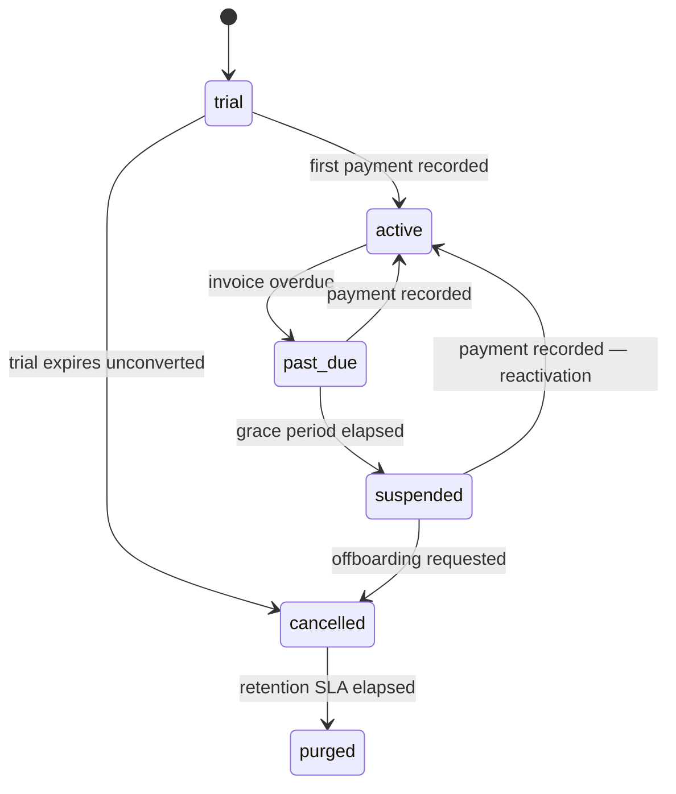

# 21. SaaS billing, metering and the operator console (Phase 3e)

Distinct from school fee collection. **Two money flows, never one ledger** — the
tables are separate, the sequences are separate, the reports are separate
([§11.1](../phase-2a/03-schema-platform-identity.md)).

Manual-first, per [ADR-0030](../../architecture/adr/0030-manual-first-saas-billing.md):
at fewer than 50 tenants, an operator issuing invoices by hand costs less than
building and operating a billing engine.

## 21.1 Tenant lifecycle



| State | Read | Write | Export | Notes |
|---|---|---|---|---|
| `trial` | ✅ | ✅ | ✅ | Feature-limited by plan |
| `active` | ✅ | ✅ | ✅ | |
| `past_due` | ✅ | ✅ | ✅ | Banner only. **Writes are not blocked** during term-time collection |
| `suspended` | ✅ | ❌ | ✅ | `ctx.readOnly = true` |
| `cancelled` | ✅ | ❌ | ✅ | 60-day window before purge |
| `purged` | ❌ | ❌ | ❌ | Hard-deleted after export |

**Suspension never denies records.** A guardian must still be able to retrieve a
receipt and a school must still export its data — withholding a child's
transcript over a vendor dispute is not acceptable
([OQ-21](../../architecture/phase-1a/13-open-questions.md)). This is invariant 14,
enforced in `withTenant`: `ctx.readOnly` refuses a writable transaction, so no
use case can forget it ([§5.4](../phase-2a/05-rls-and-isolation-harness.md)).

`past_due` deliberately does **not** block writes. A school in the middle of
collecting a term's fees that suddenly cannot record payments will lose money and
blame the platform; a banner and an email are the right pressure.

## 21.2 Metering

Written by a **nightly batch, never on the request path** (FR-13.2). A per-request
counter would be a hot write on every page view for no benefit — the billing
period is a month.

```
meterTenants(forMonth):                          # cron, 02:00 Asia/Dhaka
  for each non-purged tenant:
    active_students  = COUNT(DISTINCT enrolment.student_id)
                       WHERE academic_year.is_current
                         AND student.status = 'active'
    sms_sent         = SUM(segments) FROM notification_message
                       WHERE sent_at IN month AND status <> 'suppressed'
    storage_bytes    = SUM(byte_size) FROM document_render + document
    documents_rendered = COUNT(*) FROM document_render WHERE status='done'
    UPSERT tenant_usage_meter (tenant, month, metric, value)
```

`active_students` counts **enrolments in the current academic year with active
status** — not rows in `student`, which includes alumni and withdrawals and would
overbill a school for children who left.

Idempotent by `PRIMARY KEY (tenant_id, period_month, metric)`, so a re-run
corrects rather than duplicates.

## 21.3 Billing cycle

```
1. Month end  → meter runs
2. Operator reviews usage, generates platform_invoice rows (bulk action)
3. Invoice delivered by email + SMS with a payment reference
4. Payment arrives by bank/bKash → operator records platform_payment
5. Unpaid at due_date + graceDays → tenant.status = 'past_due', dunning starts
6. past_due + suspendAfterDays  → tenant.status = 'suspended'
```

| Setting | Default |
|---|---|
| Billing period | Monthly, in arrears |
| Grace after due date | 14 days |
| Suspend after `past_due` | 30 days |
| Dunning | Day 1, 7, 14, 21 — email + SMS to the tenant owner |
| Purge after `cancelled` | 60 days (export available throughout) |

Pricing is per-student per month against the metered count, floored at a plan
minimum. The metered count is **shown on the invoice**, because "why is this
month more than last month" is the first question a principal asks.

**Trigger to automate** ([ADR-0030](../../architecture/adr/0030-manual-first-saas-billing.md)):
more than 50 tenants, or more than half a day per month spent on reconciliation.

## 21.4 Feature entitlement

```ts
export function can(ctx: AuthContext, feature: FeatureKey)
  : { enabled: boolean; limit?: number; used?: number };
```

Resolution order: `tenant_feature_override` (if unexpired) → `plan_feature` →
deny. Evaluated **server-side, always**. The client may render based on the
answer, but every gated use case re-checks — a flag enforced only in the UI is a
flag that a `curl` request ignores.

Limits are checked at the point of consumption, not at login: `sms_monthly`
against the month's metered total, `students` against the current active count,
`storage_bytes` on upload.

## 21.5 Operator console

Separate host, operator session, **MFA required**, `sm_platform` pool
([§5.1](../phase-2a/05-rls-and-isolation-harness.md)).

| Method | Path | Permission |
|---|---|---|
| `GET` | `/api/platform/v1/tenants` | `platform.usage.read` |
| `POST` | `/api/platform/v1/tenants` | `platform.tenant.provision` |
| `GET` | `/api/platform/v1/tenants/:id/health` | `platform.usage.read` |
| `POST` | `/api/platform/v1/tenants/:id:suspend` | `platform.tenant.suspend` |
| `POST` | `/api/platform/v1/tenants/:id:reactivate` | `platform.tenant.suspend` |
| `POST` | `/api/platform/v1/tenants/:id:offboard` | `platform.tenant.suspend` |
| `PATCH` | `/api/platform/v1/tenants/:id/features` | `platform.plan.manage` |
| `POST` | `/api/platform/v1/invoices:generate` | `platform.plan.manage` |
| `POST` | `/api/platform/v1/invoices/:id/payments` | `platform.plan.manage` |
| `POST` | `/api/platform/v1/tenants/:id:impersonate` | `platform.impersonate` |
| `GET` | `/api/platform/v1/audit` | `platform.usage.read` |

### Tenant health — the churn signal

The most valuable screen and the cheapest to build
([§26.7](../../architecture/phase-1b/26-reporting-data-path.md)):

| Metric | Why it matters |
|---|---|
| Last staff login | Silence is the first churn signal |
| **Attendance-taken rate**, last 14 days | A school that stops taking attendance in March has stopped using the product |
| Fee-entry rate, last 30 days | Same, for the module they pay for |
| SMS balance and spend trend | Predicts a support call |
| Storage against quota | |
| Open error count (Sentry, tagged by tenant) | |

A tenant whose attendance-taken rate falls below a threshold gets a **support
call before they decide not to renew** — which at this ARPU is the difference
between a business and a hobby.

## 21.6 Impersonation

[ADR-0029](../../architecture/adr/0029-impersonation-controls.md). A
privacy-sensitive capability, so the controls are explicit rather than implied.

```ts
export const ImpersonateSchema = z.object({
  reason: z.string().min(20),                   // substantive, not "support"
  durationMinutes: z.number().int().min(5).max(30).default(30),
  scope: z.enum(['read_only','read_write']).default('read_only'),
}).strict();
```

| Control | Behaviour |
|---|---|
| Reason | **Mandatory**, minimum 20 characters, stored on `operator_audit` |
| Duration | Hard limit 30 minutes; the session expires, it is not merely flagged |
| Default scope | **Read-only.** Write access is a separate, explicit choice |
| Tenant visibility | The tenant owner is **notified at session start**, and past sessions are listed in tenant settings |
| Audit | Every mutation during the session carries `audit_log.impersonated_by` |
| UI | A persistent, unmissable banner naming the operator and the countdown |
| Prohibited | Impersonating to perform a destructive action the tenant did not request |

Tenant visibility is the control that makes the rest credible. An impersonation
log only the operator can see is not an accountability mechanism.

## 21.7 Offboarding

```
offboardTenant(tenantId, reason):
  1. status → 'cancelled'; writes stop, reads and export continue
  2. generate a FULL export (§16.7) — same code path as restore
  3. notify the owner with the download link and the purge date
  4. 60 days later: verify the export was downloaded (or re-notify)
  5. purge: delete rows in dependency order, delete R2 objects
  6. status → 'purged'; retain a tombstone: slug, dates, invoice history
  7. backups age out within 12 months (NFR §4.1)
```

The tombstone exists so a returning school is recognised rather than treated as a
brand-new signup, and so the platform's own revenue history stays intact after a
tenant is purged.

Purge is the **only** hard delete of tenant data in the system (invariant 6), and
it runs only after an export exists.

## 21.8 Acceptance for Phase 3e

1. A suspended tenant can read everything and export, and every write is refused
   by `withTenant` rather than by individual use cases.
2. A `past_due` tenant can still record payments.
3. Metering counts active enrolments in the current year — not alumni.
4. Re-running the meter for a month corrects rather than duplicates.
5. A feature limit is enforced server-side even when the client calls the
   endpoint directly.
6. Impersonation expires at 30 minutes, defaults to read-only, and appears in the
   tenant's own settings screen.
7. Offboarding produces a complete export before anything is deleted.
8. Platform revenue and school fee collection never appear in the same query.
